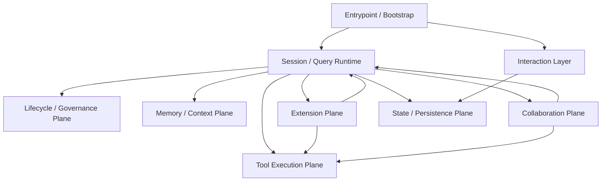
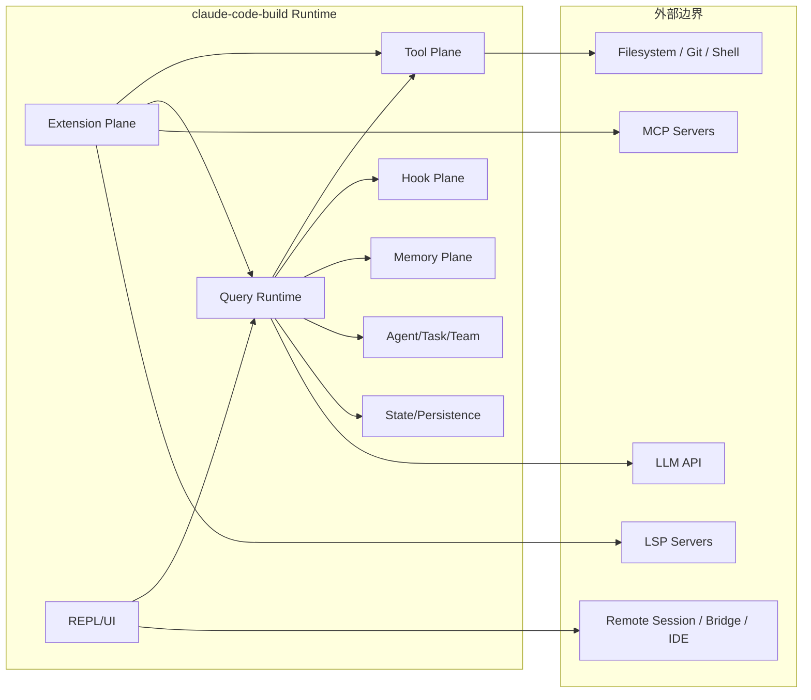
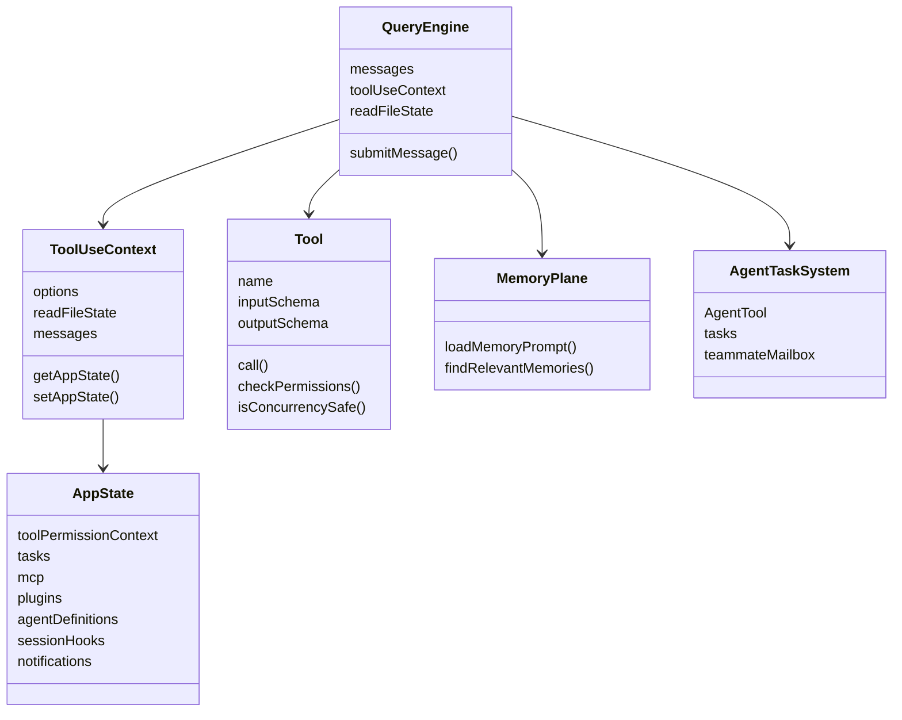
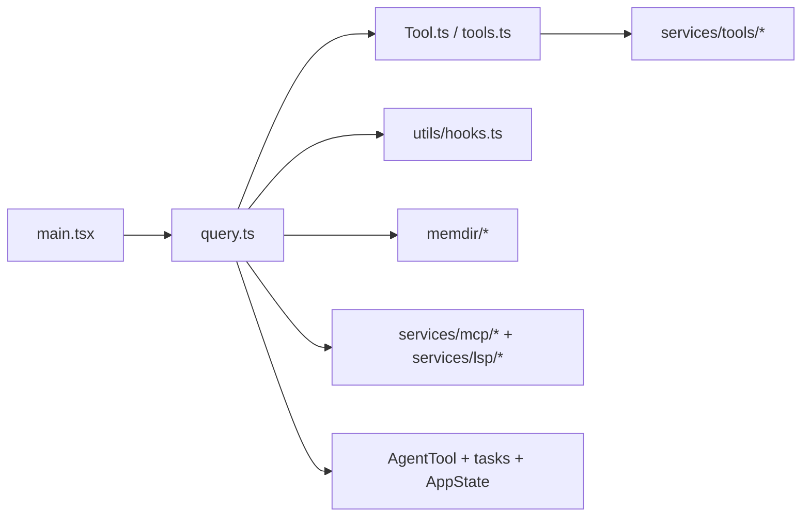

# 01. 系统总览

## 1.1 总体定义

`claude-code-build` 的核心不是单次模型调用，而是一套持续运行的会话引擎。这个引擎围绕一轮 agent turn 的完整生命周期组织：

1. 启动与装配
2. 构造上下文
3. 调用模型
4. 执行工具
5. 运行生命周期治理逻辑
6. 管理会话状态、记忆、插件、MCP、LSP、任务与代理
7. 进入下一轮或收尾

从架构角度看，它更接近一套终端原生的 agent runtime 平台，而不是普通的“命令行工具包装器”。

---

## 1.2 一级架构平面

### 各平面含义

- **Entrypoint / Bootstrap**：`main.tsx`，负责装配整个系统
- **Interaction Layer**：REPL、Ink、commands、页面组件
- **Session / Query Runtime**：`query.ts`、`QueryEngine.ts`，负责主流程推进
- **Tool Execution Plane**：`Tool.ts`、`tools.ts`、`services/tools/*`
- **Lifecycle / Governance Plane**：`utils/hooks.ts` 及相关 hook 子系统
- **Memory / Context Plane**：`memdir/*`、`queryContext.ts`、`attachments.ts`
- **Extension Plane**：MCP、skills、plugins、LSP
- **Collaboration Plane**：Agent、Task、Team、Mailbox
- **State / Persistence Plane**：AppState、sessionStorage、file caches、history

---

## 1.3 系统形态

### 交互侧
- REPL / terminal UI
- slash commands
- prompt input / footer / notification / panel
- 远程桥接、assistant mode、voice、buddy 等产品壳能力

### 运行时侧
- Query loop
- Tool call orchestration
- Hook lifecycle
- Memory prompt + relevant memory retrieval
- Session persistence
- Compact / fallback / stop phase

### 协作侧
- AgentTool 启动子代理
- task 系统承载异步任务和后台代理
- team / teammate / mailbox 支持多代理协作

### 扩展侧
- MCP servers
- skills
- plugins
- LSP servers

---

## 1.4 系统边界

系统处于 LLM API、本地执行环境、外部扩展服务、远程交互渠道之间，承担统一编排和治理职责。

---

## 1.5 最核心的 4 条主线

### 主线 1：启动与装配
- `main.tsx`
- `bootstrap/state.ts`
- settings/auth/policy/plugins/skills/MCP/LSP 初始化

### 主线 2：会话与 query 运行时
- `query.ts`
- `QueryEngine.ts`
- `query/config.ts`
- `query/stopHooks.ts`

### 主线 3：工具执行与治理
- `Tool.ts`
- `tools.ts`
- `services/tools/toolOrchestration.ts`
- `services/tools/StreamingToolExecutor.ts`
- `utils/hooks.ts`

### 主线 4：记忆、扩展与协作
- `memdir/*`
- `services/mcp/*`
- `services/lsp/*`
- `skills/*`
- `plugins/*`
- `tools/AgentTool/*`
- `tasks/*`

---

## 1.6 运行时中的主要对象

---

## 1.7 核心判断

1. **Query Runtime 是系统心脏**：真正推进回合的不是 UI，也不是 tools，而是 query loop
2. **Tool Plane 是独立执行平面**：工具不是 query 中的临时分支，而是统一协议对象
3. **Hook Plane 是正式治理层**：不是简单 callback，而是生命周期协议
4. **Memory 不是单点 prompt 片段**：它同时包含长期记忆目录、实时检索和 turn-end 行为
5. **Agent / Task / Team 不是装饰能力**：它们是正式协作运行时
6. **MCP / LSP / Skills / Plugins 形成分层扩展系统**：扩展能力不是旁路，而是正式系统组成部分

---

## 1.8 阅读建议

理解整个仓库时，建议先建立以下顺序：

如果先从组件层或命令层开始，容易把系统误读成“终端 UI 工程”；实际的重心在运行时与扩展/治理平面。