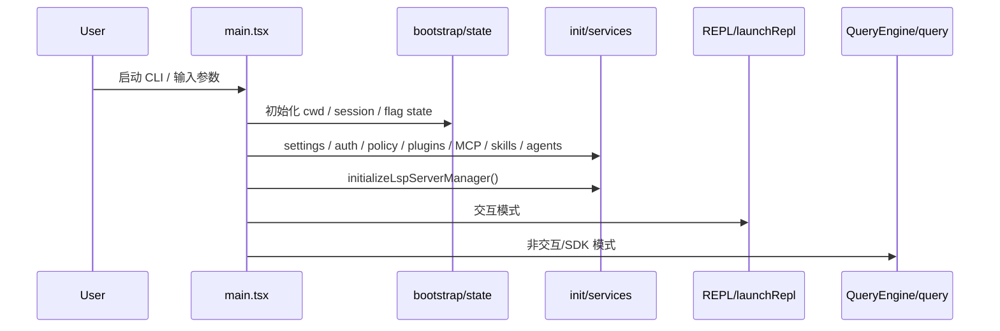
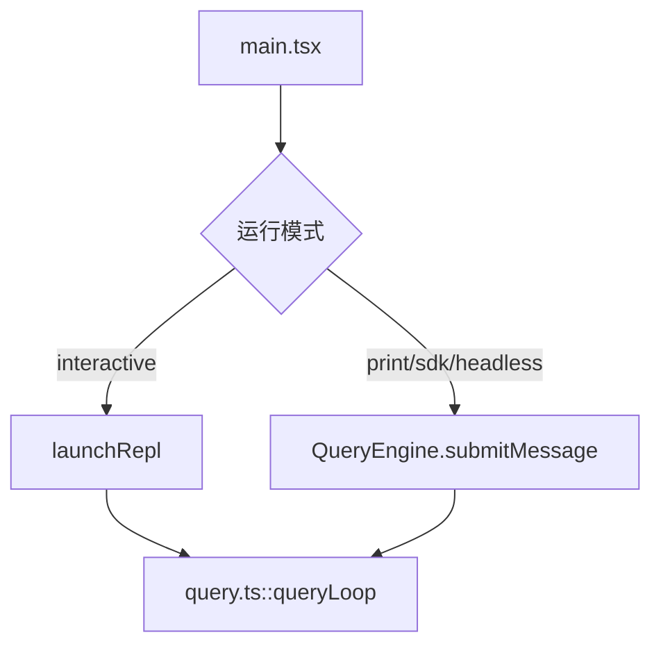
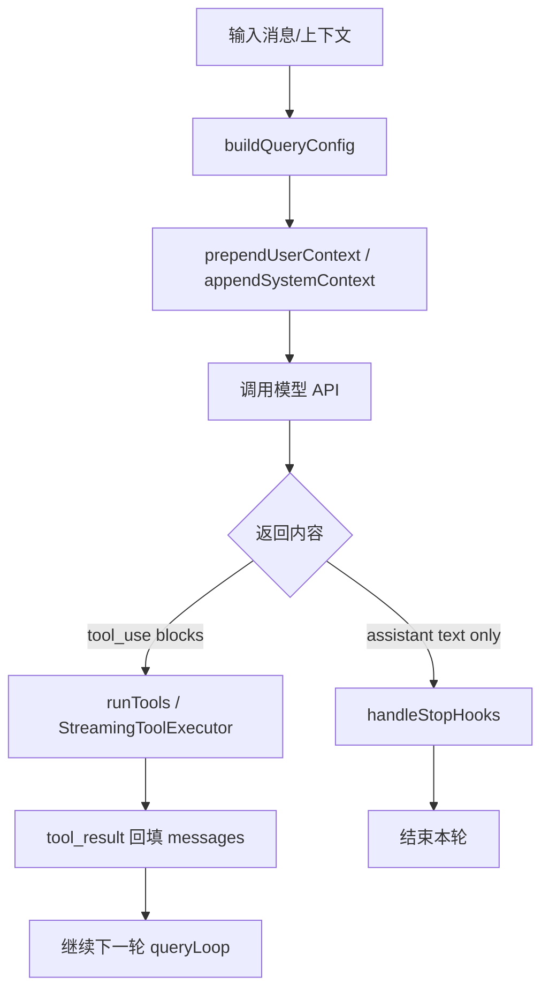
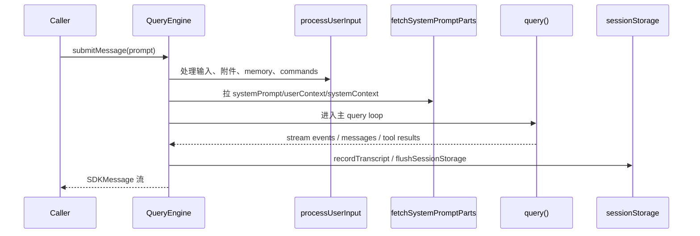
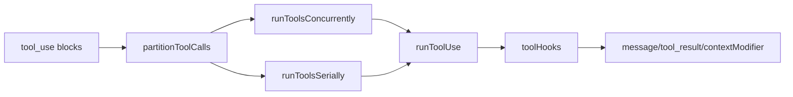
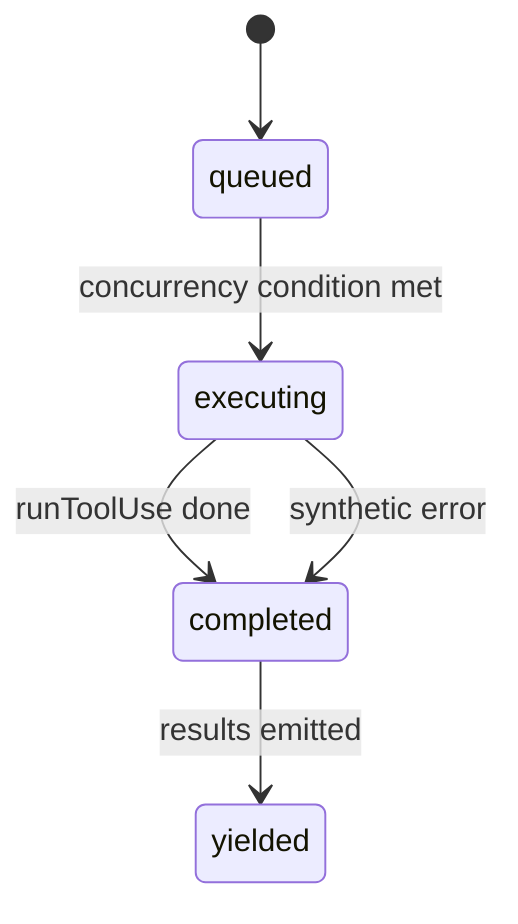
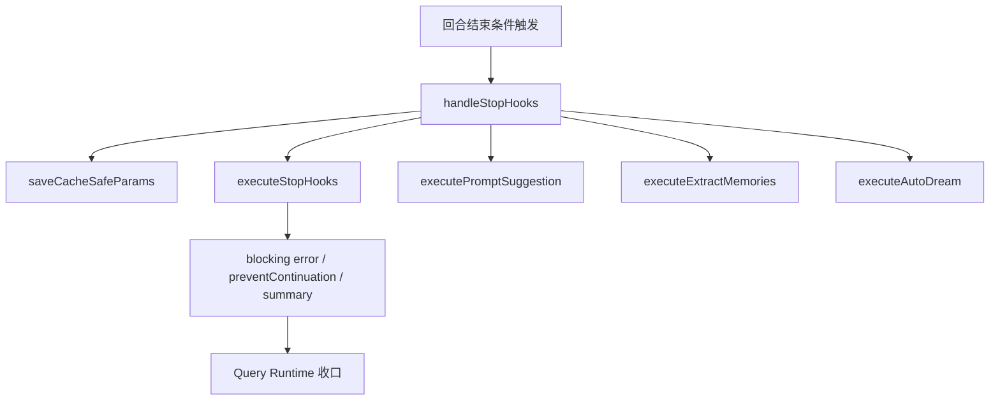
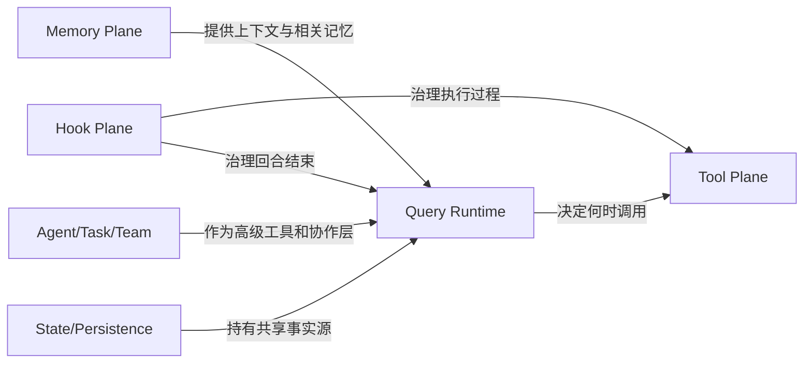

# 02. 运行时主线与控制流

## 2.1 启动路径

`main.tsx` 是整个系统的 composition root。它负责：

- 超早期 side effects（startup profiler、MDM raw read、keychain prefetch）
- 解析 CLI 参数和模式
- 初始化 settings、policy、auth、model、plugins、skills、MCP、LSP、commands、agents
- 进入 REPL、headless、SDK、remote、assistant 等路径

---

## 2.2 REPL 路径与 SDK 路径

### REPL 路径
- 以 `launchRepl()` 为入口
- 带完整 Ink UI、footer、notifications、command mode、task panel
- 对话中的消息、工具进度和系统附件都会投射到可交互界面

### SDK / Headless 路径
- 以 `QueryEngine.submitMessage()` 为入口
- 将完整 query 生命周期封装成可嵌入会话引擎
- 适合 print / SDK / automation 场景

---

## 2.3 Query 主循环

`query.ts` 中的 `query()` / `queryLoop()` 是系统最关键的控制流。

### Query Loop 负责的问题
- 组装 systemPrompt、userContext、systemContext
- 归一化消息历史
- 调用模型
- 接收 assistant/tool_use 流
- 分派工具执行
- 应用 tool_result budget、compact、fallback、stop hook 等机制

---

## 2.4 QueryEngine 的角色

`QueryEngine.ts` 不是另起一套逻辑，而是 headless / SDK 路径对 query runtime 的封装。

### 它维护的状态
- `mutableMessages`
- `readFileState`
- `permissionDenials`
- `totalUsage`
- `discoveredSkillNames`
- `loadedNestedMemoryPaths`

### `submitMessage()` 的作用
- 准备一次会话 turn
- 调 `processUserInput(...)`
- 构建 system prompt parts
- 调 `query(...)`
- 记录 transcript 与 usage
- 产出 SDKMessage 流

---

## 2.5 Tool 执行主线

工具执行由 `services/tools/*` 系列文件承接。

### 关键文件
- `toolOrchestration.ts`
- `StreamingToolExecutor.ts`
- `toolExecution.ts`
- `toolHooks.ts`

### 关键分层
1. **分批**：按并发安全性拆 batch
2. **串行/并行**：并发安全工具可并发，其余必须串行
3. **单工具执行**：真正跑 `runToolUse()`
4. **前后钩子**：PreToolUse / PostToolUse / Failure hooks

---

## 2.6 StreamingToolExecutor 的作用

当 assistant 以流式形式逐步吐出 `tool_use` 时，系统不会等所有内容结束后再执行，而是用 `StreamingToolExecutor` 边接收边调度。

### 它维护的状态
- `queued`
- `executing`
- `completed`
- `yielded`
- sibling error / user interrupted / streaming fallback 等状态

### 关键机制
- 并发安全工具可同时执行
- 非并发安全工具独占执行
- 一旦发生 sibling error，其他并行工具可能被合成错误中断

---

## 2.7 Stop 阶段

`query/stopHooks.ts` 把“回合结束”独立建模成一个正式阶段。

### 主要职责
- 构造 stopHookContext
- 保存 cache-safe params
- 执行 stop hooks
- 执行 prompt suggestion / extract memories / auto-dream / cleanup 等后台逻辑
- 产出 stop summary 和 blocking errors

---

## 2.8 主控制权分布

- **Query Runtime**：拥有主流程推进权
- **Tool Plane**：拥有执行权
- **Hook Plane**：拥有治理权
- **State/Persistence**：持有共享状态，但不直接主导控制流

---

## 2.9 关键结论

1. `main.tsx` 负责装配，不负责核心业务语义
2. `query.ts` / `QueryEngine.ts` 负责会话生命周期和 turn 控制权
3. `services/tools/*` 是独立执行平面，不是 query 的小分支
4. `stopHooks.ts` 使回合结束成为正式生命周期阶段
5. REPL 与 SDK 共享同一套 runtime 核心语义，只是在承载层上不同