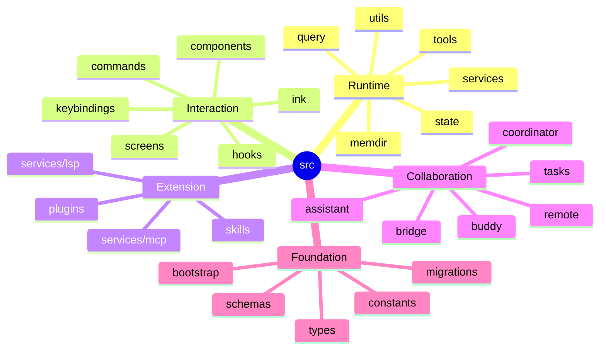
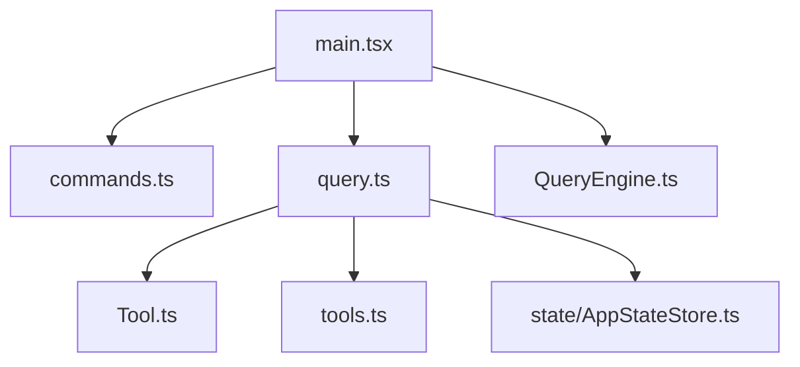
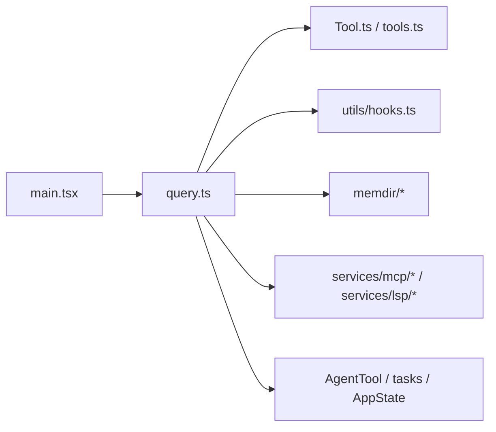

# 03. 目录结构与模块映射

自动计数见：[`generated/directory-counts.md`](generated/directory-counts.md)

## 3.1 顶层目录分组

---

## 3.2 运行时核心目录

### `query/`
- query 主循环辅助逻辑
- stop hooks
- token budget
- deps/config/transitions

### `tools/`
- 系统工具实现总集
- FileRead/FileEdit/Bash/Agent/LSP/MCP/Task/Skill/Notebook 等

### `services/`
- 工具之外的服务层
- API、MCP、LSP、analytics、PromptSuggestion、compact、sessionTranscript 等

### `state/`
- AppState
- store
- selectors
- onChangeAppState

### `utils/`
- 最大的横切基础设施目录
- hooks、messages、attachments、permissions、sessionStorage、settings、model、cwd、git 等

### `memdir/`
- MEMORY.md / auto memory / relevant memories / team memory

---

## 3.3 交互层目录

### `commands/`
命令控制面。项目不是纯自然语言交互，而是保留了大量显式命令入口。

### `components/` / `ink/` / `screens/`
终端 UI 承载层。包括 prompt input、footer、notifications、task panel、dialogs 等。

### `hooks/`
这里主要是 React hooks / UI hooks，不应与 `utils/hooks.ts` 的生命周期 hook 系统混淆。

---

## 3.4 扩展层目录

### `skills/`
- skills 加载、bundled skills、MCP skill builders
- 是 prompt 与工作流封装机制

### `plugins/`
- 插件入口与 bundled plugins
- 和 `utils/plugins/*` 配合完成 plugin lifecycle

### `services/mcp/`
- MCP client、config、auth、headers helper、claudeai integration、connection manager

### `services/lsp/`
- LSP manager、client、server instance、diagnostics

---

## 3.5 协作层目录

### `tasks/`
- 任务模型
- LocalAgentTask / RemoteAgentTask
- task 状态、进度、输出与 lifecycle

### `tools/AgentTool/`
- 子代理入口
- agent prompt / loadAgentsDir / forkSubagent / runAgent / agent memory

### `coordinator/`
- 协调器模式
- team / swarm 相关上层逻辑

### `utils/teammate*` / `tools/Team*Tool` / `tools/SendMessageTool`
- teammate identity
- mailbox
- shared team state
- direct messaging

---

## 3.6 根层关键文件

### `main.tsx`
CLI / REPL 启动总入口

### `query.ts`
主 query loop

### `QueryEngine.ts`
SDK/headless 会话引擎

### `Tool.ts`
Tool 协议定义与 ToolUseContext

### `tools.ts`
工具池装配与过滤

### `commands.ts`
命令装配与技能/插件命令整合

### `Task.ts` / `tasks.ts`
任务抽象与任务出口

---

## 3.7 目录与架构平面的映射

| 架构平面 | 主要目录 / 文件 |
|---|---|
| Entrypoint / Bootstrap | `main.tsx`, `bootstrap/*` |
| Interaction Layer | `commands/*`, `components/*`, `ink/*`, `screens/*`, `replLauncher.tsx` |
| Session / Query Runtime | `query.ts`, `QueryEngine.ts`, `query/*` |
| Tool Execution Plane | `Tool.ts`, `tools.ts`, `tools/*`, `services/tools/*` |
| Lifecycle / Governance Plane | `utils/hooks.ts`, `utils/hooks/*`, `schemas/hooks.ts` |
| Memory / Context Plane | `memdir/*`, `utils/queryContext.ts`, `utils/attachments.ts` |
| Extension Plane | `skills/*`, `plugins/*`, `services/mcp/*`, `services/lsp/*` |
| Collaboration Plane | `tools/AgentTool/*`, `tasks/*`, `coordinator/*`, `utils/teammate*` |
| State / Persistence Plane | `state/*`, `utils/sessionStorage.ts`, `utils/fileStateCache.ts`, `utils/fileHistory.ts` |

---

## 3.8 阅读顺序建议

### 全局理解顺序

### 模块深入顺序
1. `query.ts`
2. `Tool.ts`
3. `tools.ts`
4. `services/tools/*`
5. `utils/hooks.ts`
6. `memdir/*`
7. `services/mcp/*`
8. `services/lsp/*`
9. `tools/AgentTool/*`
10. `state/AppStateStore.ts`

---

## 3.9 关键结论

目录结构高度映射了系统真实架构：

- `query`、`tools`、`services/tools`、`utils/hooks`、`state` 构成运行时核心
- `memdir` 是独立 Memory Plane，不是附属目录
- `services/mcp`、`services/lsp`、`skills`、`plugins` 构成扩展平面
- `AgentTool`、`tasks`、`teammate` 体系构成协作平面
- `commands`、`components`、`ink` 主要构成交互承载层