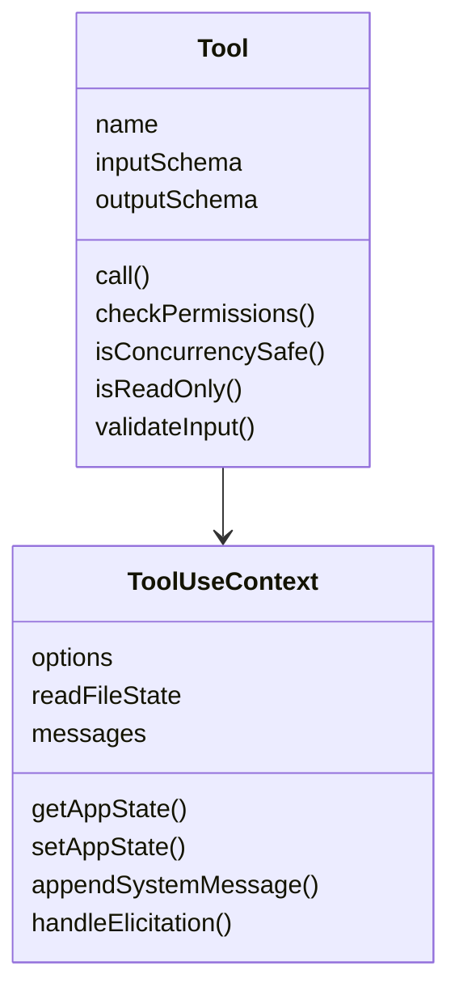
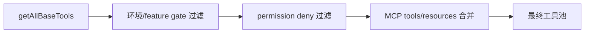
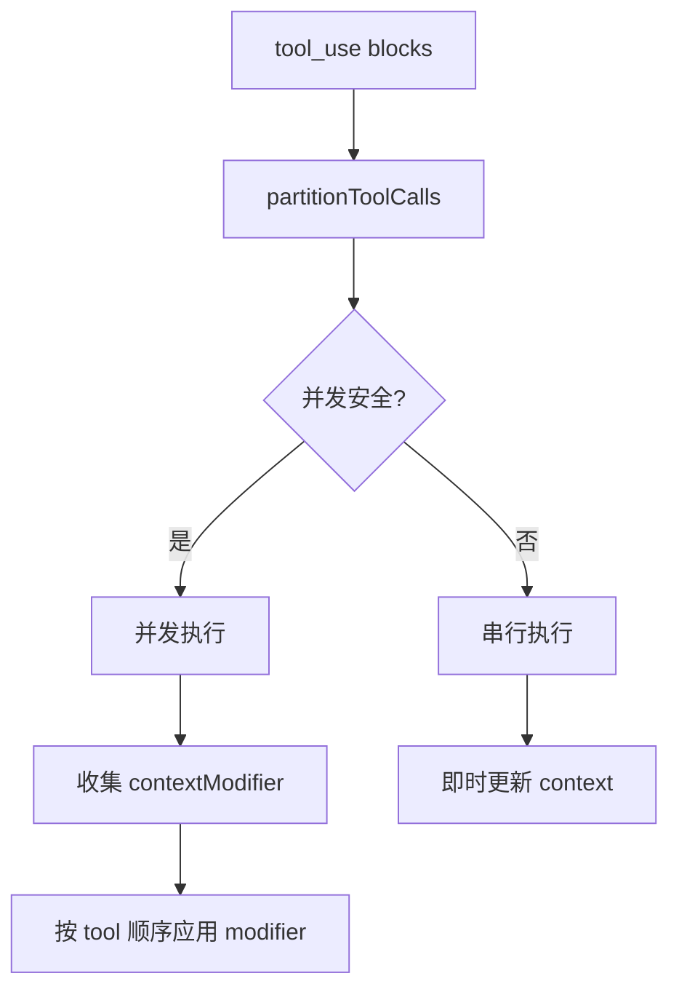
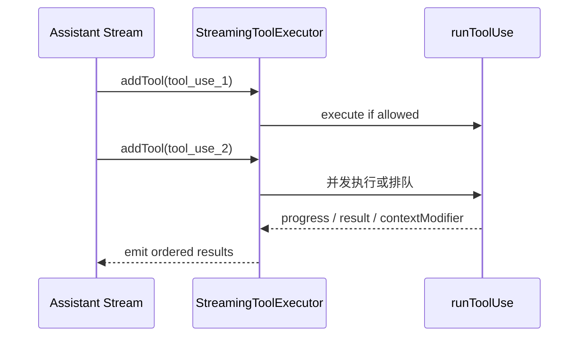
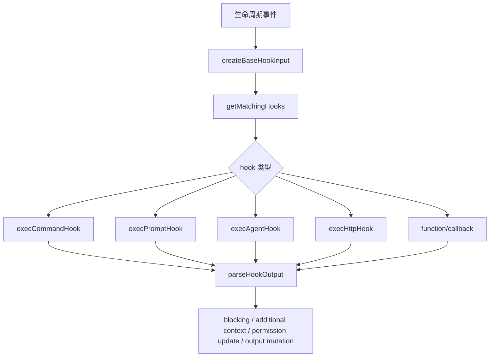
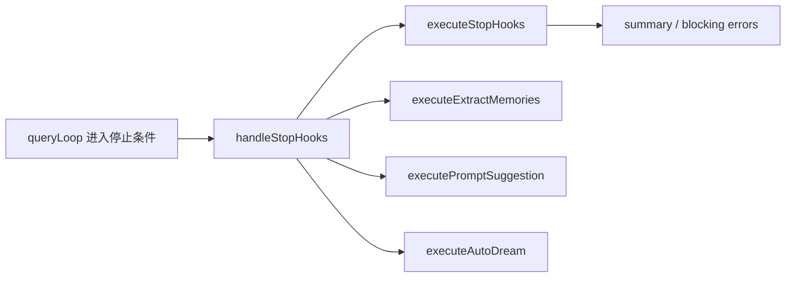
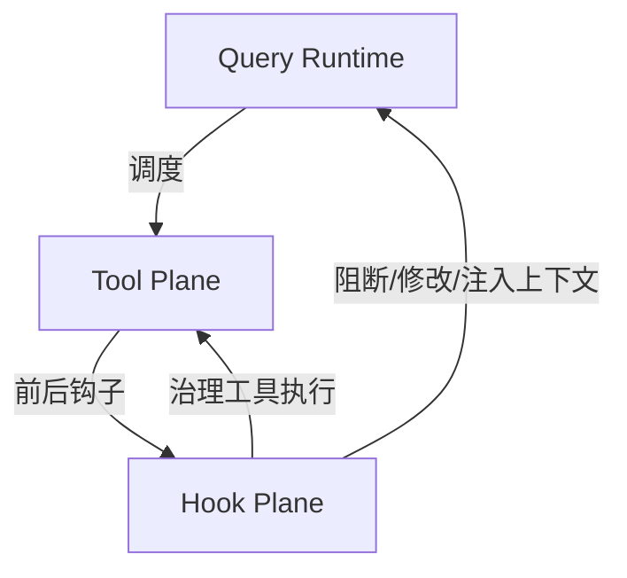

# 04. Query / Tool / Hook 架构

## 4.1 Query Runtime

Query Runtime 由 `query.ts` 与 `QueryEngine.ts` 共同构成。

### `query.ts`
- 面向 REPL 路径
- 包含 `query()` 和 `queryLoop()`
- 管理消息演进、tool_result 回填、compact、fallback、stop hooks

### `QueryEngine.ts`
- 面向 SDK / headless 路径
- 持久化会话状态
- 将 query 生命周期包装成可复用对象

```mermaid
flowchart TD
    A[用户输入/SDK submitMessage] --> B[processUserInput]
    B --> C[fetchSystemPromptParts]
    C --> D[query()/queryLoop()]
    D --> E{assistant or tool_use?}
    E -->|assistant| F[handleStopHooks]
    E -->|tool_use| G[runTools / StreamingToolExecutor]
    G --> H[tool_result]
    H --> D
```

---

## 4.2 Tool 抽象层

`Tool.ts` 是工具系统的协议中心。

### 核心对象
- `Tool`
- `ToolUseContext`
- `ToolPermissionContext`
- `buildTool()`
- `findToolByName()` / `toolMatchesName()`

### `ToolUseContext` 的作用
它把工具接入运行时的所需状态和依赖一次性打包：

- commands / tools / model / mcpClients / agentDefinitions
- `readFileState`
- `getAppState()` / `setAppState()`
- `messages`
- `appendSystemMessage()`
- `handleElicitation()`
- fileHistory / attribution / notifications



---

## 4.3 工具池装配

`tools.ts` 负责系统最终向模型暴露什么工具。

### 关键函数
- `getAllBaseTools()`
- `getToolsForDefaultPreset()`
- `filterToolsByDenyRules()`
- `assembleToolPool()`

### 工具池装配逻辑



### 工具种类
内建工具池中可见的重要类别：
- 文件：Read / Edit / Write / NotebookEdit
- shell：Bash / PowerShell
- 搜索：Glob / Grep / WebSearch / WebFetch / ToolSearch
- 协作：Agent / Task / Team / SendMessage
- 扩展：MCP resource / LSP / Skill
- 运行模式：Plan、Worktree、Cron、Workflow 等

---

## 4.4 Tool 执行平面

### `toolOrchestration.ts`
负责多工具批处理的调度。

#### 核心函数
- `runTools()`
- `partitionToolCalls()`
- `runToolsSerially()`
- `runToolsConcurrently()`

#### 核心策略
- 工具先按 `isConcurrencySafe()` 分批
- 并发安全工具可以并发执行
- 非并发安全工具必须串行执行
- 并发工具产生的 contextModifier 在完成后按顺序应用



---

## 4.5 StreamingToolExecutor

StreamingToolExecutor 处理“模型流式生成工具调用”的情况。

### 关键对象
- `TrackedTool`
- `ToolStatus = queued/executing/completed/yielded`

### 关键行为
- 工具一到达就入队
- 根据并发条件决定何时启动
- 发生 sibling error / user interruption / fallback 时生成 synthetic error
- 结果按接收顺序回流



---

## 4.6 Hook 架构

`utils/hooks.ts` 是生命周期治理层的中枢。

### 支持的 hook 类型
- command hook
- prompt hook
- http hook
- agent hook
- function hook
- callback hook

### 事件范围
从 imports 可以直接看到支持的生命周期事件非常丰富：
- PreToolUse / PostToolUse / PostToolUseFailure
- Stop / StopFailure / SessionStart / SessionEnd / Setup
- SubagentStart / SubagentStop
- TeammateIdle / TaskCreated / TaskCompleted
- PermissionRequest / PermissionDenied
- ConfigChange / FileChanged / InstructionsLoaded / CwdChanged
- Elicitation / ElicitationResult



### 重要点
- hooks 不只是记录器，而是可以改变系统行为
- hooks 承担治理层职责，而不是主流程执行职责
- `ToolUseContext.agentId` / `agentType` 被显式传入 hooks，用于区分主线程与子代理

---

## 4.7 Stop hooks 的位置

`query/stopHooks.ts` 把 Stop 阶段放在 query runtime 和 hook plane 的交界处。

### Stop 阶段不只做 hooks
还做：
- cache-safe params 保存
- extract memories
- prompt suggestion
- auto-dream
- task / teammate 生命周期处理
- computer-use cleanup



---

## 4.8 Query / Tool / Hook 三者关系



### 控制权分布
- Query Runtime：决定何时发起模型调用、何时进入工具执行、何时结束回合
- Tool Plane：决定如何实际执行工具调用
- Hook Plane：决定如何对执行和生命周期施加治理约束

---

## 4.9 关键结论

1. query runtime 拥有主流程推进权
2. tools 是一套独立协议系统，不是 query 里的分支 if/else
3. hook plane 是正式治理层，支持多种事件和多种执行器
4. stop phase 是正式生命周期阶段，不是简单尾部清理
5. streaming tool execution 说明系统设计目标是“实时 agent 体验”，而不是“整段输出完成后再执行工具”