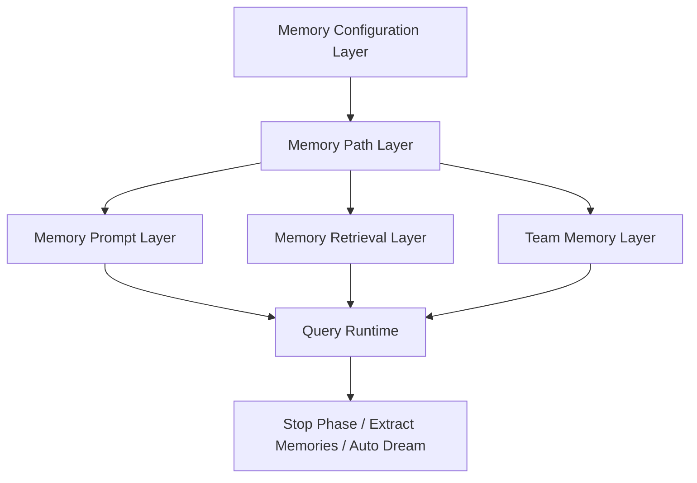
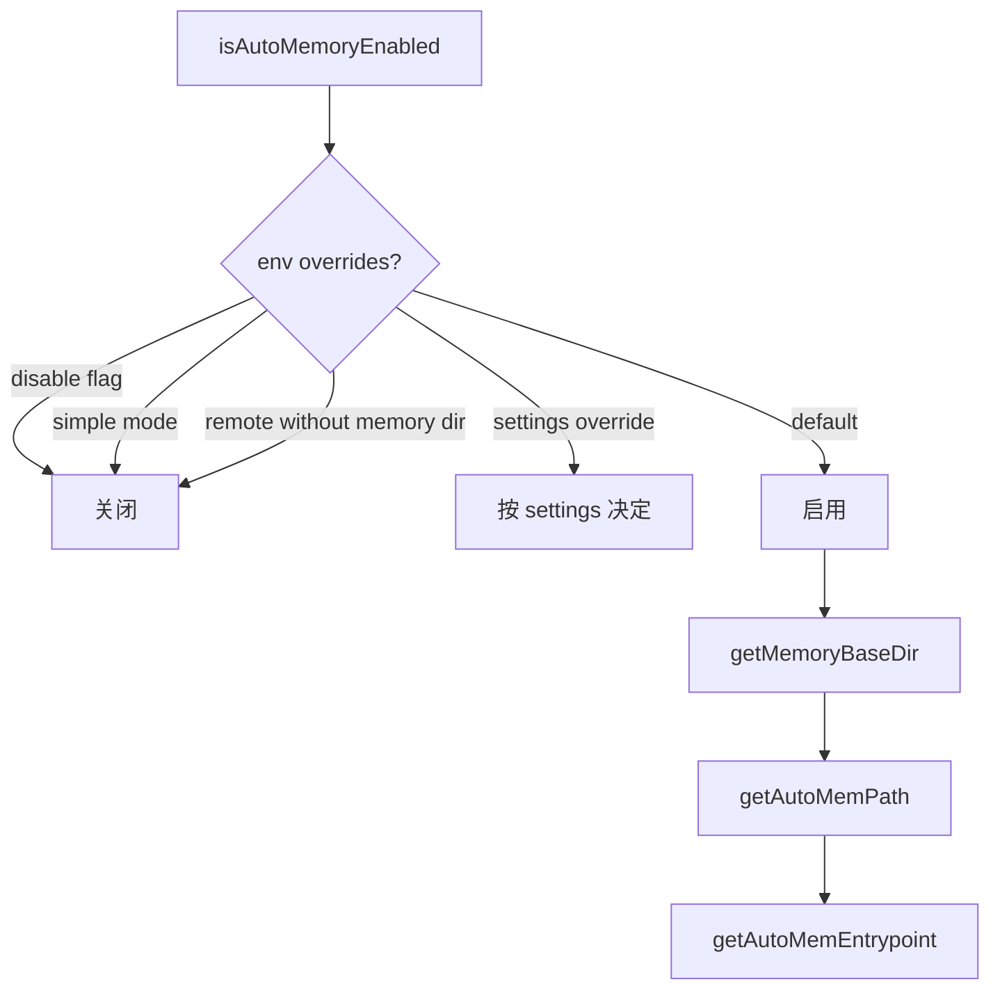
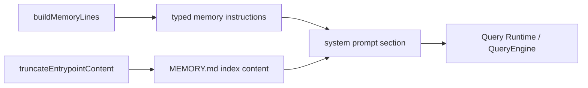
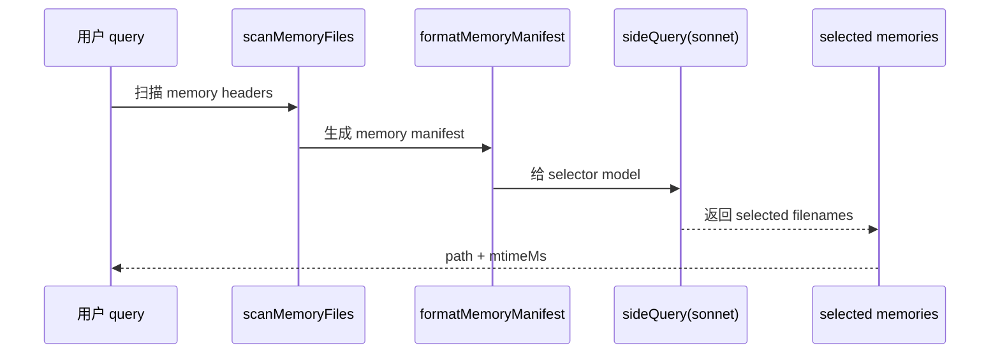
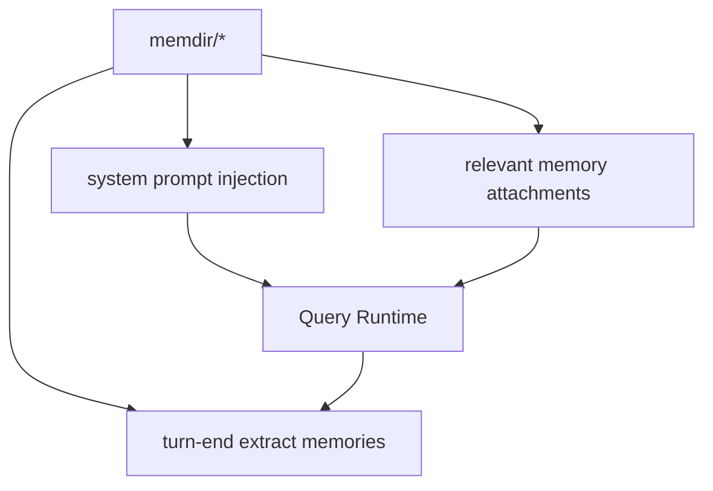
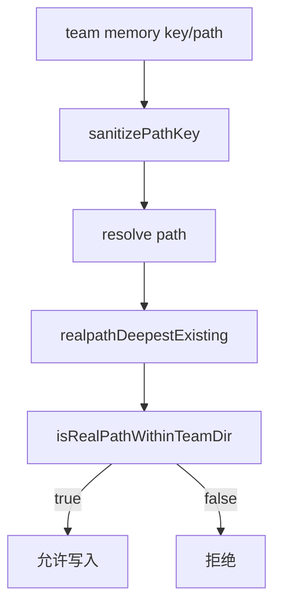
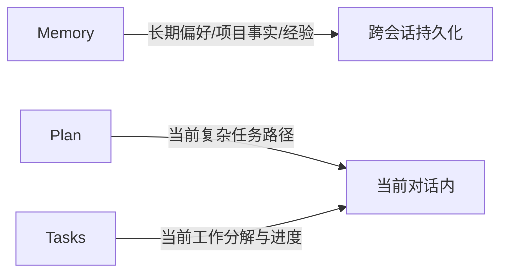
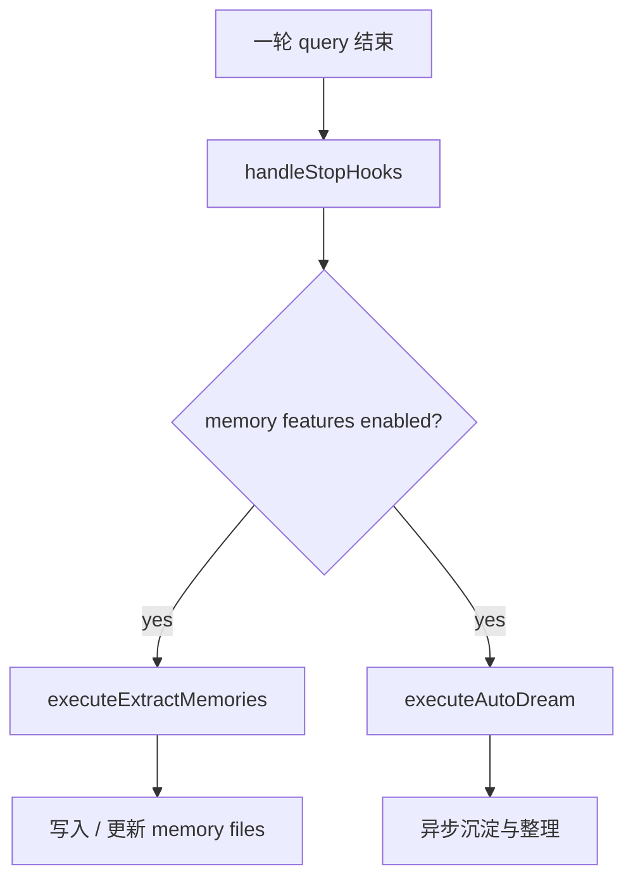

# 05. Memory 架构

Memory 模块是这个仓库最值得单独拆解的部分之一。它不是单一文件，而是一套包含目录约定、系统提示注入、相关记忆检索、团队记忆、安全路径控制和 turn-end 处理的子系统。

---

## 5.1 Memory 子系统分层

### 分层说明
- **Configuration Layer**：auto memory 是否启用、extract mode 是否激活
- **Path Layer**：memory base dir、auto memory dir、team memory dir、安全校验
- **Prompt Layer**：生成 MEMORY.md 体系说明与行为规则
- **Retrieval Layer**：按 query 检索相关记忆
- **Team Memory Layer**：team-specific memory 与路径安全
- **Turn-end Layer**：stop phase 的记忆提炼和自动处理

---

## 5.2 关键文件

### 路径与总入口
- `memdir/memdir.ts`
- `memdir/paths.ts`
- `memdir/teamMemPaths.ts`

### 检索与选择
- `memdir/findRelevantMemories.ts`
- `memdir/memoryScan.ts`
- `memdir/memoryAge.ts`

### 类型与 prompt 片段
- `memdir/memoryTypes.ts`
- `memdir/teamMemPrompts.ts`

### 与 query 的接缝
- `utils/attachments.ts`
- `utils/queryContext.ts`
- `query/stopHooks.ts`

---

## 5.3 启用条件与路径决策

### `paths.ts` 的作用
`paths.ts` 控制：
- auto memory 是否开启
- extract mode 是否激活
- memory base dir 在哪里
- auto memory path / MEMORY.md / daily log path 如何生成

### 关键行为
- 支持环境变量显式开关
- simple / bare mode 下会关闭 memory 系统的多个分支
- 远程模式如果没有持久 memory dir，也会关闭
- 支持 settings 层覆盖 autoMemoryDirectory

---

## 5.4 auto memory 路径体系

`getAutoMemPath()` 的路径决策顺序：

1. 环境变量 override
2. settings.json 中的 trusted sources 覆盖
3. 默认落到 `<memoryBase>/projects/<sanitized-project-root>/memory/`

### 设计意义
- memory 默认按项目隔离
- 同一 git repo/worktree 会落到统一的 canonical 路径
- settings 与 env override 让远程 / cowork / 特殊会话能重定向 memory 存储

---

## 5.5 MEMORY.md Prompt Layer

`memdir/memdir.ts` 中最核心的不是“读文件”，而是“构造 memory 体系的系统提示”。

### 关键能力
- `truncateEntrypointContent()`：裁剪 `MEMORY.md` 入口内容
- `buildMemoryLines()`：构造 memory 行为规范
- `ensureMemoryDirExists()`：确保 memory 目录存在
- `loadMemoryPrompt()` / 相关入口：把 memory prompt 注入到系统提示拼装流程

### Prompt Layer 的职责
它并不直接替代 memory 内容，而是负责告诉模型：
- memory 在哪
- memory 用什么类型组织
- 什么信息该写 / 不该写
- 如何索引 MEMORY.md
- 如何把 memory 与 tasks / plan 区分开

---

## 5.6 相关记忆检索（Relevant Memory Retrieval）

这是 memory 子系统最像“检索层”的部分。

### 关键文件
- `findRelevantMemories.ts`
- `memoryScan.ts`

### 实现方式
1. 扫描 memory 文件头（不是整文件全文）
2. 形成 memory manifest
3. 用 sideQuery 调一个较轻量的模型选择“这次 query 最相关的 0~5 条记忆”
4. 返回 `{ path, mtimeMs }`

### `findRelevantMemories()` 流程

### 关键特征
- MEMORY.md 本身不参与 relevant selection（因为它已作为系统 prompt 入口）
- 会过滤 already surfaced memories，避免同一 turn/多 turn 重复占预算
- 结合 recently-used tools，避免把当前正在使用工具的纯参考说明重复塞进上下文

---

## 5.7 与 Query Runtime 的接缝

Memory 并不是孤立模块，而是通过多个接缝进入 query runtime。

### 接缝 1：System Prompt
通过 `loadMemoryPrompt()` / `fetchSystemPromptParts()`，让模型知道 memory 体系规则。

### 接缝 2：Attachments
`utils/attachments.ts` 中有多处 memory 相关逻辑：
- `filterDuplicateMemoryAttachments`
- nested memory 触发器
- `findRelevantMemories(...)`
- `memoryFreshnessText(...)`

说明 relevant memories 很可能以 attachment / system reminder 的形式进入消息流。

### 接缝 3：Stop Phase
`query/stopHooks.ts` 中：
- extract memories
- auto-dream
- prompt suggestion

说明 turn-end 会触发 memory 更新或后台处理。

---

## 5.8 Team Memory Layer

`teamMemPaths.ts` 说明 memory 不只是个人维度，还有 team 维度。

### 关键能力
- `isTeamMemoryEnabled()`
- `getTeamMemPath()`
- `getTeamMemEntrypoint()`
- `validateTeamMemWritePath()`
- `isRealPathWithinTeamDir()`

### 安全重点
这块实现了非常严格的路径安全控制：
- 拒绝 null byte
- 拒绝 URL-encoded traversal
- 拒绝 unicode normalization traversal
- 拒绝 backslash / absolute path / UNC path
- 对 deepest existing ancestor 做 realpath
- 检测 dangling symlink / symlink loop

### 架构意义
team memory 是一个带安全边界的共享记忆子系统，而不是简单的子目录。

---

## 5.9 Memory 与其他持久化机制的关系

`buildMemoryLines()` 的说明文本里明确区分了：

- **Memory**：跨会话、跨任务长期有效的信息
- **Plan**：当前复杂任务的执行计划
- **Tasks**：当前会话中的执行步骤与进度

这说明 memory 不是通用持久化容器，而是长期知识与协作偏好层。

---

## 5.10 Turn-end 记忆行为

在 `stopHooks.ts` 中可以看到：

- `executeExtractMemories(...)`
- `executeAutoDream(...)`

说明 stop 阶段承担记忆系统的后台维护角色。

### Turn-end 记忆链路

---

## 5.11 Memory 子系统结论

1. memory 是独立平面，不是系统 prompt 的附属文件读取逻辑
2. memory 子系统同时覆盖：路径、提示、检索、注入、team sharing、turn-end maintenance
3. relevant memories 的选择不是简单 grep，而是 header scan + sideQuery 选择
4. team memory 的路径安全是完整设计过的，说明它被视为正式协作能力
5. memory 和 plan/tasks 被明确区分，说明系统对持久化语义有明确分层