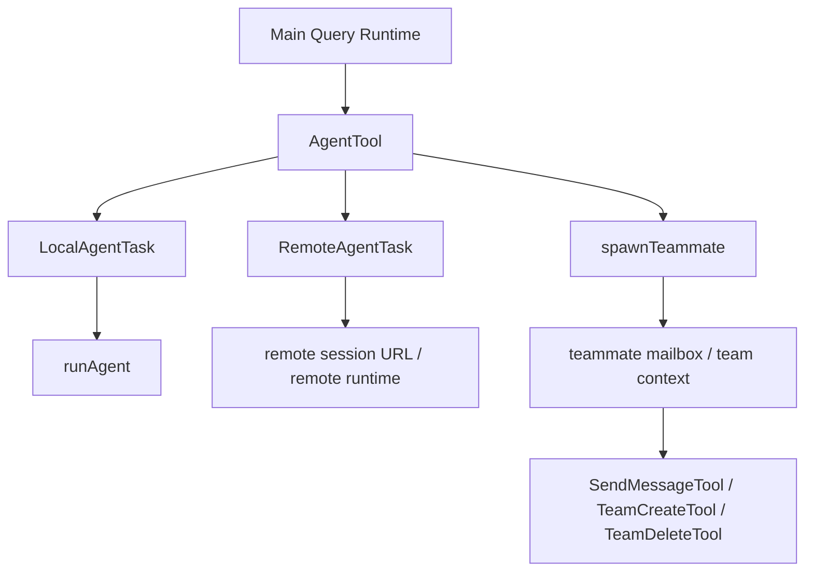
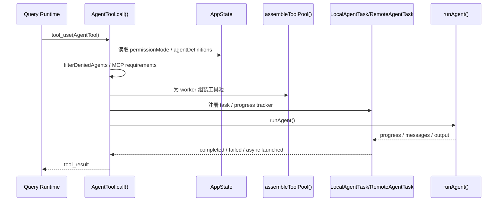
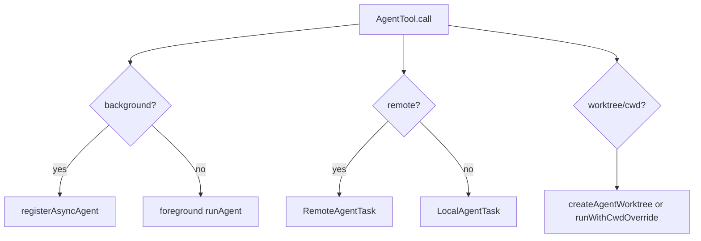
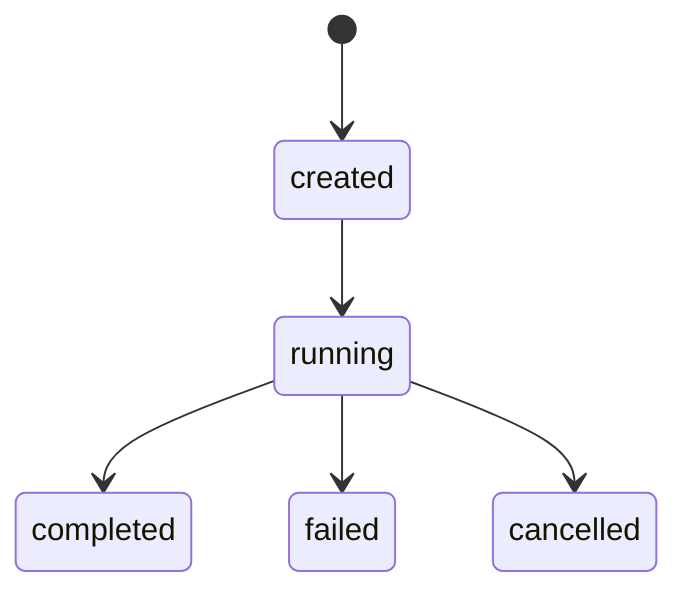
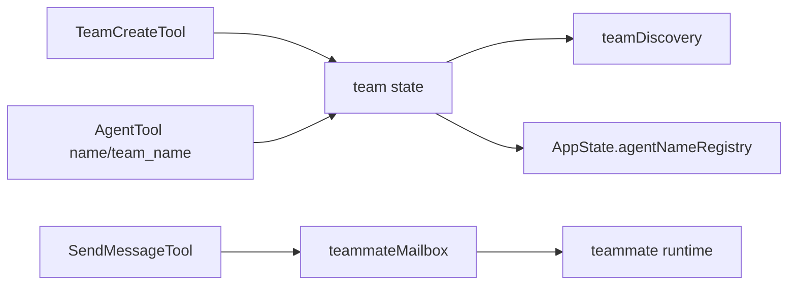
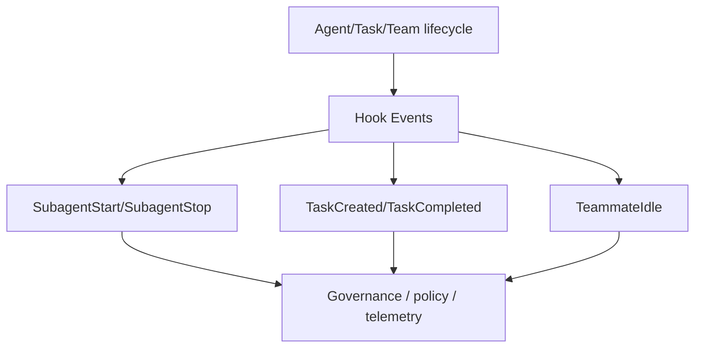

# 06. Agent / Task / Team 架构

## 6.1 Collaboration Plane 总览

这个仓库里的多代理能力不是 prompt 层技巧，而是正式运行时。

---

## 6.2 AgentTool 的职责

`tools/AgentTool/AgentTool.tsx` 是协作平面的核心入口。

### 关键职责
- agent schema 定义
- 选择 agent type / model
- 过滤 deny rules 与 MCP requirements
- 组装 worker 工具池
- 决定前台 / 后台 / 本地 / 远程 / worktree 模式
- task 注册与进度管理
- 启动 `runAgent()`

### 输入 schema 暴露的能力
从文件开头可以直接看到输入层支持：
- `description`
- `prompt`
- `subagent_type`
- `model`
- `run_in_background`
- `name`
- `team_name`
- `mode`
- `isolation`
- `cwd`

这说明 agent 启动不仅仅是“给另一个模型一个 prompt”，而是带完整运行参数。

---

## 6.3 AgentTool 调用链

---

## 6.4 AgentTool 的关键分支

### 分支 1：foreground vs background
- foreground：主线程等待子代理结果
- background：注册异步任务，主线程先返回 `async_launched`

### 分支 2：local vs remote
- local：本地执行 `runAgent()`
- remote：注册 RemoteAgentTask，获得 session URL

### 分支 3：worktree / cwd isolation
- 可创建隔离 worktree
- 也可直接切 cwd 或使用 remote 环境

---

## 6.5 runAgent 与任务执行

虽然本次没有深入展开 `runAgent.ts` 全文，但从 AgentTool 调用和 task imports 可以明确：

- 子代理本质上再次进入 query/runtime
- task 负责承载其生命周期与对外暴露状态
- AgentTool 只负责启动、封装和结果收口

也就是说：

> AgentTool 是协作入口，runAgent 是代理执行器，Task 是生命周期容器。

---

## 6.6 任务系统

### 关键目录/文件
- `tasks/*`
- `tasks/LocalAgentTask/*`
- `tasks/RemoteAgentTask/*`
- `Task.ts`
- `tasks.ts`

### 任务系统职责
- 注册 task
- 记录进度
- 跟踪输出文件
- 管理前台/后台代理
- 完成/失败/取消生命周期

### 从 AppState 可见的任务相关状态
- `tasks: { [taskId]: TaskState }`
- `foregroundedTaskId`
- `viewingAgentTaskId`
- `remoteBackgroundTaskCount`

---

## 6.7 Team / Teammate 架构

团队能力由以下部分组成：

- `tools/TeamCreateTool/*`
- `tools/TeamDeleteTool/*`
- `tools/SendMessageTool/*`
- `utils/teammate.ts`
- `utils/teammateContext.ts`
- `utils/teammateMailbox.ts`
- `utils/teamDiscovery.ts`

### 关键能力
- 创建 / 删除 team
- 命名 agent 并注册到 registry
- 按名字发送消息
- 维护 teammate mailbox
- 在 AppState 中暴露 team / task / teammate 状态

---

## 6.8 In-process teammate 与 viewed teammate

从 AppState 和 imports 可见，系统支持：
- in-process teammate
- foregrounded task
- viewing specific teammate transcript

这意味着团队协作不只是后台任务，还包括：
- 切换查看代理上下文
- 直接与特定 teammate 交互
- 通过 UI 观察 task/teammate 状态

---

## 6.9 协作层与 Hook 层的接缝

`utils/hooks.ts` 中直接导入了：
- `SubagentStartHookInput`
- `SubagentStopHookInput`
- `TeammateIdleHookInput`
- `TaskCreatedHookInput`
- `TaskCompletedHookInput`

这说明协作系统的生命周期被完整接入 hook plane。

---

## 6.10 协作层与 Memory 的接缝

从 `memdir/teamMemPaths.ts`、`memdir/teamMemPrompts.ts` 以及 `utils/attachments.ts` 中的 teammate 相关导入可见：

- team 可以拥有共享记忆空间
- team lead / teammate 之间的上下文并非完全孤立
- relevant memory 和 team state 可以共同参与上下文组装

这使多代理协作不仅共享任务，还共享记忆和上下文机制。

---

## 6.11 协作层结论

1. AgentTool 是正式工具，不是提示技巧
2. Task 是代理生命周期的承载容器
3. Team / mailbox / agent registry 说明系统已支持多代理协作，而不只是单个 subagent
4. 协作层通过 hooks、AppState、memory、UI 多处与其他平面深度耦合
5. foreground/background/local/remote/worktree 几种模式共同构成了一个多形态协作运行时