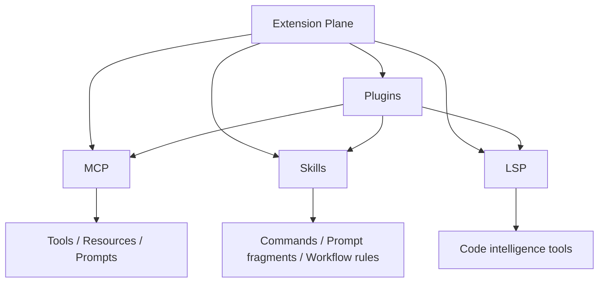
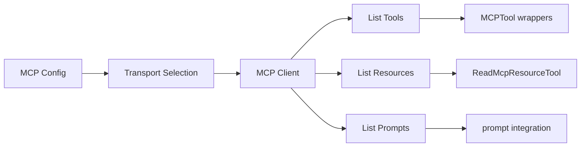
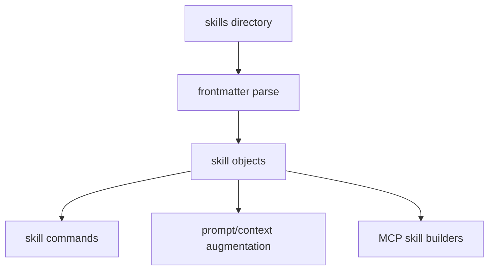
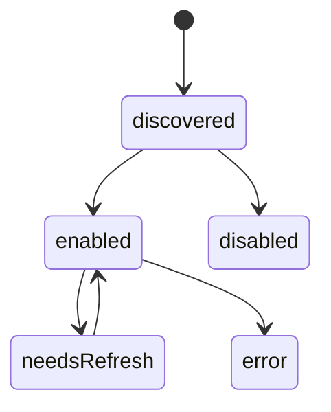
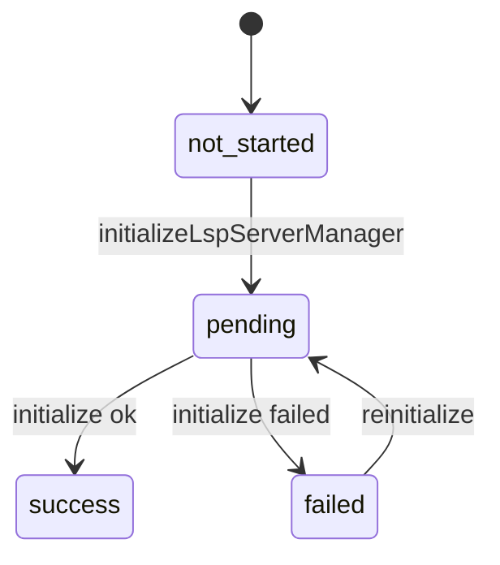
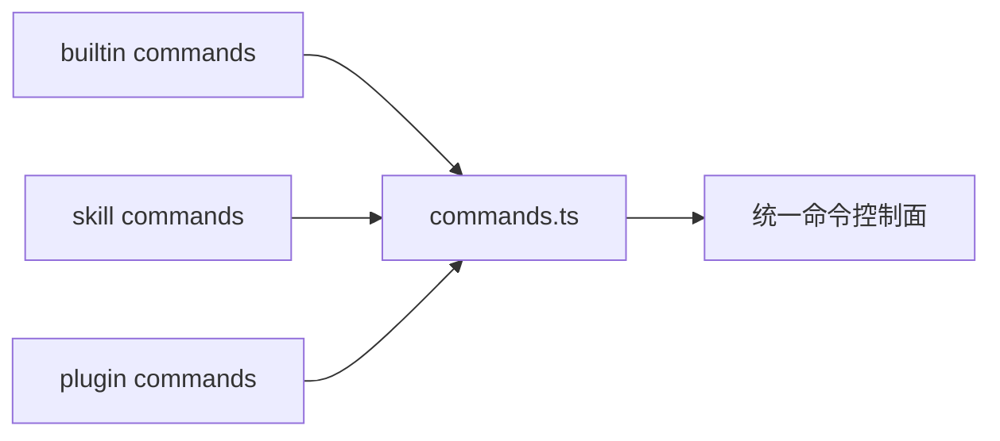
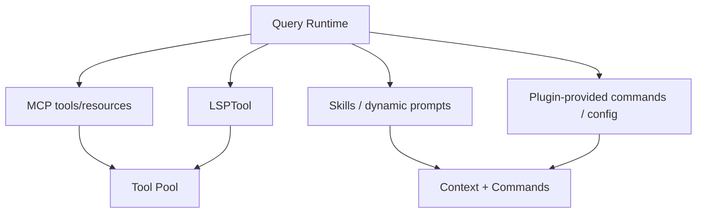

# 07. 扩展架构：MCP / Plugins / Skills / LSP

## 7.1 扩展平面总览

这个仓库的扩展能力不是单一路径，而是多层并存：
- MCP 负责接入外部 server 能力
- plugins 负责打包和加载扩展单元
- skills 负责把工作流/上下文规则注入系统
- LSP 负责提供语义级代码理解能力

---

## 7.2 MCP 子系统

### 关键文件
- `services/mcp/client.ts`
- `services/mcp/config.ts`
- `services/mcp/types.ts`
- `services/mcp/headersHelper.ts`
- `services/mcp/claudeai.ts`
- `tools/MCPTool/*`
- `tools/ListMcpResourcesTool/*`
- `tools/ReadMcpResourceTool/*`

### client.ts 里暴露出的能力特征
从 imports 可以直接看到 MCP 子系统承担：
- stdio / SSE / streamable HTTP / websocket 多 transport
- OAuth / UnauthorizedError / token refresh
- tool/resource/prompt discovery
- elicitation hooks
- content truncation / binary persistence
- proxy / TLS / session ingress auth / session expiration
- MCP tool 包装与 result collapse

### 架构判断
MCP 在这个项目里不是普通外部 adapter，而是正式扩展总线。

---

## 7.3 Skills 子系统

### 关键文件
- `skills/loadSkillsDir.ts`
- `skills/bundled/*`
- `skills/bundledSkills.ts`
- `skills/mcpSkillBuilders.ts`
- `commands.ts`（技能命令整合）

### 能力
- 发现 skills 目录
- 读取 skill frontmatter
- 构建 skill command
- 支持路径触发 / 条件触发
- 与 MCP skills 对接

### 架构判断
skills 是轻量级扩展层，主要作用是把 prompt 资产、工作流和规则变成可加载单元。

---

## 7.4 Plugins 子系统

### 关键文件
- `plugins/*`
- `plugins/bundled/index.ts`
- `utils/plugins/*`
- `utils/plugins/loadPluginCommands.ts`
- `utils/plugins/pluginLoader.ts`

### 插件层职责
- 加载 plugin manifest
- 管理启用/禁用/错误状态
- 合并 plugin commands / plugin skills
- 触发 plugin refresh / reload
- 承载 plugin LSP / MCP / hook 相关能力

### AppState 中的 plugin 状态
从 `AppStateStore.ts` 中可见：
- `enabled`
- `disabled`
- `commands`
- `errors`
- `installationStatus`
- `needsRefresh`

---

## 7.5 LSP 子系统

### 关键文件
- `services/lsp/manager.ts`
- `services/lsp/LSPServerManager.ts`
- `services/lsp/LSPClient.ts`
- `services/lsp/LSPServerInstance.ts`
- `services/lsp/LSPDiagnosticRegistry.ts`
- `tools/LSPTool/LSPTool.ts`
- `utils/plugins/lspPluginIntegration.ts`

### `manager.ts` 暴露的架构特点
- LSP manager 是全局 singleton
- 初始化状态有：`not-started / pending / success / failed`
- 支持 `initializeLspServerManager()` 和 `reinitializeLspServerManager()`
- `isLspConnected()` 为 LSPTool 开关提供依据
- bare mode 下不启用 LSP

### 设计含义
LSP 不是临时工具，而是一个具备：
- manager
- lifecycle
- passive diagnostics
- plugin injection
- reconnect / reinitialize

的独立子系统。

---

## 7.6 Commands 与扩展平面的关系

`commands.ts` 不是单纯内建命令注册器，它也是扩展平面的一部分。

### 作用
- 聚合 built-in commands
- 聚合 skill dir commands
- 聚合 plugin commands
- 按 availability 规则过滤命令
- 暴露统一命令控制面

---

## 7.7 扩展平面与 Query Runtime 的接缝

### 说明
- MCP/LSP 最终进入工具池
- skills/plugins 会同时影响 command layer 和 context layer
- 扩展平面不仅增加能力，还会影响 query 的上下文与控制面

---

## 7.8 扩展架构结论

1. MCP 是最重的扩展总线
2. plugins 是打包与分发层
3. skills 是工作流与上下文规则层
4. LSP 是代码智能子系统
5. commands 是扩展能力对用户暴露的控制面之一
6. 扩展平面通过工具池、命令层和上下文层三条路径影响主运行时