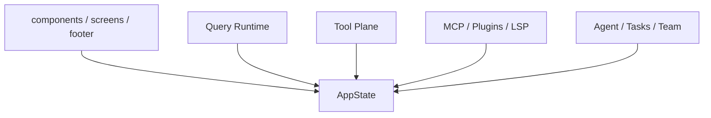
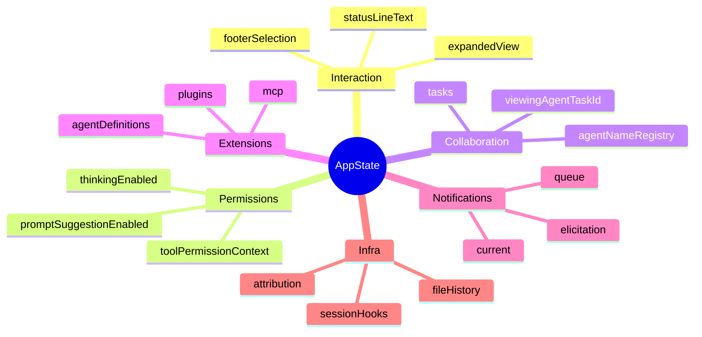
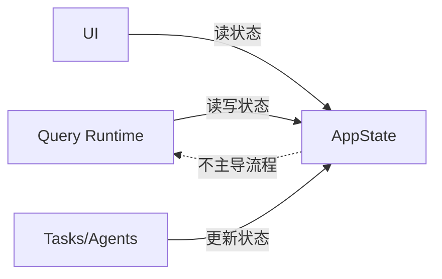
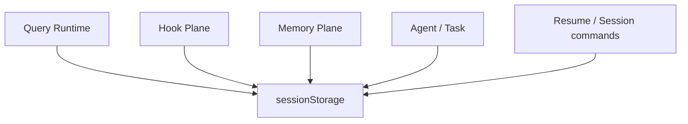
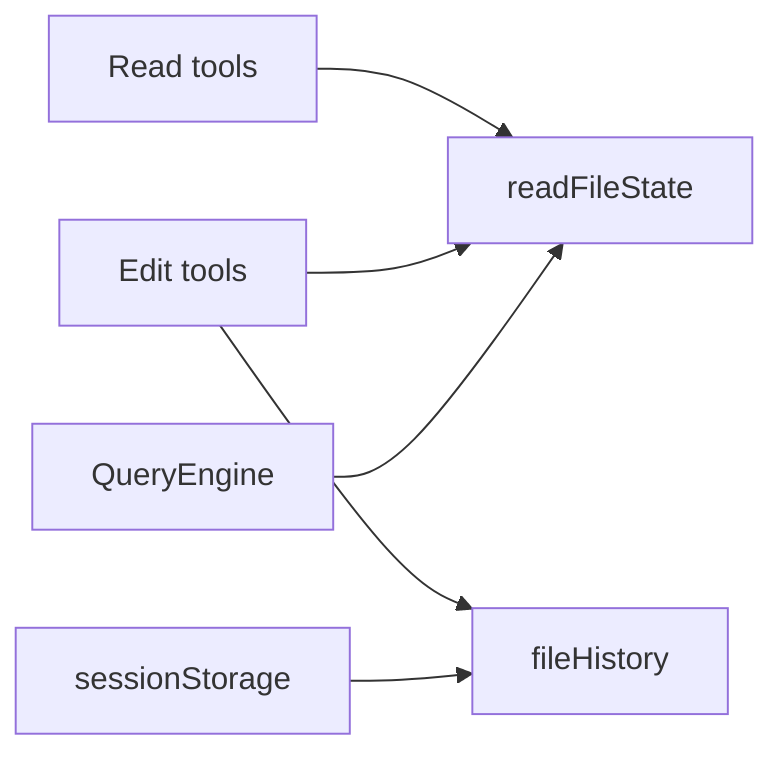
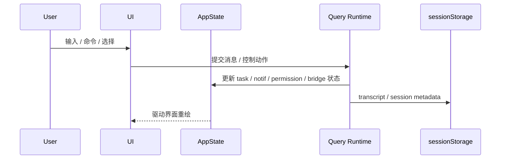

# 08. State / UI / Session 架构

## 8.1 AppState 的位置

`state/AppStateStore.ts` 定义的是整个 REPL / runtime 的共享事实源。

### AppState 的角色
- UI 层状态源
- 任务、通知、插件、MCP、teammate 等横切状态的汇聚点
- tool permission context 所在位置
- prompt suggestion / speculation / bridge / remote 状态载体

---

## 8.2 AppState 的主要分区

从 `AppStateStore.ts` 可以直接把状态分成几个大区。

### 交互与显示
- `expandedView`
- `viewSelectionMode`
- `footerSelection`
- `statusLineText`
- `spinnerTip`

### 权限与模式
- `toolPermissionContext`
- `thinkingEnabled`
- `promptSuggestionEnabled`
- `agent`
- `kairosEnabled`

### 远程与桥接
- `remoteSessionUrl`
- `remoteConnectionStatus`
- `replBridgeEnabled`
- `replBridgeConnected`
- `replBridgeSessionActive`

### 协作与任务
- `tasks`
- `agentNameRegistry`
- `foregroundedTaskId`
- `viewingAgentTaskId`

### 扩展层
- `mcp.clients/tools/resources`
- `plugins.enabled/disabled/errors`
- `agentDefinitions`

### 其他横切状态
- `notifications`
- `elicitation.queue`
- `sessionHooks`
- `fileHistory`
- `attribution`
- `todos`
- `bagel*` / `tungsten*` / `computerUseMcpState`

---

## 8.3 AppState 不是 orchestration runtime

虽然 AppState 很大，但它不直接推进 query 主循环。主循环控制权仍然在：
- `query.ts`
- `QueryEngine.ts`

AppState 更像：
- 共享事实源
- UI 与 runtime 的状态同步层
- 协作/扩展子系统的宿主

---

## 8.4 Session Persistence

虽然本次没有完整展开 `utils/sessionStorage.ts`，但从 `main.tsx`、`QueryEngine.ts`、`hooks.ts`、`queryContext.ts` 等文件的 imports 可以看出，它承担以下职责：

- 记录 transcript
- flush session storage
- 取 sessionId / projectDir / transcript path
- 保存 cache-safe params
- resume / recover / title / agent metadata
- hook transcript path 和 agent transcript path

### Session persistence 与系统的关系

---

## 8.5 UI 层结构

### 关键目录
- `components/*`
- `ink/*`
- `screens/*`
- `hooks/*`
- `replLauncher.tsx`
- `interactiveHelpers.tsx`

### UI 层职责
- prompt input
- footer pills
- task / teammate panels
- notification 与 dialog
- selections / previews / inspectors
- bridge / remote / companion 等附加界面能力

### 架构特点
UI 层明显很重，但其职责是“承载交互”，不是“定义运行时语义”。

---

## 8.6 命令控制面

`commands.ts` 和 `commands/*` 构成系统的显式控制面。

### 命令层作用
- 提供 slash/local command 入口
- 把交互从纯自然语言扩展为显式控制操作
- 把 skills/plugins 的一部分能力变成可调用命令

从 `commands.ts` 的 imports 可以看出，命令覆盖面极广：
- memory / tasks / skills / hooks / permissions
- mcp / plugin / model / session / resume
- review / plan / branch / chrome / voice / buddy / bridge 等

这意味着命令系统是整个产品壳的重要控制面，而不只是 REPL 的辅助功能。

---

## 8.7 readFileState / fileHistory / caches

### `readFileState`
- ToolUseContext 中的重要缓存
- 用于 read-before-edit 保护
- notebook / file edit 都会依赖它

### `fileHistory`
- AppState 的一部分
- 用于文件改动快照与历史追踪

### `cloneFileStateCache` / `fileStateCache`
- 在 QueryEngine 和工具执行路径中用于维持文件读取与编辑一致性

---

## 8.8 Session / UI / State 三者关系

---

## 8.9 关键结论

1. AppState 是共享事实源，但不是主流程控制器
2. sessionStorage 是运行时、hooks、memory、resume 的共同依赖点
3. UI 层很重，但在架构上属于承载层
4. 命令层是系统显式控制面，不是纯交互附属物
5. caches（readFileState / fileHistory 等）是工具正确性和会话一致性的重要支撑