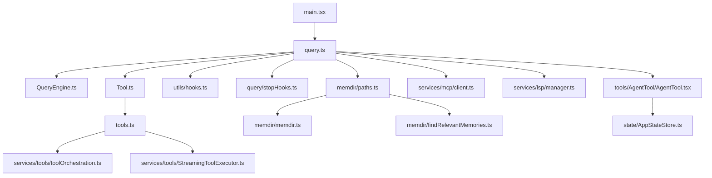

# 09. 文件与函数级阅读指南

本节不是穷举所有源码文件，而是给出最值得优先阅读的文件与函数入口。

参考自动符号索引：[`generated/key-file-symbols.md`](generated/key-file-symbols.md)

---

## 9.1 第一梯队：建立主运行时骨架

### `src/main.tsx`
作用：启动总装配入口。

应重点关注：
- `main`
- 启动期 settings / auth / policy / MCP / plugins / skills / agents 初始化逻辑
- `initializeLspServerManager()` 的调用位置
- 模式分流：interactive / print / SDK / remote

### `src/query.ts`
作用：REPL 路径的 query 主循环。

应重点关注：
- `query()`
- `queryLoop()`
- `yieldMissingToolResultBlocks()`
- `buildQueryConfig()` 调用位置
- `runTools()`、`StreamingToolExecutor`、`handleStopHooks()` 的接缝

### `src/QueryEngine.ts`
作用：SDK/headless 会话引擎。

应重点关注：
- `class QueryEngine`
- `submitMessage()`
- `fetchSystemPromptParts()`、`processUserInput()`、`recordTranscript()` 的接缝
- `readFileState`、`mutableMessages` 等持久状态

---

## 9.2 第二梯队：理解工具平面

### `src/Tool.ts`
作用：定义工具协议和 ToolUseContext。

关注点：
- `ToolUseContext`
- `ToolPermissionContext`
- `getEmptyToolPermissionContext()`
- `buildTool()`
- `findToolByName()` / `toolMatchesName()`

### `src/tools.ts`
作用：工具池装配。

关注点：
- `getAllBaseTools()`
- `getToolsForDefaultPreset()`
- feature gate 对工具池的影响
- deny rule 过滤
- MCP/LSP/Agent/Team 类工具的进入路径

### `src/services/tools/toolOrchestration.ts`
作用：多工具批调度。

关注点：
- `runTools()`
- `partitionToolCalls()`
- `runToolsSerially()`
- `runToolsConcurrently()`

### `src/services/tools/StreamingToolExecutor.ts`
作用：流式工具执行器。

关注点：
- `TrackedTool`
- `addTool()`
- `processQueue()`
- `createSyntheticErrorMessage()`
- `getAbortReason()`

---

## 9.3 第三梯队：理解治理层

### `src/utils/hooks.ts`
作用：生命周期 hook 中枢。

关注点：
- hook imports 覆盖的事件类型
- `getSessionEndHookTimeoutMs()`
- `executeInBackground()`
- hook 匹配、执行、输出解释链路
- hooks 与 ToolUseContext / sessionStorage / appState 的接缝

### `src/query/stopHooks.ts`
作用：Stop 阶段处理器。

关注点：
- `handleStopHooks()`
- `stopHookContext` 的构造
- `saveCacheSafeParams(...)`
- `executeStopHooks(...)`
- `executePromptSuggestion(...)`
- `executeExtractMemories(...)`
- `executeAutoDream(...)`

---

## 9.4 第四梯队：理解 Memory Plane

### `src/memdir/paths.ts`
作用：memory 开关与路径决策。

关注点：
- `isAutoMemoryEnabled()`
- `isExtractModeActive()`
- `getMemoryBaseDir()`
- `getAutoMemPath()`
- `getAutoMemEntrypoint()`
- `getAutoMemDailyLogPath()`

### `src/memdir/memdir.ts`
作用：memory prompt 构造与目录管理。

关注点：
- `truncateEntrypointContent()`
- `buildMemoryLines()`
- `ensureMemoryDirExists()`
- memory prompt 结构与 taxonomy

### `src/memdir/findRelevantMemories.ts`
作用：相关记忆检索。

关注点：
- `findRelevantMemories()`
- `selectRelevantMemories()`
- `SELECT_MEMORIES_SYSTEM_PROMPT`
- `scanMemoryFiles()` / `formatMemoryManifest()` 的接缝

### `src/memdir/teamMemPaths.ts`
作用：team memory 路径安全。

关注点：
- `sanitizePathKey()`
- `realpathDeepestExisting()`
- `isRealPathWithinTeamDir()`
- `validateTeamMemWritePath()`

---

## 9.5 第五梯队：理解扩展平面

### `src/services/mcp/client.ts`
作用：MCP 总客户端。

关注点：
- `McpAuthError`
- `McpToolCallError_*`
- `isMcpSessionExpiredError()`
- transport imports
- elicitation、auth、truncate/persist、headers/proxy/TLS 等链路

### `src/services/lsp/manager.ts`
作用：LSP manager singleton 包装层。

关注点：
- `getLspServerManager()`
- `getInitializationStatus()`
- `isLspConnected()`
- `initializeLspServerManager()`
- `reinitializeLspServerManager()`

### `src/commands.ts`
作用：命令总表装配。

关注点：
- imports 覆盖的命令广度
- `getSkillDirCommands()` / plugin command 整合
- command availability 控制

---

## 9.6 第六梯队：理解协作层

### `src/tools/AgentTool/AgentTool.tsx`
作用：子代理与团队协作入口。

关注点：
- `inputSchema` / `outputSchema`
- `getAutoBackgroundMs()`
- `AgentTool = buildTool({...})`
- `call()`
- `assembleToolPool()`、task、remote、worktree、spawnTeammate 的接缝

### `src/state/AppStateStore.ts`
作用：共享应用状态模型。

关注点：
- `AppState` 的字段分区
- `IDLE_SPECULATION_STATE`
- tasks / mcp / plugins / bridge / remote / teammate / sessionHooks 状态

---

## 9.7 阅读路线图

---

## 9.8 结论

如果只从文件层抓核心：

- `main.tsx` 决定怎么装配系统
- `query.ts` / `QueryEngine.ts` 决定怎么推进一轮 agent 行为
- `Tool.ts` / `tools.ts` / `services/tools/*` 决定工具如何作为正式执行平面工作
- `utils/hooks.ts` / `query/stopHooks.ts` 决定生命周期治理如何接入
- `memdir/*` 决定 memory 体系如何独立成平面
- `services/mcp/*` / `services/lsp/*` 决定扩展如何接入
- `AgentTool.tsx` / `AppStateStore.ts` 决定协作和平面之间的共享状态如何组织