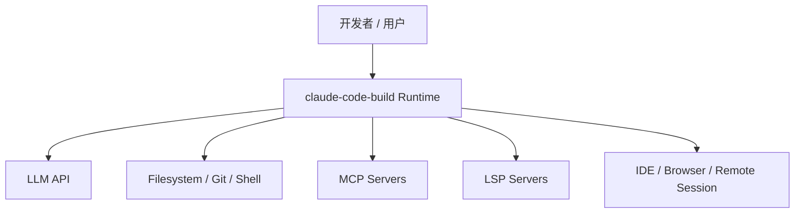
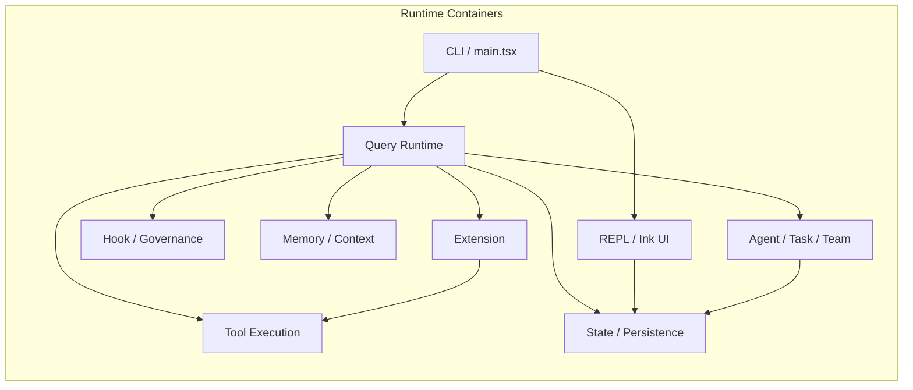
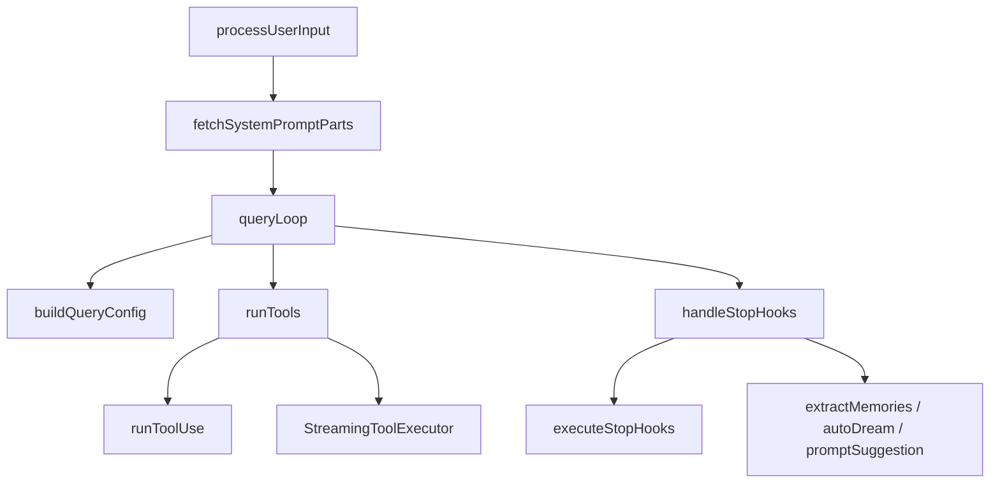
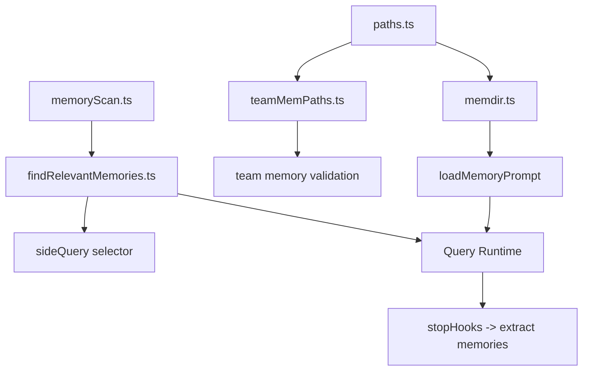
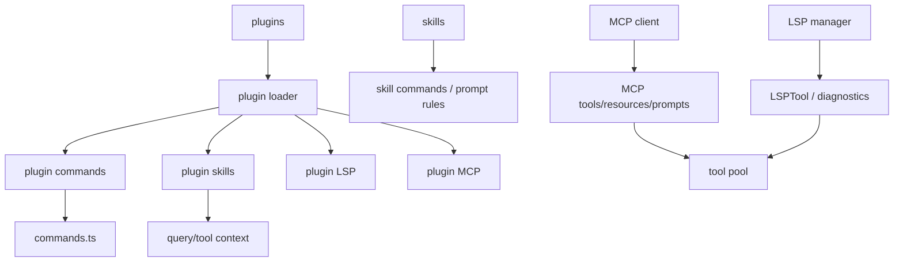
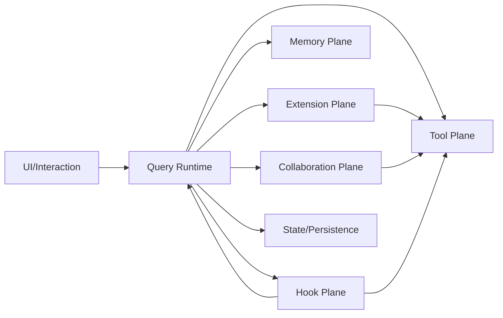
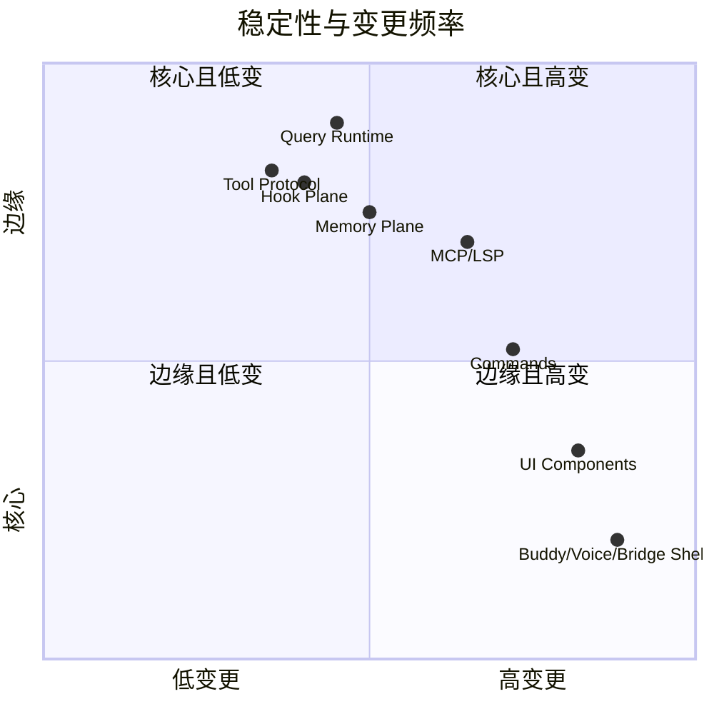

# 10. 依赖视图与 C4 风格视角

## 10.1 Context View

系统位于用户、模型、本地执行环境、外部服务和远程交互渠道之间，起到统一编排层的作用。

---

## 10.2 Container View

---

## 10.3 Component View：Query Runtime

---

## 10.4 Component View：Memory Plane

---

## 10.5 Component View：Extension Plane

---

## 10.6 Dependency Direction

### 依赖方向要点
- UI 不应直接决定业务语义，主要依赖 Runtime
- Runtime 调度 Tool / Hook / Memory / Extension / Collaboration
- State 为共享事实源，被多个平面读写
- Extension 最终多半要落回 Tool Plane 或 Context Layer

---

## 10.7 稳定边界与高变边界

说明：
- Query Runtime、Tool Protocol、Hook Plane 是核心结构
- UI、Buddy、Voice、Bridge 等壳层更偏边缘能力
- MCP/LSP/Skills/Plugins 虽属扩展，但对平台边界影响较大

---

## 10.8 结论

从依赖视角看，这个项目最重要的不是目录多，而是它已经形成较清晰的层次：

- Runtime 作为中心
- Tool / Hook / Memory / Extension / Collaboration 作为主要执行与扩展平面
- UI 与产品壳作为外层承载
- State / Persistence 作为跨平面的共享事实源

这也是它能够容纳 REPL、SDK、MCP、LSP、subagent、team 等多种能力的原因。