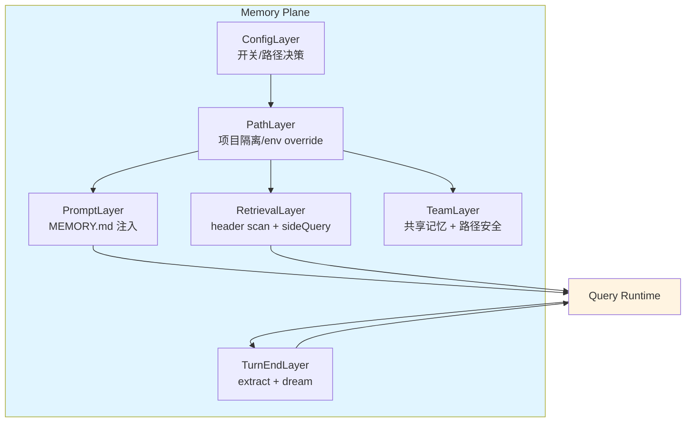
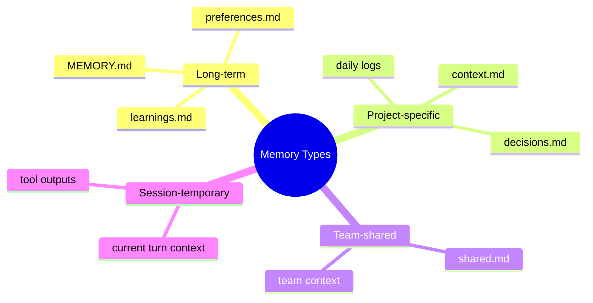
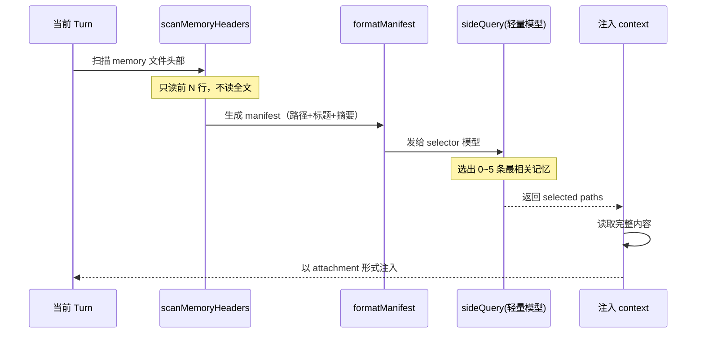
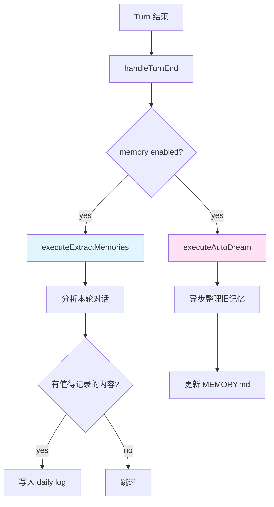

# 11. Memory 模块企业级设计方案

## 1. 背景与需求分析

### 1.1 问题陈述

当前 AI Agent 系统面临的记忆管理挑战：

- **无状态困境**：每次会话都是全新开始，无法记住用户偏好、项目事实、历史决策
- **记忆混淆**：没有区分"会话内临时记忆"和"跨会话长期记忆"
- **全量注入低效**：简单地把所有记忆塞进 prompt，浪费 token 且效果差
- **记忆膨胀**：没有整理机制，记忆会无限增长或丢失关键信息
- **协作缺失**：没有团队共享记忆机制

### 1.2 需求定义

| 需求类别 | 具体需求 | 优先级 |
|---------|---------|--------|
| 会话级记忆 | 当前 turn 内的上下文感知 | P0 |
| 跨会话记忆 | 长期偏好、项目事实、经验沉淀 | P0 |
| 相关记忆检索 | 按需选择相关记忆，不是全量注入 | P0 |
| 记忆整理 | turn-end 自动提炼，定期 dream 整理 | P1 |
| 团队记忆 | 共享记忆 + 路径安全控制 | P2 |
| 项目隔离 | 不同项目的记忆互不干扰 | P1 |

### 1.3 设计目标

1. **独立平面**：Memory 是独立的知识平面，不是系统 prompt 的附属文件读取逻辑
2. **按需检索**：不是全量注入，而是 header scan + sideQuery 选择
3. **自动维护**：turn-end 自动提炼，异步 dream 整理
4. **安全隔离**：项目隔离 + 团队记忆路径安全
5. **可扩展**：支持多种记忆类型（偏好、决策、上下文、经验）

---

## 2. 架构设计

### 2.1 分层架构



### 2.2 层次职责

| 层次 | 职责 | 关键能力 |
|------|------|---------|
| ConfigLayer | 开关控制、模式决策 | `isMemoryEnabled()`, `isExtractModeActive()` |
| PathLayer | 路径管理、项目隔离 | `getMemoryBaseDir()`, `getProjectMemoryPath()` |
| PromptLayer | MEMORY.md 注入 | `buildMemoryPrompt()`, `truncateEntrypoint()` |
| RetrievalLayer | 相关记忆检索 | `findRelevantMemories()`, `scanHeaders()` |
| TeamLayer | 团队记忆管理 | `getTeamMemPath()`, `validateTeamMemWritePath()` |
| TurnEndLayer | 记忆维护 | `executeExtractMemories()`, `executeAutoDream()` |

---

## 3. 存储结构设计

### 3.1 目录结构

```
~/.agent/memory/
├── MEMORY.md                    # 长期记忆入口（全量注入到 system prompt）
├── projects/
│   └── <project-hash>/          # 按项目隔离
│       ├── memory/
│       │   ├── 2026-04-08.md   # 日常记忆日志（按日期）
│       │   ├── decisions.md    # 决策记录
│       │   ├── context.md      # 项目上下文
│       │   └── learnings.md    # 经验教训
│       └── team/               # 团队共享记忆
│           └── shared.md
└── global/
    └── preferences.md          # 全局偏好
```

### 3.2 记忆类型分类



### 3.3 文件格式规范

**MEMORY.md 格式：**

```markdown
# Long-term Memory

## User Preferences
- Coding style: TypeScript with strict mode
- Prefers functional programming patterns
- Uses bun as runtime

## Project Facts
- Main project: AI Agent monorepo
- Tech stack: bun + TypeScript + monorepo
- Key modules: memory, compaction, file-history

## Important Decisions
- 2026-04-08: Decided to use header scan + sideQuery for memory retrieval
- 2026-04-07: Adopted three-phase compaction design

## Learnings
- Memory should be an independent plane, not file reading logic
- Relevant memory selection is better than full injection
```

**Daily Log 格式：**

```markdown
# 2026-04-08

## Conversations
- Discussed GitNexus integration
- Designed memory module architecture

## Decisions
- Memory retrieval uses header scan + sideQuery pattern

## Context Updates
- User wants enterprise-grade design for memory/compaction/fileHistory
```

---

## 4. 核心接口设计

### 4.1 类型定义

```typescript
// packages/memory/src/types.ts

export interface MemoryConfig {
  enabled: boolean;
  extractMode: boolean;
  baseDir: string;
  projectHash: string;
  teamEnabled: boolean;
}

export interface MemoryEntry {
  path: string;
  mtimeMs: number;
  headers: string[];   // 只扫描 header，不读全文
  relevanceScore?: number;
}

export interface MemoryContext {
  entrypoint: string;        // MEMORY.md 内容（截断后）
  relevant: MemoryEntry[];   // sideQuery 选出的相关记忆
  sessionMemory: string[];   // 当前会话内的临时记忆
}

export interface MemoryManifest {
  path: string;
  title: string;
  summary: string;
  lastModified: number;
}
```

### 4.2 配置层接口

```typescript
// packages/memory/src/config.ts

export function isMemoryEnabled(env?: Record<string, string>): boolean {
  // 环境变量优先
  if (env?.AGENT_NO_MEMORY === '1') return false;
  if (env?.AGENT_SIMPLE_MODE === '1') return false;
  
  // settings.json 配置
  const settings = loadSettings();
  if (settings.memory?.enabled !== undefined) {
    return settings.memory.enabled;
  }
  
  // 默认启用
  return true;
}

export function isExtractModeActive(): boolean {
  const settings = loadSettings();
  return settings.memory?.extractMode ?? true;
}

export function getMemoryConfig(): MemoryConfig {
  return {
    enabled: isMemoryEnabled(),
    extractMode: isExtractModeActive(),
    baseDir: getMemoryBaseDir(),
    projectHash: getProjectHash(),
    teamEnabled: isTeamMemoryEnabled()
  };
}
```

### 4.3 路径层接口

```typescript
// packages/memory/src/paths.ts

export function getMemoryBaseDir(): string {
  // 1. 环境变量 override
  if (process.env.AGENT_MEMORY_DIR) {
    return process.env.AGENT_MEMORY_DIR;
  }
  
  // 2. settings.json 配置
  const settings = loadSettings();
  if (settings.memory?.baseDir) {
    return settings.memory.baseDir;
  }
  
  // 3. 默认路径
  return path.join(os.homedir(), '.agent', 'memory');
}

export function getProjectMemoryPath(projectRoot: string): string {
  const baseDir = getMemoryBaseDir();
  const projectHash = hashProjectPath(projectRoot);
  return path.join(baseDir, 'projects', projectHash, 'memory');
}

export function getMemoryEntrypoint(): string {
  const baseDir = getMemoryBaseDir();
  return path.join(baseDir, 'MEMORY.md');
}

export function getDailyLogPath(date: Date = new Date()): string {
  const projectPath = getProjectMemoryPath(process.cwd());
  const dateStr = date.toISOString().split('T')[0];
  return path.join(projectPath, `${dateStr}.md`);
}

export async function ensureMemoryDirExists(): Promise<void> {
  const dirs = [
    getMemoryBaseDir(),
    getProjectMemoryPath(process.cwd()),
    path.join(getMemoryBaseDir(), 'global')
  ];
  
  for (const dir of dirs) {
    await fs.mkdir(dir, { recursive: true });
  }
}
```

---

## 5. 相关记忆检索设计

### 5.1 检索流程



### 5.2 Header Scan 实现

**核心思想：只读文件头部，不读全文，节省 I/O 和 token**

```typescript
// packages/memory/src/retrieval.ts

export async function scanMemoryHeaders(
  memoryDir: string,
  opts: { maxHeaderLines?: number } = {}
): Promise<MemoryManifest[]> {
  const maxLines = opts.maxHeaderLines ?? 20;
  const files = await glob('**/*.md', { cwd: memoryDir });
  
  const manifests: MemoryManifest[] = [];
  
  for (const file of files) {
    const fullPath = path.join(memoryDir, file);
    const content = await readFileLines(fullPath, maxLines);
    
    manifests.push({
      path: fullPath,
      title: extractTitle(content),
      summary: extractSummary(content),
      lastModified: (await fs.stat(fullPath)).mtimeMs
    });
  }
  
  return manifests;
}

async function readFileLines(filePath: string, maxLines: number): Promise<string> {
  const stream = createReadStream(filePath, { encoding: 'utf-8' });
  const lines: string[] = [];
  
  for await (const line of stream) {
    lines.push(line);
    if (lines.length >= maxLines) break;
  }
  
  return lines.join('\n');
}

function extractTitle(content: string): string {
  const match = content.match(/^#\s+(.+)$/m);
  return match?.[1] ?? 'Untitled';
}

function extractSummary(content: string): string {
  // 提取第一段非标题内容作为摘要
  const lines = content.split('\n').filter(l => !l.startsWith('#') && l.trim());
  return lines.slice(0, 3).join(' ').slice(0, 200);
}
```

### 5.3 SideQuery 选择器

```typescript
// packages/memory/src/selector.ts

const SELECT_MEMORIES_SYSTEM_PROMPT = `You are a memory selector. Given a user query and a list of memory files, select the 0-5 most relevant memories.

Output format (JSON):
{
  "selected": ["path1", "path2"],
  "reasoning": "why these memories are relevant"
}

Rules:
- Select 0-5 memories (not more)
- Prioritize recent and directly relevant memories
- If no memories are relevant, return empty array
`;

export async function selectRelevantMemories(
  query: string,
  manifests: MemoryManifest[],
  alreadySurfaced: Set<string>,
  opts: { maxResults?: number; model?: string } = {}
): Promise<string[]> {
  // 过滤已展示过的
  const candidates = manifests.filter(m => !alreadySurfaced.has(m.path));
  
  if (candidates.length === 0) return [];
  
  // 格式化 manifest
  const manifestText = formatMemoryManifest(candidates);
  
  // 调用轻量模型选择
  const response = await sideQuery({
    system: SELECT_MEMORIES_SYSTEM_PROMPT,
    user: `Query: ${query}\n\nAvailable memories:\n${manifestText}`,
    model: opts.model ?? 'fast-model',
    maxTokens: 256
  });
  
  const result = JSON.parse(response);
  return result.selected.slice(0, opts.maxResults ?? 5);
}

function formatMemoryManifest(manifests: MemoryManifest[]): string {
  return manifests.map((m, i) => 
    `[${i}] ${m.title}\n` +
    `    Path: ${m.path}\n` +
    `    Summary: ${m.summary}\n` +
    `    Modified: ${new Date(m.lastModified).toISOString()}`
  ).join('\n\n');
}
```

### 5.4 完整检索接口

```typescript
// packages/memory/src/retrieval.ts

export async function findRelevantMemories(
  query: string,
  memoryDir: string,
  alreadySurfaced: Set<string>,
  opts: { maxResults?: number } = {}
): Promise<MemoryEntry[]> {
  // 1. 扫描 header（不读全文，省 token）
  const manifests = await scanMemoryHeaders(memoryDir);
  
  // 2. 用轻量模型选择相关记忆
  const selectedPaths = await selectRelevantMemories(
    query,
    manifests,
    alreadySurfaced,
    opts
  );
  
  // 3. 读取完整内容
  const entries: MemoryEntry[] = [];
  for (const path of selectedPaths) {
    const content = await fs.readFile(path, 'utf-8');
    const stat = await fs.stat(path);
    entries.push({
      path,
      mtimeMs: stat.mtimeMs,
      headers: content.split('\n').filter(l => l.startsWith('#'))
    });
  }
  
  return entries;
}
```

---

## 6. Turn-end 记忆整理

### 6.1 整理流程



### 6.2 Extract Memories 实现

```typescript
// packages/memory/src/turn-end.ts

const EXTRACT_MEMORIES_PROMPT = `Analyze this conversation turn and extract information worth remembering long-term.

Extract:
- User preferences or habits
- Important decisions made
- Project context updates
- Learnings or insights

Output format (JSON):
{
  "hasContent": true/false,
  "preferences": ["..."],
  "decisions": ["..."],
  "context": ["..."],
  "learnings": ["..."]
}

If nothing worth remembering, return hasContent: false.
`;

export async function executeExtractMemories(
  messages: Message[],
  memoryDir: string
): Promise<void> {
  // 分析本轮对话，提炼值得记录的内容
  const extracted = await sideQuery({
    system: EXTRACT_MEMORIES_PROMPT,
    user: formatMessagesForExtraction(messages),
    model: 'fast-model',
    maxTokens: 512
  });
  
  const result = JSON.parse(extracted);
  
  if (!result.hasContent) return;
  
  // 写入 daily log
  const dailyLog = getDailyLogPath();
  const timestamp = new Date().toISOString();
  const content = formatExtractedMemories(result, timestamp);
  
  await appendToFile(dailyLog, content);
}

function formatMessagesForExtraction(messages: Message[]): string {
  return messages
    .filter(m => m.role === 'user' || m.role === 'assistant')
    .map(m => `${m.role}: ${m.content}`)
    .join('\n\n');
}

function formatExtractedMemories(result: any, timestamp: string): string {
  let content = `\n## ${timestamp}\n\n`;
  
  if (result.preferences?.length) {
    content += `### Preferences\n${result.preferences.map(p => `- ${p}`).join('\n')}\n\n`;
  }
  
  if (result.decisions?.length) {
    content += `### Decisions\n${result.decisions.map(d => `- ${d}`).join('\n')}\n\n`;
  }
  
  if (result.context?.length) {
    content += `### Context\n${result.context.map(c => `- ${c}`).join('\n')}\n\n`;
  }
  
  if (result.learnings?.length) {
    content += `### Learnings\n${result.learnings.map(l => `- ${l}`).join('\n')}\n\n`;
  }
  
  return content;
}
```

### 6.3 Auto Dream 实现

**核心思想：异步整理，不阻塞主流程**

```typescript
// packages/memory/src/dream.ts

const DREAM_DISTILL_PROMPT = `You are a memory curator. Review these daily logs and distill them into long-term memory.

Extract:
- Persistent user preferences
- Important project facts
- Key decisions with lasting impact
- Valuable learnings

Output format (markdown):
# Updated Long-term Memory

## User Preferences
...

## Project Facts
...

## Important Decisions
...

## Learnings
...
`;

export async function executeAutoDream(
  memoryDir: string
): Promise<void> {
  // 异步整理：把 daily logs 沉淀到 MEMORY.md
  // 在后台运行，不阻塞主流程
  setImmediate(async () => {
    try {
      const recentLogs = await getRecentDailyLogs(memoryDir, 7);
      
      if (recentLogs.length === 0) return;
      
      const distilled = await sideQuery({
        system: DREAM_DISTILL_PROMPT,
        user: recentLogs.join('\n\n---\n\n'),
        model: 'smart-model',
        maxTokens: 2048
      });
      
      await updateMemoryEntrypoint(distilled);
      
      // 清理已整理的 daily logs（可选）
      // await archiveProcessedLogs(recentLogs);
    } catch (error) {
      console.error('Auto dream failed:', error);
    }
  });
}

async function getRecentDailyLogs(
  memoryDir: string,
  days: number
): Promise<string[]> {
  const logs: string[] = [];
  const now = new Date();
  
  for (let i = 0; i < days; i++) {
    const date = new Date(now);
    date.setDate(date.getDate() - i);
    const logPath = getDailyLogPath(date);
    
    if (await fileExists(logPath)) {
      const content = await fs.readFile(logPath, 'utf-8');
      logs.push(content);
    }
  }
  
  return logs;
}

async function updateMemoryEntrypoint(content: string): Promise<void> {
  const entrypoint = getMemoryEntrypoint();
  await fs.writeFile(entrypoint, content, 'utf-8');
}
```

---

## 7. 团队记忆设计

### 7.1 路径安全控制

**核心：防止路径遍历攻击**

```typescript
// packages/memory/src/team.ts

export function sanitizePathKey(key: string): string {
  // 拒绝危险字符
  if (key.includes('\0')) throw new Error('Null byte in path');
  if (key.includes('%')) throw new Error('URL encoding in path');
  if (key.includes('\\')) throw new Error('Backslash in path');
  if (path.isAbsolute(key)) throw new Error('Absolute path not allowed');
  
  // 规范化
  return path.normalize(key).replace(/\.\./g, '');
}

export async function validateTeamMemWritePath(
  key: string,
  teamDir: string
): Promise<string> {
  const sanitized = sanitizePathKey(key);
  const fullPath = path.join(teamDir, sanitized);
  
  // 检查是否在 team dir 内
  const realTeamDir = await fs.realpath(teamDir);
  const realPath = await realpathDeepestExisting(fullPath);
  
  if (!realPath.startsWith(realTeamDir)) {
    throw new Error('Path traversal detected');
  }
  
  return fullPath;
}

async function realpathDeepestExisting(p: string): Promise<string> {
  let current = p;
  
  while (current !== path.dirname(current)) {
    try {
      return await fs.realpath(current);
    } catch {
      current = path.dirname(current);
    }
  }
  
  return current;
}
```

### 7.2 团队记忆接口

```typescript
// packages/memory/src/team.ts

export async function writeTeamMemory(
  key: string,
  content: string,
  teamDir: string
): Promise<void> {
  const safePath = await validateTeamMemWritePath(key, teamDir);
  await fs.mkdir(path.dirname(safePath), { recursive: true });
  await fs.writeFile(safePath, content, 'utf-8');
}

export async function readTeamMemory(
  key: string,
  teamDir: string
): Promise<string | null> {
  const safePath = await validateTeamMemWritePath(key, teamDir);
  
  try {
    return await fs.readFile(safePath, 'utf-8');
  } catch {
    return null;
  }
}
```

---

## 8. 集成示例

### 8.1 Query Loop 集成

```typescript
// packages/agent-core/src/query/loop.ts

import { 
  findRelevantMemories, 
  executeExtractMemories,
  executeAutoDream 
} from '@your-org/memory';

export async function* queryLoop(ctx: QueryContext) {
  // 1. Turn 开始：注入记忆
  const memories = await findRelevantMemories(
    ctx.userInput,
    ctx.memoryDir,
    ctx.surfacedMemories
  );
  
  ctx.systemContext.push(...formatMemoriesAsContext(memories));
  
  // 标记已展示的记忆
  memories.forEach(m => ctx.surfacedMemories.add(m.path));

  // 2. 主循环
  while (true) {
    const response = await callModel(ctx);
    
    if (response.type === 'assistant') {
      // Turn 结束：提炼记忆
      await executeExtractMemories(ctx.messages, ctx.memoryDir);
      executeAutoDream(ctx.memoryDir); // 异步，不等待
      
      yield { type: 'done', response };
      break;
    } else {
      yield* runTools(response.tools, ctx);
    }
  }
}
```

---

## 9. 性能优化

### 9.1 Header Scan 优化

- 只读前 N 行，不读全文
- 使用流式读取，避免大文件内存占用
- 并发扫描多个文件

### 9.2 SideQuery 优化

- 使用轻量模型（fast-model）
- 限制 maxTokens（256 足够）
- 缓存 manifest，避免重复扫描

### 9.3 Dream 优化

- 异步执行，不阻塞主流程
- 限制处理频率（每天一次）
- 批量处理多天日志

---

## 10. 监控与调试

### 10.1 日志记录

```typescript
export function logMemoryEvent(event: {
  type: 'scan' | 'select' | 'extract' | 'dream';
  duration: number;
  details: any;
}): void {
  console.log(`[Memory] ${event.type} took ${event.duration}ms`, event.details);
}
```

### 10.2 指标收集

- 记忆文件数量
- Header scan 耗时
- SideQuery 选择准确率
- Extract 触发频率
- Dream 整理频率

---

## 11. 总结

### 11.1 核心设计原则

1. **独立平面**：Memory 是独立的知识平面，不是文件读取逻辑
2. **按需检索**：Header scan + sideQuery，不是全量注入
3. **自动维护**：Turn-end extract + 异步 dream
4. **安全隔离**：项目隔离 + 团队记忆路径安全

### 11.2 关键机制

| 机制 | 作用 | 实现方式 |
|------|------|---------|
| Header Scan | 快速扫描记忆文件 | 只读前 N 行，不读全文 |
| SideQuery | 选择相关记忆 | 轻量模型 + manifest |
| Extract | Turn-end 提炼 | 分析对话，写入 daily log |
| Dream | 异步整理 | 沉淀到 MEMORY.md |
| Team Memory | 共享记忆 | 路径安全控制 |

### 11.3 下一步

- 实现 Memory 包的核心接口
- 集成到 Query Loop
- 添加监控和调试工具
- 编写单元测试和集成测试
