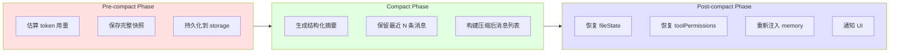
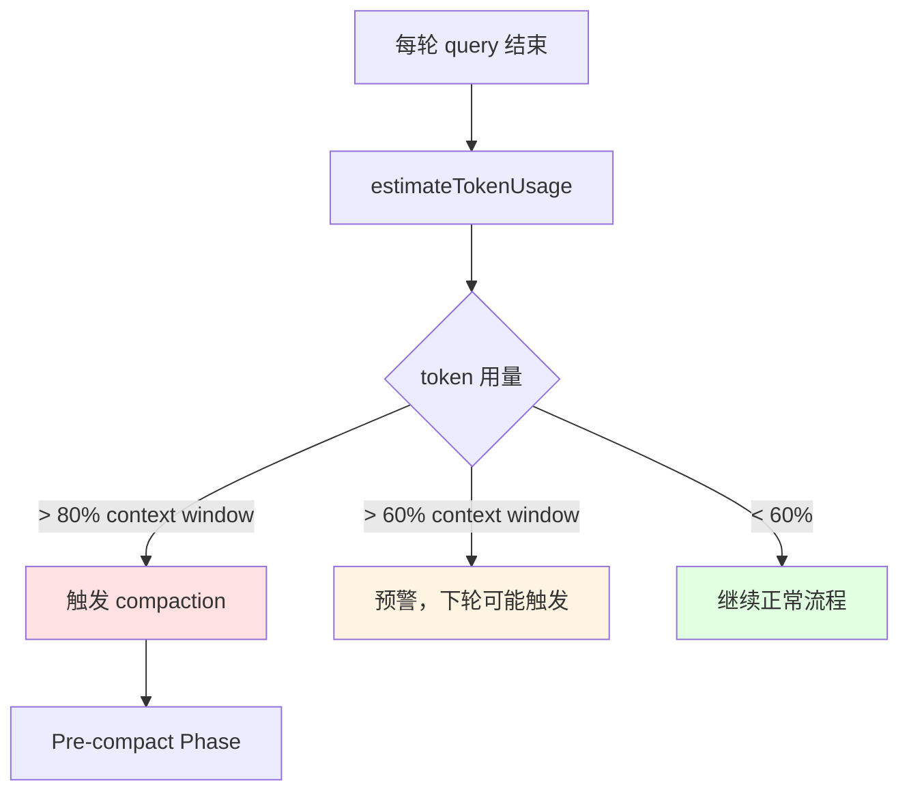
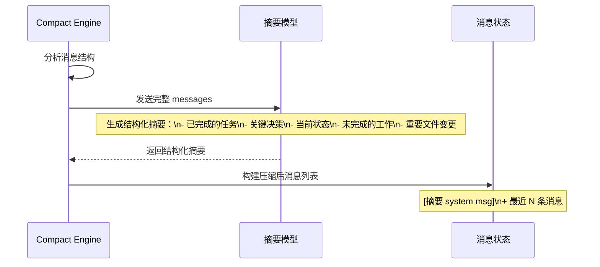
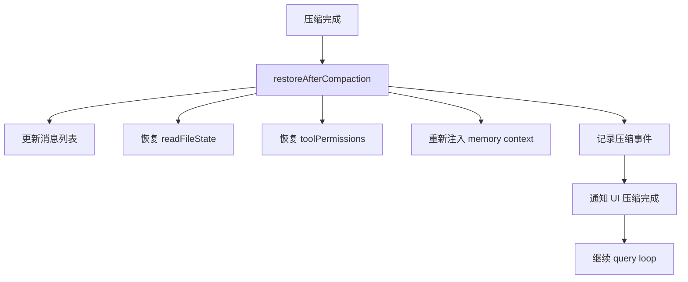
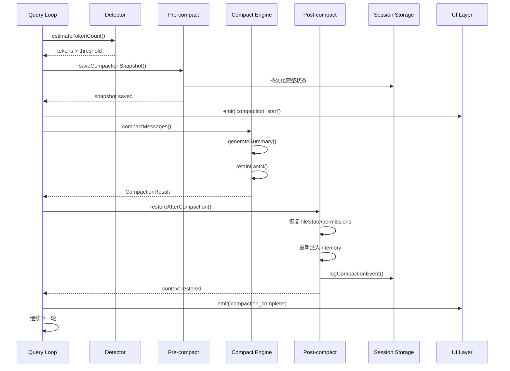
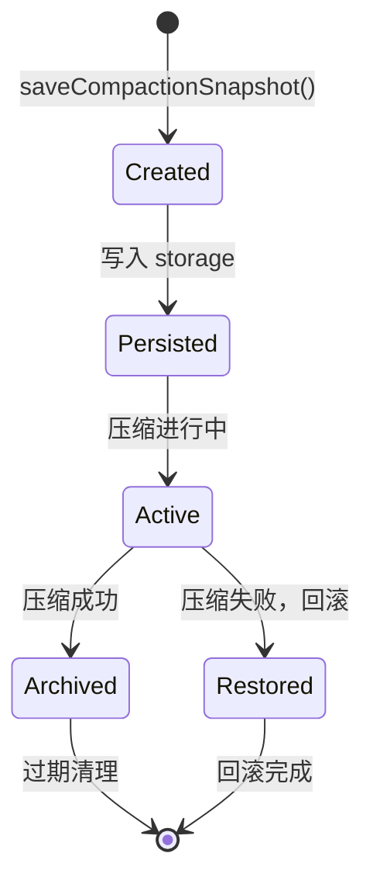

# 12. Compaction 模块企业级设计方案

## 1. 背景与需求分析

### 1.1 问题陈述

AI Agent 在长对话场景下面临的上下文管理挑战：

- **Context 溢出**：长对话超出模型 context window，导致报错或截断
- **简单截断的代价**：直接丢弃旧消息会丢失关键上下文（文件状态、决策历史、工具结果）
- **状态不一致**：压缩后 readFileState、toolPermissions 等状态可能丢失，导致 read-before-edit 保护失效
- **无法恢复**：没有压缩前快照，无法在出错时回滚

### 1.2 需求定义

| 需求类别 | 具体需求 | 优先级 |
|---------|---------|--------|
| 触发检测 | 准确估算 token 用量，在合适时机触发压缩 | P0 |
| 状态保存 | 压缩前保存完整状态快照 | P0 |
| 摘要生成 | 生成结构化摘要，保留关键信息 | P0 |
| 上下文恢复 | 压缩后恢复必要上下文，无缝继续 | P0 |
| 可观测性 | 记录压缩事件，支持调试 | P1 |
| 手动触发 | 支持用户或系统手动触发压缩 | P2 |

### 1.3 设计目标

1. **三阶段正式流程**：Pre-compact → Compact → Post-compact，每阶段职责清晰
2. **状态完整性**：压缩前后状态一致，不丢失关键上下文
3. **无缝继续**：压缩对用户透明，对话可以无缝继续
4. **可恢复**：快照持久化，支持出错时回滚

---

## 2. 架构设计

### 2.1 三阶段流程



### 2.2 触发条件



---

## 3. 核心数据结构

```typescript
// packages/compaction/src/types.ts

export interface CompactionSnapshot {
  sessionId: string;
  timestamp: number;
  messages: Message[];
  fileHistory: FileHistorySnapshot;
  readFileState: ReadFileState;
  toolPermissions: ToolPermissionContext;
  memoryContext: MemoryContext;
  tokenCount: number;
  reason: 'auto' | 'manual' | 'threshold';
}

export interface CompactionResult {
  summary: string;
  retainedMessages: Message[];
  compressedTokenCount: number;
  originalTokenCount: number;
  compressionRatio: number;
}

export interface CompactionOptions {
  summaryModel?: string;
  summaryMaxTokens?: number;
  retainLastN?: number;
  threshold?: number;  // 触发阈值，默认 0.8
}

export interface CompactionEvent {
  sessionId: string;
  timestamp: number;
  originalTokens: number;
  compressedTokens: number;
  compressionRatio: number;
  duration: number;
}
```

---

## 4. Pre-compact Phase 设计

### 4.1 职责

- 估算当前 token 用量
- 保存完整状态快照（messages、fileHistory、readFileState、toolPermissions）
- 持久化快照到 session storage

### 4.2 Token 估算

```typescript
// packages/compaction/src/detector.ts

export function estimateTokenCount(messages: Message[]): number {
  // 简单估算：4 chars ≈ 1 token
  const totalChars = messages.reduce((sum, msg) => {
    const content = typeof msg.content === 'string'
      ? msg.content
      : JSON.stringify(msg.content);
    return sum + content.length;
  }, 0);
  
  return Math.ceil(totalChars / 4);
}

export function shouldCompact(
  messages: Message[],
  contextWindow: number,
  threshold = 0.8
): boolean {
  const tokenCount = estimateTokenCount(messages);
  return tokenCount > contextWindow * threshold;
}

export function getCompactionUrgency(
  messages: Message[],
  contextWindow: number
): 'none' | 'warning' | 'urgent' {
  const ratio = estimateTokenCount(messages) / contextWindow;
  if (ratio > 0.8) return 'urgent';
  if (ratio > 0.6) return 'warning';
  return 'none';
}
```

### 4.3 快照保存

```typescript
// packages/compaction/src/pre-compact.ts

export async function saveCompactionSnapshot(
  ctx: QueryContext,
  reason: CompactionSnapshot['reason'] = 'auto'
): Promise<CompactionSnapshot> {
  const snapshot: CompactionSnapshot = {
    sessionId: ctx.sessionId,
    timestamp: Date.now(),
    messages: deepClone(ctx.messages),
    fileHistory: cloneFileHistory(ctx.fileHistory),
    readFileState: deepClone(ctx.readFileState),
    toolPermissions: deepClone(ctx.toolPermissions),
    memoryContext: deepClone(ctx.memoryContext),
    tokenCount: estimateTokenCount(ctx.messages),
    reason
  };
  
  // 持久化到 session storage
  await persistSnapshot(snapshot);
  
  return snapshot;
}

async function persistSnapshot(snapshot: CompactionSnapshot): Promise<void> {
  const snapshotPath = getSnapshotPath(snapshot.sessionId, snapshot.timestamp);
  await fs.mkdir(path.dirname(snapshotPath), { recursive: true });
  await fs.writeFile(snapshotPath, JSON.stringify(snapshot), 'utf-8');
}

function getSnapshotPath(sessionId: string, timestamp: number): string {
  return path.join(
    os.homedir(),
    '.agent',
    'sessions',
    sessionId,
    `snapshot-${timestamp}.json`
  );
}
```

---

## 5. Compact Phase 设计

### 5.1 摘要生成策略



### 5.2 摘要 Prompt 设计

```typescript
// packages/compaction/src/compact.ts

const COMPACTION_SUMMARY_PROMPT = `You are summarizing a conversation between a user and an AI agent.

Create a structured summary that preserves:
1. **Completed tasks**: What has been accomplished
2. **Key decisions**: Important choices made and their rationale
3. **Current state**: What files were modified, what tools were used
4. **Pending work**: What still needs to be done
5. **Important context**: Critical information for continuing the work

Format:
## Conversation Summary

### Completed Tasks
- ...

### Key Decisions
- ...

### Current State
- Files modified: ...
- Tools used: ...

### Pending Work
- ...

### Important Context
- ...

Be concise but complete. The agent must be able to continue work seamlessly from this summary.
`;
```

### 5.3 压缩实现

```typescript
// packages/compaction/src/compact.ts

export async function compactMessages(
  messages: Message[],
  opts: CompactionOptions = {}
): Promise<CompactionResult> {
  const {
    summaryModel = 'smart-model',
    summaryMaxTokens = 2048,
    retainLastN = 10
  } = opts;
  
  const originalTokenCount = estimateTokenCount(messages);
  
  // 1. 生成摘要
  const summary = await generateSummary(messages, {
    model: summaryModel,
    maxTokens: summaryMaxTokens,
    systemPrompt: COMPACTION_SUMMARY_PROMPT
  });
  
  // 2. 保留最近 N 条消息（保持对话连贯性）
  const retained = messages.slice(-retainLastN);
  
  // 3. 构建压缩后的消息列表
  const compacted: Message[] = [
    {
      role: 'system',
      content: `[Conversation Summary - Compacted at ${new Date().toISOString()}]\n\n${summary}`
    },
    ...retained
  ];
  
  const compressedTokenCount = estimateTokenCount(compacted);
  
  return {
    summary,
    retainedMessages: compacted,
    compressedTokenCount,
    originalTokenCount,
    compressionRatio: compressedTokenCount / originalTokenCount
  };
}

async function generateSummary(
  messages: Message[],
  opts: { model: string; maxTokens: number; systemPrompt: string }
): Promise<string> {
  const userContent = messages
    .filter(m => m.role === 'user' || m.role === 'assistant')
    .map(m => `${m.role.toUpperCase()}: ${
      typeof m.content === 'string' ? m.content : JSON.stringify(m.content)
    }`)
    .join('\n\n');
  
  return await callModel({
    model: opts.model,
    system: opts.systemPrompt,
    user: `Please summarize this conversation:\n\n${userContent}`,
    maxTokens: opts.maxTokens
  });
}
```

---

## 6. Post-compact Phase 设计

### 6.1 上下文恢复



### 6.2 恢复实现

```typescript
// packages/compaction/src/post-compact.ts

export async function restoreAfterCompaction(
  snapshot: CompactionSnapshot,
  compacted: CompactionResult,
  ctx: QueryContext
): Promise<void> {
  // 1. 更新消息列表
  ctx.messages = compacted.retainedMessages;
  
  // 2. 恢复文件状态（read-before-edit 保护不能丢）
  ctx.readFileState = snapshot.readFileState;
  
  // 3. 恢复工具权限
  ctx.toolPermissions = snapshot.toolPermissions;
  
  // 4. 恢复 fileHistory（快照信息）
  ctx.fileHistory = snapshot.fileHistory;
  
  // 5. 重新注入 memory context
  await reinjectMemoryContext(ctx, snapshot.memoryContext);
  
  // 6. 记录压缩事件
  await logCompactionEvent({
    sessionId: ctx.sessionId,
    timestamp: Date.now(),
    originalTokens: snapshot.tokenCount,
    compressedTokens: compacted.compressedTokenCount,
    compressionRatio: compacted.compressionRatio,
    duration: Date.now() - snapshot.timestamp
  });
  
  // 7. 通知 UI
  ctx.emitEvent({ type: 'compaction_complete', result: compacted });
}

async function reinjectMemoryContext(
  ctx: QueryContext,
  memoryContext: MemoryContext
): Promise<void> {
  // 重新注入 MEMORY.md 内容
  if (memoryContext.entrypoint) {
    ctx.systemContext.push({
      type: 'memory',
      content: memoryContext.entrypoint
    });
  }
  
  // 重新注入相关记忆
  for (const memory of memoryContext.relevant) {
    const content = await fs.readFile(memory.path, 'utf-8');
    ctx.systemContext.push({
      type: 'relevant_memory',
      path: memory.path,
      content
    });
  }
}
```

---

## 7. 完整压缩流程

### 7.1 时序图



### 7.2 Query Loop 集成

```typescript
// packages/agent-core/src/query/loop.ts

import { shouldCompact, saveCompactionSnapshot, compactMessages, restoreAfterCompaction } from '@your-org/compaction';

export async function* queryLoop(ctx: QueryContext) {
  while (true) {
    const response = await callModel(ctx);
    
    if (response.type === 'assistant') {
      yield { type: 'done', response };
      break;
    }
    
    yield* runTools(response.tools, ctx);
    
    // 每轮工具执行后检查是否需要压缩
    if (shouldCompact(ctx.messages, ctx.contextWindow)) {
      const snapshot = await saveCompactionSnapshot(ctx);
      const compacted = await compactMessages(ctx.messages, ctx.compactionOpts);
      await restoreAfterCompaction(snapshot, compacted, ctx);
    }
  }
}
```

---

## 8. 快照管理

### 8.1 快照生命周期



### 8.2 快照清理策略

```typescript
// packages/compaction/src/snapshot-manager.ts

export async function cleanupOldSnapshots(
  sessionId: string,
  opts: { maxAge?: number; maxCount?: number } = {}
): Promise<void> {
  const { maxAge = 7 * 24 * 60 * 60 * 1000, maxCount = 10 } = opts;
  
  const snapshotDir = getSnapshotDir(sessionId);
  const files = await fs.readdir(snapshotDir);
  
  const snapshots = files
    .filter(f => f.startsWith('snapshot-'))
    .map(f => ({
      name: f,
      timestamp: parseInt(f.replace('snapshot-', '').replace('.json', ''))
    }))
    .sort((a, b) => b.timestamp - a.timestamp);
  
  const now = Date.now();
  const toDelete = snapshots.filter((s, i) => 
    i >= maxCount || (now - s.timestamp) > maxAge
  );
  
  for (const snapshot of toDelete) {
    await fs.unlink(path.join(snapshotDir, snapshot.name));
  }
}
```

---

## 9. 错误处理与回滚

### 9.1 压缩失败处理

```typescript
// packages/compaction/src/compact.ts

export async function runCompactionWithFallback(
  ctx: QueryContext,
  opts: CompactionOptions = {}
): Promise<void> {
  let snapshot: CompactionSnapshot | null = null;
  
  try {
    // 1. 保存快照
    snapshot = await saveCompactionSnapshot(ctx);
    
    // 2. 执行压缩
    const compacted = await compactMessages(ctx.messages, opts);
    
    // 3. 恢复上下文
    await restoreAfterCompaction(snapshot, compacted, ctx);
    
  } catch (error) {
    console.error('Compaction failed:', error);
    
    // 回滚到快照
    if (snapshot) {
      await rollbackToSnapshot(snapshot, ctx);
    }
    
    // 降级：简单截断
    ctx.messages = ctx.messages.slice(-20);
  }
}

async function rollbackToSnapshot(
  snapshot: CompactionSnapshot,
  ctx: QueryContext
): Promise<void> {
  ctx.messages = snapshot.messages;
  ctx.readFileState = snapshot.readFileState;
  ctx.toolPermissions = snapshot.toolPermissions;
  ctx.fileHistory = snapshot.fileHistory;
}
```

---

## 10. 监控与可观测性

### 10.1 压缩事件记录

```typescript
// packages/compaction/src/telemetry.ts

export async function logCompactionEvent(event: CompactionEvent): Promise<void> {
  const logPath = getCompactionLogPath(event.sessionId);
  const logEntry = {
    ...event,
    date: new Date(event.timestamp).toISOString()
  };
  
  await appendToFile(logPath, JSON.stringify(logEntry) + '\n');
  
  console.log(
    `[Compaction] ${event.originalTokens} → ${event.compressedTokens} tokens ` +
    `(${(event.compressionRatio * 100).toFixed(1)}% of original) ` +
    `in ${event.duration}ms`
  );
}
```

### 10.2 关键指标

| 指标 | 说明 | 告警阈值 |
|------|------|---------|
| 压缩触发频率 | 每小时压缩次数 | > 10 次/小时 |
| 压缩比 | 压缩后/压缩前 token 比 | > 0.8（压缩效果差） |
| 压缩耗时 | 单次压缩时间 | > 30s |
| 快照大小 | 单个快照文件大小 | > 10MB |

---

## 11. 总结

### 11.1 核心设计原则

1. **三阶段正式流程**：Pre-compact → Compact → Post-compact，职责清晰
2. **状态完整性**：压缩前保存完整快照，压缩后完整恢复
3. **无缝继续**：压缩对用户透明，对话可以无缝继续
4. **可恢复**：快照持久化，支持出错时回滚

### 11.2 关键机制

| 阶段 | 核心操作 | 关键数据 |
|------|---------|---------|
| Pre-compact | 保存完整快照 | messages + fileHistory + readFileState + toolPermissions |
| Compact | 生成结构化摘要 | 已完成任务 + 关键决策 + 当前状态 + 待完成工作 |
| Post-compact | 恢复必要上下文 | readFileState + toolPermissions + memory context |

### 11.3 下一步

- 实现 Compaction 包的核心接口
- 集成到 Query Loop
- 添加压缩事件监控
- 编写单元测试（特别是状态恢复的正确性）
