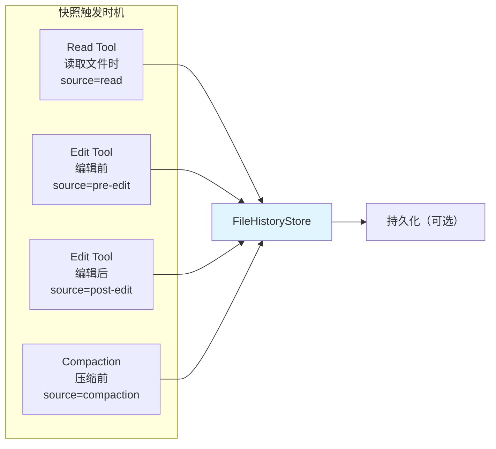
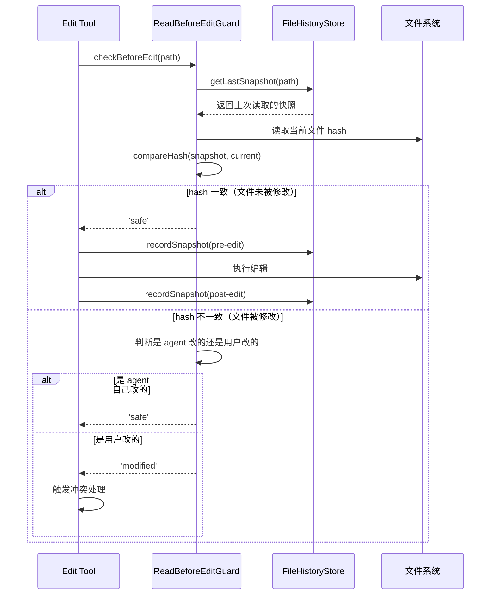
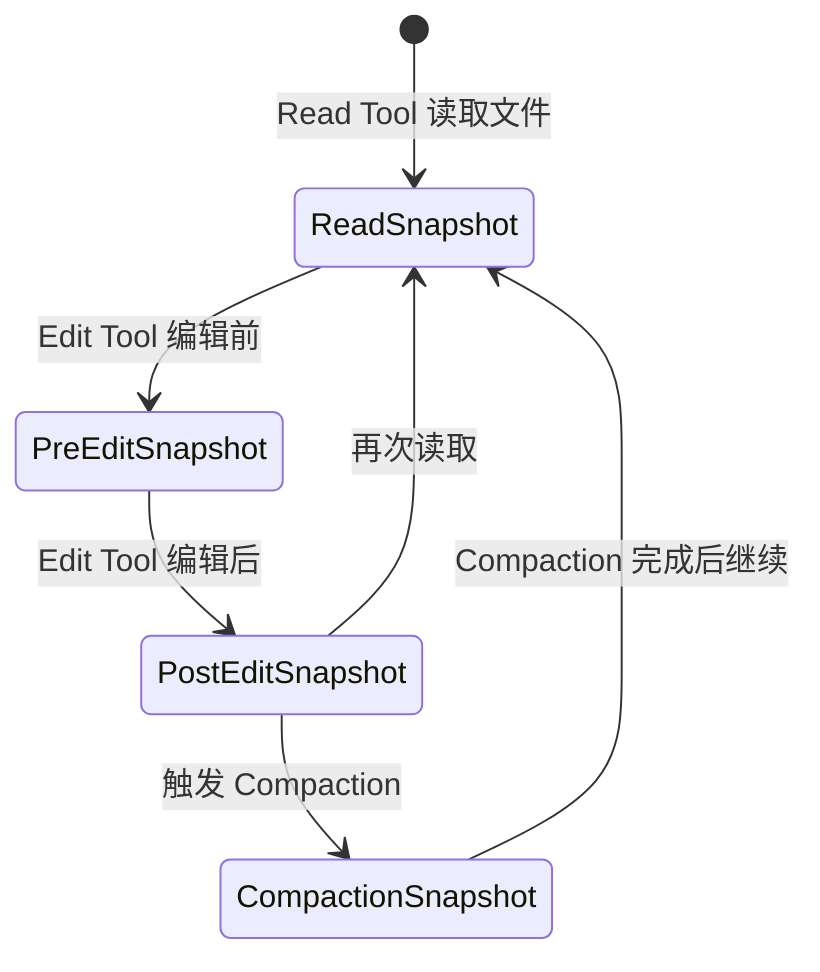
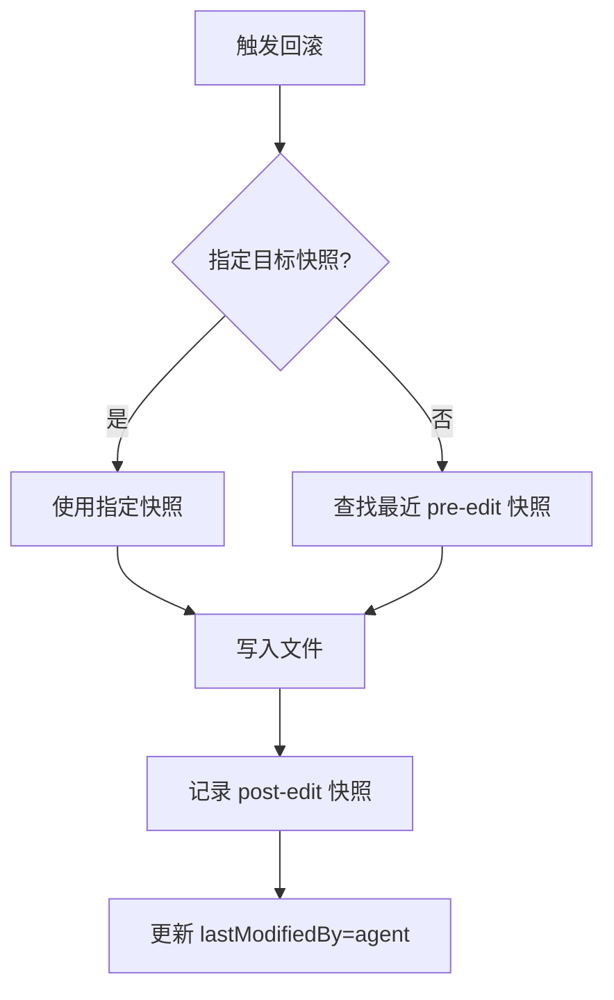
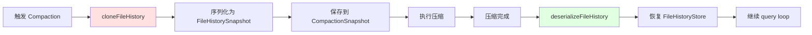

# 13. FileHistory 模块企业级设计方案

## 1. 背景与需求分析

### 1.1 问题陈述

AI Agent 在文件操作场景下面临的挑战：

- **覆盖风险**：Agent 编辑文件时，可能覆盖用户在 agent 读取后手动做的修改
- **无法回滚**：没有快照机制，agent 误操作后无法恢复
- **状态不一致**：Compaction 后 fileHistory 丢失，read-before-edit 保护失效
- **变更不可追踪**：无法知道哪些文件被 agent 修改过、修改了几次

### 1.2 需求定义

| 需求类别 | 具体需求 | 优先级 |
|---------|---------|--------|
| Read-before-edit 保护 | 编辑前检测文件是否被用户修改 | P0 |
| 快照管理 | 读取/编辑时自动记录快照 | P0 |
| 回滚支持 | 支持回滚到任意历史版本 | P1 |
| Compaction 集成 | 压缩时保存 fileHistory 快照 | P0 |
| 变更追踪 | 追踪 agent 修改了哪些文件 | P1 |

### 1.3 设计目标

1. **工具正确性保障**：read-before-edit 保护是核心，不能绕过
2. **轻量快照**：只在必要时记录快照，不影响性能
3. **与 Compaction 集成**：压缩时保存 fileHistory，恢复时还原
4. **可回滚**：支持回滚到 pre-edit 快照

---

## 2. 架构设计

### 2.1 快照触发时机



### 2.2 核心数据结构

```typescript
// packages/file-history/src/types.ts

export interface FileSnapshot {
  path: string;
  content: string;
  hash: string;          // SHA256，用于快速比对
  mtimeMs: number;       // 文件系统修改时间
  capturedAt: number;    // agent 捕获时间
  source: 'read' | 'pre-edit' | 'post-edit' | 'compaction';
}

export interface FileHistoryEntry {
  path: string;
  snapshots: FileSnapshot[];
  currentHash: string;
  lastModifiedBy: 'agent' | 'user' | 'unknown';
}

export interface FileHistoryStore {
  entries: Map<string, FileHistoryEntry>;
  sessionId: string;
  createdAt: number;
}

export interface FileHistorySnapshot {
  entries: Record<string, FileHistoryEntry>;
  sessionId: string;
  snapshotAt: number;
}
```

---

## 3. Read-before-edit 保护

### 3.1 保护流程



### 3.2 保护实现

```typescript
// packages/file-history/src/guard.ts

export type GuardResult = 'safe' | 'modified' | 'not-read';

export async function checkReadBeforeEdit(
  filePath: string,
  store: FileHistoryStore
): Promise<GuardResult> {
  const entry = store.entries.get(filePath);

  // agent 没读过这个文件
  if (!entry || entry.snapshots.length === 0) return 'not-read';

  const currentHash = await hashFile(filePath);
  const lastSnapshot = entry.snapshots.at(-1)!;

  // hash 一致，文件未被修改
  if (currentHash === lastSnapshot.hash) return 'safe';

  // 检查是否是 agent 自己最后一次编辑的结果
  const lastAgentEdit = [...entry.snapshots]
    .reverse()
    .find(s => s.source === 'post-edit');

  if (lastAgentEdit && currentHash === lastAgentEdit.hash) return 'safe';

  // 文件被用户修改了
  return 'modified';
}

async function hashFile(filePath: string): Promise<string> {
  const content = await fs.readFile(filePath);
  return crypto.createHash('sha256').update(content).digest('hex');
}
```

### 3.3 冲突处理策略

```typescript
// packages/file-history/src/conflict.ts

export type ConflictResolution = 'overwrite' | 'merge' | 'abort';

export async function handleEditConflict(
  filePath: string,
  store: FileHistoryStore,
  opts: { strategy?: ConflictResolution } = {}
): Promise<ConflictResolution> {
  const strategy = opts.strategy ?? 'abort';

  switch (strategy) {
    case 'overwrite':
      // 直接覆盖用户修改（危险，需要明确授权）
      return 'overwrite';

    case 'merge':
      // 尝试三方合并（agent 原始版本 + agent 修改 + 用户修改）
      return await attemptMerge(filePath, store);

    case 'abort':
    default:
      // 中止编辑，提示用户
      return 'abort';
  }
}
```

---

## 4. 快照管理

### 4.1 记录快照

```typescript
// packages/file-history/src/snapshot.ts

export async function recordSnapshot(
  store: FileHistoryStore,
  filePath: string,
  source: FileSnapshot['source']
): Promise<FileSnapshot> {
  const content = await fs.readFile(filePath, 'utf-8');
  const stat = await fs.stat(filePath);
  const hash = crypto.createHash('sha256').update(content).digest('hex');

  const snapshot: FileSnapshot = {
    path: filePath,
    content,
    hash,
    mtimeMs: stat.mtimeMs,
    capturedAt: Date.now(),
    source
  };

  // 更新 store
  const entry = store.entries.get(filePath) ?? {
    path: filePath,
    snapshots: [],
    currentHash: hash,
    lastModifiedBy: 'unknown'
  };

  entry.snapshots.push(snapshot);
  entry.currentHash = hash;
  entry.lastModifiedBy = source === 'post-edit' ? 'agent' : entry.lastModifiedBy;

  store.entries.set(filePath, entry);

  return snapshot;
}
```

### 4.2 快照生命周期



---

## 5. 回滚机制

### 5.1 回滚流程



### 5.2 回滚实现

```typescript
// packages/file-history/src/rollback.ts

export async function rollbackFile(
  filePath: string,
  store: FileHistoryStore,
  targetSnapshot?: FileSnapshot
): Promise<void> {
  const entry = store.entries.get(filePath);
  if (!entry) throw new Error(`No history for ${filePath}`);

  // 默认回滚到最近一次 pre-edit 快照
  const target = targetSnapshot
    ?? [...entry.snapshots].reverse().find(s => s.source === 'pre-edit');

  if (!target) throw new Error(`No pre-edit snapshot for ${filePath}`);

  // 写入文件
  await fs.writeFile(filePath, target.content, 'utf-8');

  // 记录回滚操作
  await recordSnapshot(store, filePath, 'post-edit');
}

export async function rollbackSession(
  store: FileHistoryStore,
  opts: { onlyAgentModified?: boolean } = {}
): Promise<string[]> {
  const rolledBack: string[] = [];

  for (const [filePath, entry] of store.entries) {
    if (opts.onlyAgentModified && entry.lastModifiedBy !== 'agent') continue;

    try {
      await rollbackFile(filePath, store);
      rolledBack.push(filePath);
    } catch (error) {
      console.error(`Failed to rollback ${filePath}:`, error);
    }
  }

  return rolledBack;
}
```

---

## 6. Compaction 集成

### 6.1 集成流程



### 6.2 序列化与反序列化

```typescript
// packages/file-history/src/serialization.ts

export function serializeFileHistory(store: FileHistoryStore): FileHistorySnapshot {
  const entries: Record<string, FileHistoryEntry> = {};

  for (const [path, entry] of store.entries) {
    // 只保留最近 3 个快照，节省空间
    entries[path] = {
      ...entry,
      snapshots: entry.snapshots.slice(-3)
    };
  }

  return {
    entries,
    sessionId: store.sessionId,
    snapshotAt: Date.now()
  };
}

export function deserializeFileHistory(
  snapshot: FileHistorySnapshot
): FileHistoryStore {
  const entries = new Map<string, FileHistoryEntry>();

  for (const [path, entry] of Object.entries(snapshot.entries)) {
    entries.set(path, entry);
  }

  return {
    entries,
    sessionId: snapshot.sessionId,
    createdAt: snapshot.snapshotAt
  };
}

export function cloneFileHistory(store: FileHistoryStore): FileHistorySnapshot {
  return serializeFileHistory(store);
}
```

---

## 7. 变更追踪

### 7.1 会话变更报告

```typescript
// packages/file-history/src/tracker.ts

export interface FileChangeReport {
  modified: string[];    // agent 修改过的文件
  created: string[];     // agent 创建的文件
  userModified: string[]; // 用户修改过的文件（可能有冲突）
}

export function getSessionChangeReport(
  store: FileHistoryStore
): FileChangeReport {
  const modified: string[] = [];
  const created: string[] = [];
  const userModified: string[] = [];

  for (const [filePath, entry] of store.entries) {
    const hasAgentEdit = entry.snapshots.some(s => s.source === 'post-edit');
    const hasRead = entry.snapshots.some(s => s.source === 'read');

    if (hasAgentEdit && !hasRead) {
      created.push(filePath);
    } else if (hasAgentEdit) {
      modified.push(filePath);
    }

    if (entry.lastModifiedBy === 'user') {
      userModified.push(filePath);
    }
  }

  return { modified, created, userModified };
}
```

---

## 8. 与 Query Loop 集成

```typescript
// packages/agent-core/src/tools/file-tools.ts

import {
  checkReadBeforeEdit,
  recordSnapshot,
  handleEditConflict
} from '@your-org/file-history';

export const readFileTool = {
  name: 'read_file',
  async call(args: { path: string }, ctx: ToolUseContext) {
    // 读取时记录快照
    await recordSnapshot(ctx.fileHistory, args.path, 'read');
    return await fs.readFile(args.path, 'utf-8');
  }
};

export const editFileTool = {
  name: 'edit_file',
  async call(args: { path: string; content: string }, ctx: ToolUseContext) {
    // 编辑前检查
    const guard = await checkReadBeforeEdit(args.path, ctx.fileHistory);

    if (guard === 'not-read') {
      // agent 没读过这个文件，先读一下
      await recordSnapshot(ctx.fileHistory, args.path, 'read');
    } else if (guard === 'modified') {
      // 文件被用户修改了
      const resolution = await handleEditConflict(args.path, ctx.fileHistory);
      if (resolution === 'abort') {
        return { error: `File ${args.path} was modified by user. Edit aborted.` };
      }
    }

    // 记录 pre-edit 快照
    await recordSnapshot(ctx.fileHistory, args.path, 'pre-edit');

    // 执行编辑
    await fs.writeFile(args.path, args.content, 'utf-8');

    // 记录 post-edit 快照
    await recordSnapshot(ctx.fileHistory, args.path, 'post-edit');

    return { success: true };
  }
};
```

---

## 9. 总结

### 9.1 核心设计原则

1. **保护优先**：read-before-edit 是核心，任何文件编辑前必须检查
2. **轻量快照**：只保留必要快照（最近 3 个），不影响性能
3. **与 Compaction 集成**：压缩时序列化，恢复时反序列化
4. **可回滚**：支持回滚到 pre-edit 快照

### 9.2 关键机制

| 机制 | 作用 | 触发时机 |
|------|------|---------|
| Read Snapshot | 记录读取时的文件状态 | Read Tool 执行时 |
| Pre-edit Snapshot | 编辑前保存原始内容 | Edit Tool 执行前 |
| Post-edit Snapshot | 编辑后记录新内容 | Edit Tool 执行后 |
| Compaction Snapshot | 压缩前保存完整历史 | Compaction 触发时 |
| Guard Check | 检测用户是否修改了文件 | Edit Tool 执行前 |
| Rollback | 恢复到历史版本 | 手动触发或出错时 |

### 9.3 下一步

- 实现 FileHistory 包的核心接口
- 集成到 Read/Edit 工具
- 与 Compaction 模块对接
- 添加变更追踪和报告功能
