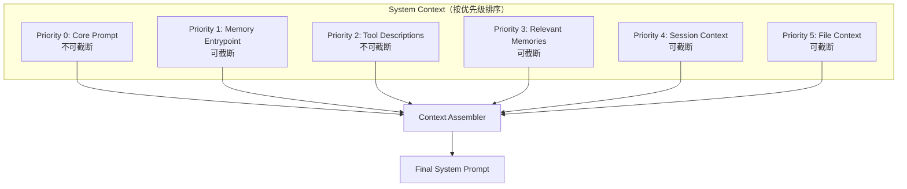

# 14. System Context 分层注入设计方案

## 1. 背景与需求

### 1.1 问题

传统做法把所有上下文拼成一个大字符串：

```typescript
const systemPrompt = `You are an AI assistant...
Memory: ${memoryContent}
Tools: ${toolDescriptions}
Files: ${fileList}`;
```

**问题：**
- 内容混在一起，compaction 时无法精确控制哪部分保留、哪部分截断
- 无法按优先级管理，重要内容可能被挤到后面
- Token 预算超出时只能粗暴截断，丢失关键信息

### 1.2 需求

| 需求 | 说明 | 优先级 |
|------|------|--------|
| 分层管理 | 每类上下文独立管理，可单独开关 | P0 |
| 优先级排序 | 重要内容优先保留 | P0 |
| Token 预算 | 按预算填充，超出时按优先级截断 | P0 |
| Compaction 集成 | 压缩时精确控制保留哪些层 | P0 |
| 按需组装 | 不同场景加载不同的 context parts | P1 |

---

## 2. 架构设计

### 2.1 分层结构



### 2.2 核心类型

```typescript
// packages/context/src/types.ts

export type ContextPartType =
  | 'core'
  | 'memory'
  | 'tools'
  | 'relevant_memory'
  | 'session'
  | 'files'
  | 'code_context'
  | 'custom';

export interface SystemContextPart {
  type: ContextPartType;
  priority: number;       // 数字越小越重要，越优先保留
  content: string;
  truncatable: boolean;   // 是否可以被截断
  maxTokens?: number;     // 该层最大 token 数
  label?: string;         // 调试用标签
}

export interface ContextAssemblerOptions {
  tokenBudget: number;    // 总 token 预算
  separator?: string;     // 层间分隔符
}
```

---

## 3. Context Assembler 实现

```typescript
// packages/context/src/assembler.ts

export class ContextAssembler {
  private parts: SystemContextPart[] = [];

  add(part: SystemContextPart): this {
    this.parts.push(part);
    return this;
  }

  remove(type: ContextPartType): this {
    this.parts = this.parts.filter(p => p.type !== type);
    return this;
  }

  assemble(opts: ContextAssemblerOptions): string {
    const sorted = [...this.parts].sort((a, b) => a.priority - b.priority);
    const separator = opts.separator ?? '\n\n---\n\n';

    let totalTokens = 0;
    const selected: SystemContextPart[] = [];

    for (const part of sorted) {
      const tokens = estimateTokens(part.content);

      if (totalTokens + tokens <= opts.tokenBudget) {
        selected.push(part);
        totalTokens += tokens;
      } else if (part.truncatable && part.maxTokens) {
        // 截断到允许的最大 token 数
        const remaining = opts.tokenBudget - totalTokens;
        const truncated = truncateToTokens(part.content, Math.min(remaining, part.maxTokens));
        selected.push({ ...part, content: truncated });
        totalTokens += estimateTokens(truncated);
      } else if (!part.truncatable) {
        // 不可截断的部分强制保留（可能超出预算）
        selected.push(part);
        totalTokens += tokens;
      }
      // truncatable 但没有 maxTokens 的部分，超出预算时直接跳过
    }

    return selected.map(p => p.content).join(separator);
  }

  estimateTotal(): number {
    return this.parts.reduce((sum, p) => sum + estimateTokens(p.content), 0);
  }

  // 用于 compaction：只保留指定优先级以内的层
  assembleForCompaction(maxPriority: number): string {
    const filtered = this.parts.filter(p => p.priority <= maxPriority);
    return filtered.map(p => p.content).join('\n\n');
  }
}
```

---

## 4. 标准层定义

```typescript
// packages/context/src/standard-parts.ts

export function buildCorePart(systemPrompt: string): SystemContextPart {
  return {
    type: 'core',
    priority: 0,
    content: systemPrompt,
    truncatable: false,
    label: 'Core System Prompt'
  };
}

export function buildMemoryPart(memoryContent: string): SystemContextPart {
  return {
    type: 'memory',
    priority: 1,
    content: `## Long-term Memory\n\n${memoryContent}`,
    truncatable: true,
    maxTokens: 2000,
    label: 'Memory Entrypoint'
  };
}

export function buildToolsPart(toolDescriptions: string): SystemContextPart {
  return {
    type: 'tools',
    priority: 2,
    content: toolDescriptions,
    truncatable: false,
    label: 'Tool Descriptions'
  };
}

export function buildRelevantMemoryPart(memories: string[]): SystemContextPart {
  return {
    type: 'relevant_memory',
    priority: 3,
    content: `## Relevant Context\n\n${memories.join('\n\n')}`,
    truncatable: true,
    maxTokens: 3000,
    label: 'Relevant Memories'
  };
}

export function buildSessionPart(sessionContext: string): SystemContextPart {
  return {
    type: 'session',
    priority: 4,
    content: `## Session Context\n\n${sessionContext}`,
    truncatable: true,
    maxTokens: 1000,
    label: 'Session Context'
  };
}

export function buildFilesPart(fileContext: string): SystemContextPart {
  return {
    type: 'files',
    priority: 5,
    content: `## File Context\n\n${fileContext}`,
    truncatable: true,
    maxTokens: 4000,
    label: 'File Context'
  };
}
```

---

## 5. 与其他模块集成

### 5.1 与 Memory 模块集成

```typescript
// packages/agent-core/src/query/context-builder.ts

import { ContextAssembler } from '@your-org/context';
import { findRelevantMemories } from '@your-org/memory';

export async function buildSystemContext(
  ctx: QueryContext
): Promise<string> {
  const assembler = new ContextAssembler();

  // 核心 prompt
  assembler.add(buildCorePart(CORE_SYSTEM_PROMPT));

  // Memory entrypoint（MEMORY.md）
  const memoryContent = await loadMemoryEntrypoint(ctx.memoryDir);
  if (memoryContent) {
    assembler.add(buildMemoryPart(memoryContent));
  }

  // 工具描述
  assembler.add(buildToolsPart(formatToolDescriptions(ctx.tools)));

  // 相关记忆（sideQuery 选出的）
  const relevantMemories = await findRelevantMemories(
    ctx.userInput,
    ctx.memoryDir,
    ctx.surfacedMemories
  );
  if (relevantMemories.length > 0) {
    assembler.add(buildRelevantMemoryPart(
      await Promise.all(relevantMemories.map(m => fs.readFile(m.path, 'utf-8')))
    ));
  }

  // 文件上下文（当前打开的文件等）
  if (ctx.fileContext) {
    assembler.add(buildFilesPart(ctx.fileContext));
  }

  return assembler.assemble({ tokenBudget: ctx.contextWindow * 0.4 });
}
```

### 5.2 与 Compaction 模块集成

```typescript
// packages/compaction/src/post-compact.ts

export async function rebuildSystemContextAfterCompaction(
  ctx: QueryContext
): Promise<void> {
  const assembler = new ContextAssembler();

  // 压缩后只保留 priority <= 2 的层（core + memory + tools）
  assembler.add(buildCorePart(CORE_SYSTEM_PROMPT));
  assembler.add(buildMemoryPart(await loadMemoryEntrypoint(ctx.memoryDir)));
  assembler.add(buildToolsPart(formatToolDescriptions(ctx.tools)));

  // 注入压缩摘要作为 session context
  assembler.add(buildSessionPart(
    `[Compacted at ${new Date().toISOString()}]\n${ctx.compactionSummary}`
  ));

  ctx.systemPrompt = assembler.assemble({ tokenBudget: ctx.contextWindow * 0.4 });
}
```

---

## 6. 总结

| 机制 | 作用 |
|------|------|
| 分层管理 | 每类上下文独立，可单独开关 |
| 优先级排序 | 重要内容优先保留 |
| Token 预算 | 按预算填充，超出时按优先级截断 |
| Compaction 集成 | 压缩时只保留高优先级层 |
| 按需组装 | 不同场景加载不同层 |
