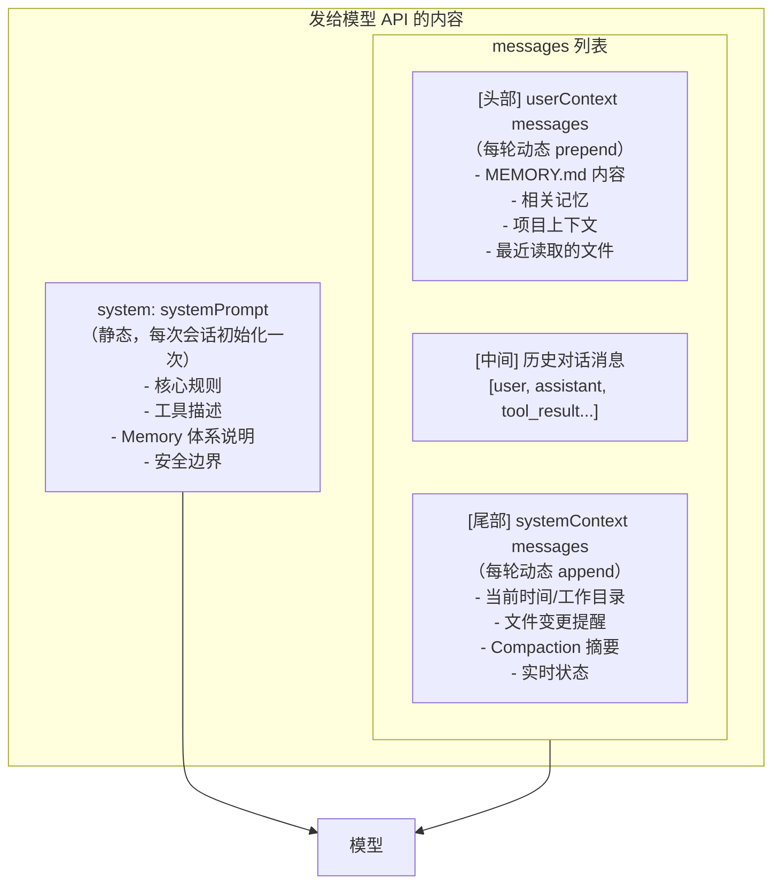
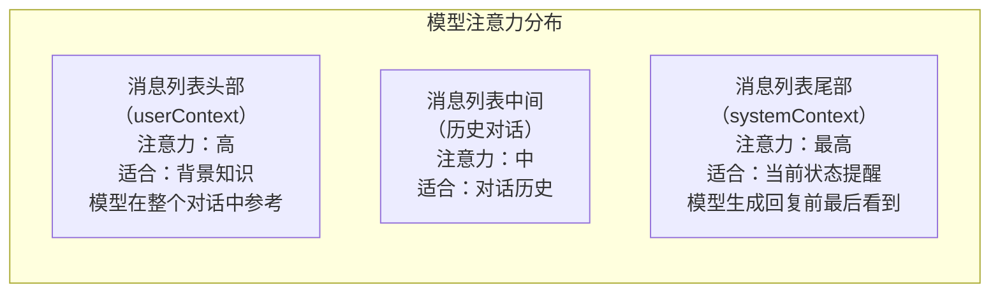
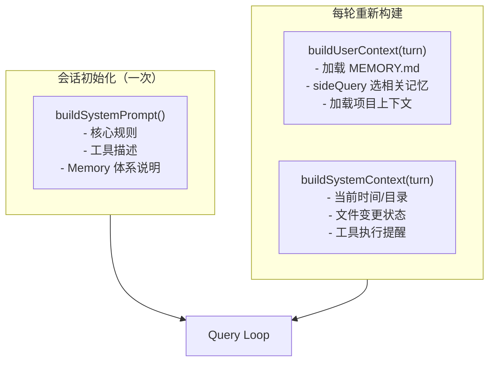
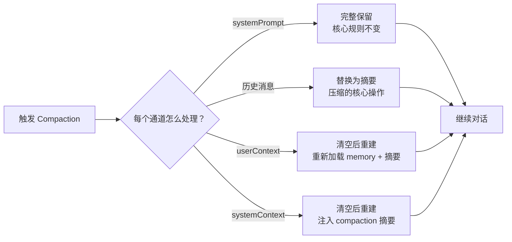
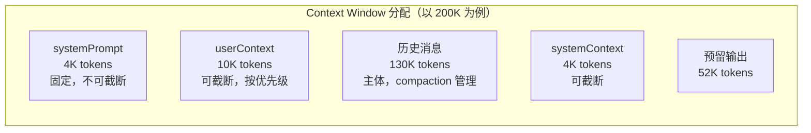
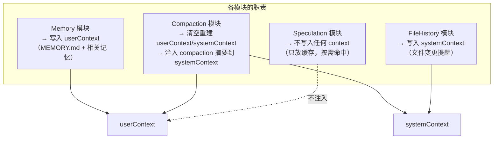

# 14. System Context 分层注入设计方案

## 1. 背景与问题

### 1.1 传统做法的问题

大多数 AI Agent 把所有上下文拼成一个大字符串塞进 system prompt：

```typescript
const systemPrompt = `You are an AI assistant...
Memory: ${memoryContent}
Tools: ${toolDescriptions}
Files: ${fileList}
Session: ${sessionContext}`;
```

这种做法有几个严重问题：

**问题 1：Compaction 时无法精确控制**

压缩时想保留 memory 但截断 file list？做不到，只能整体截断或整体保留。

**问题 2：优先级混乱**

重要的 memory 内容可能被挤到 prompt 中间，模型注意力权重低。

**问题 3：Token 浪费**

不管当前对话是否需要，所有内容都塞进去，浪费 token 预算。

**问题 4：难以维护**

各模块都往同一个字符串里追加内容，互相污染，难以调试。

---

### 1.2 Claude Code 的实际做法

Claude Code 把上下文分成**三个独立通道**，不是一个大字符串：

```
systemPrompt    → 静态的、每轮不变的核心规则
userContext     → 动态的、每轮 prepend 到消息列表头部
systemContext   → 动态的、每轮 append 到消息列表尾部
```

**关键洞察**：`userContext` 和 `systemContext` 不是注入到 system prompt 里，而是作为**独立的消息**插入到消息列表中。这样模型能更清晰地区分"永久规则"和"当前上下文"。



---

## 2. 为什么这样设计

### 2.1 位置决定注意力权重

模型对消息列表不同位置的注意力权重不同：



**设计原则：**
- **头部（userContext）**：放"这次对话需要的背景"，如 memory、项目上下文
- **尾部（systemContext）**：放"当前状态提醒"，如文件变更、compaction 摘要
- **system prompt**：放"永远不变的规则"，如工具描述、安全边界

### 2.2 三通道独立管理



三个通道独立更新，互不污染。Memory 模块只管 userContext，FileHistory 模块只管 systemContext，核心规则只在 systemPrompt 里。

### 2.3 Compaction 时精确控制

这是分层注入最大的价值：压缩时可以精确控制每个通道的处理方式。



---

## 3. 三个通道的内容规范

### 3.1 systemPrompt（静态）

每次会话初始化一次，不随对话变化。

```
内容：
- 你是谁、你的能力边界
- 工具使用规则和格式
- Memory 体系说明（MEMORY.md 在哪、怎么用、什么该记）
- 安全边界（不能做什么）
- 输出格式规范

Token 预算：~4K（固定，不可截断）
```

### 3.2 userContext（动态，每轮 prepend）

```
内容（按优先级）：
1. MEMORY.md 内容（截断版，最多 2K token）
2. sideQuery 选出的相关记忆（0-5 条，最多 3K token）
3. 当前项目上下文（package.json、README 摘要，最多 1K token）
4. 最近读取的文件内容（最多 4K token）

Token 预算：~10K（可截断，按优先级）
```

### 3.3 systemContext（动态，每轮 append）

```
内容：
- 当前时间、工作目录
- 最近的文件变更提醒（agent 修改了哪些文件）
- 工具执行状态提醒
- Compaction 摘要（压缩后注入）

Token 预算：~2K（可截断）
```

---

## 4. Token 预算分配



**Token 预算管理原则：**

1. systemPrompt 固定，不参与预算竞争
2. userContext 和 systemContext 共享 14K 预算
3. 历史消息是主体，compaction 负责控制其大小
4. 预留足够的输出 token（至少 32K）

---

## 5. 核心实现

### 5.1 类型定义

```typescript
// packages/context/src/types.ts

export type ContextPartType =
  | 'core' | 'memory' | 'tools'
  | 'relevant_memory' | 'session' | 'files' | 'custom';

export interface SystemContextPart {
  type: ContextPartType;
  priority: number;       // 数字越小越重要
  content: string;
  truncatable: boolean;
  maxTokens?: number;
}

export interface QueryContextChannels {
  systemPrompt: string;                // 静态
  userContextParts: SystemContextPart[]; // 动态，prepend
  systemContextParts: SystemContextPart[]; // 动态，append
}
```

### 5.2 Context Assembler

```typescript
// packages/context/src/assembler.ts

export class ContextAssembler {
  private parts: SystemContextPart[] = [];

  add(part: SystemContextPart): this {
    this.parts.push(part);
    return this;
  }

  assemble(tokenBudget: number): string {
    const sorted = [...this.parts].sort((a, b) => a.priority - b.priority);
    let totalTokens = 0;
    const selected: string[] = [];

    for (const part of sorted) {
      const tokens = estimateTokens(part.content);

      if (totalTokens + tokens <= tokenBudget) {
        selected.push(part.content);
        totalTokens += tokens;
      } else if (part.truncatable && part.maxTokens) {
        const remaining = Math.min(tokenBudget - totalTokens, part.maxTokens);
        if (remaining > 100) {
          selected.push(truncateToTokens(part.content, remaining));
          totalTokens += remaining;
        }
      } else if (!part.truncatable) {
        // 不可截断的强制保留
        selected.push(part.content);
        totalTokens += tokens;
      }
    }

    return selected.join('\n\n---\n\n');
  }

  // Compaction 专用：只保留高优先级层
  assembleForCompaction(maxPriority: number): string {
    return this.parts
      .filter(p => p.priority <= maxPriority)
      .sort((a, b) => a.priority - b.priority)
      .map(p => p.content)
      .join('\n\n');
  }
}
```

### 5.3 每轮构建流程

```typescript
// packages/agent-core/src/query/context-builder.ts

export async function buildTurnContext(
  ctx: QueryContext
): Promise<QueryContextChannels> {
  // userContext：每轮重新构建
  const userAssembler = new ContextAssembler();

  const memoryContent = await loadMemoryEntrypoint(ctx.memoryDir);
  if (memoryContent) {
    userAssembler.add({
      type: 'memory', priority: 1,
      content: `## Long-term Memory\n\n${memoryContent}`,
      truncatable: true, maxTokens: 2000
    });
  }

  const relevantMemories = await findRelevantMemories(
    ctx.userInput, ctx.memoryDir, ctx.surfacedMemories
  );
  if (relevantMemories.length > 0) {
    userAssembler.add({
      type: 'relevant_memory', priority: 2,
      content: `## Relevant Context\n\n${relevantMemories.join('\n\n')}`,
      truncatable: true, maxTokens: 3000
    });
  }

  // systemContext：每轮重新构建
  const sysAssembler = new ContextAssembler();

  sysAssembler.add({
    type: 'session', priority: 1,
    content: `Current time: ${new Date().toISOString()}\nWorking directory: ${process.cwd()}`,
    truncatable: false
  });

  const recentEdits = getRecentAgentEdits(ctx.fileHistory);
  if (recentEdits.length > 0) {
    sysAssembler.add({
      type: 'files', priority: 2,
      content: `## Recently Modified Files\n${recentEdits.map(f => `- ${f}`).join('\n')}`,
      truncatable: true, maxTokens: 500
    });
  }

  return {
    systemPrompt: ctx.systemPrompt, // 不变
    userContextParts: userAssembler.parts,
    systemContextParts: sysAssembler.parts
  };
}
```

---

## 6. 与其他模块的关系



**关键原则：Speculation 的预取结果不注入任何 context 通道，只放缓存。**

---

## 7. 总结

| 通道 | 内容 | 更新频率 | Token 预算 |
|------|------|---------|-----------|
| systemPrompt | 核心规则、工具描述 | 会话初始化一次 | ~4K，固定 |
| userContext | Memory、相关记忆、项目上下文 | 每轮重建 | ~10K，可截断 |
| systemContext | 当前状态、文件变更、compaction 摘要 | 每轮重建 | ~4K，可截断 |

**核心价值：**
1. 每个模块只管自己的通道，互不污染
2. Compaction 时可以精确控制每个通道的处理方式
3. 位置决定注意力权重，重要内容放对位置
4. Token 预算精确管理，不浪费
