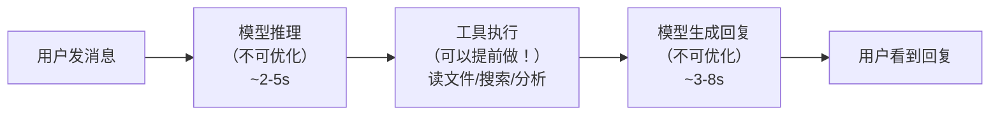
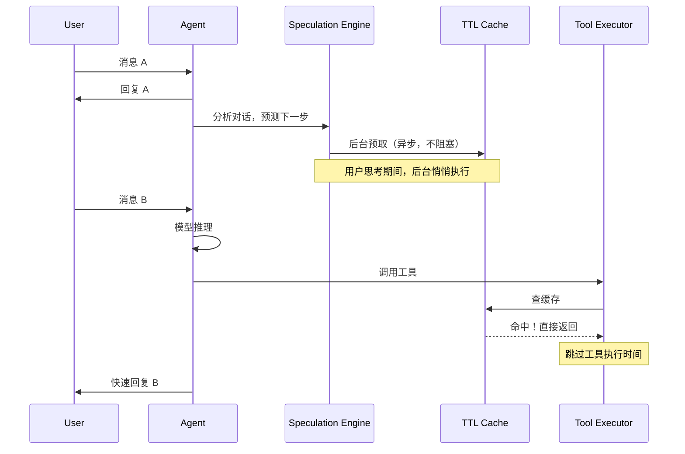
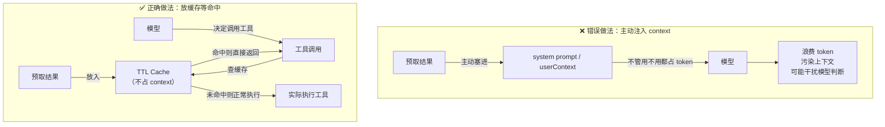
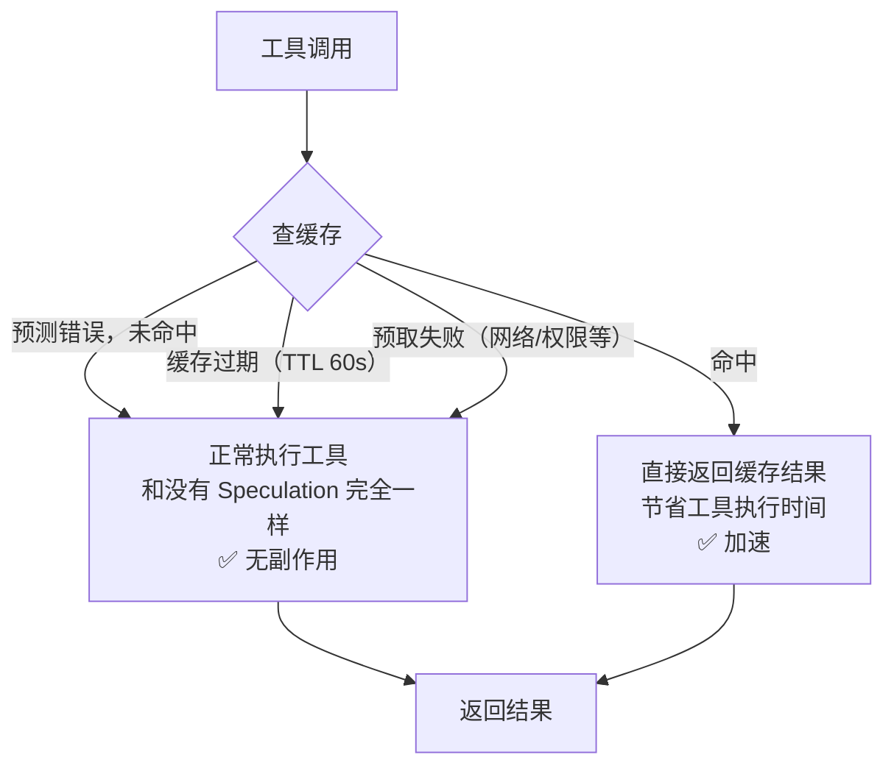
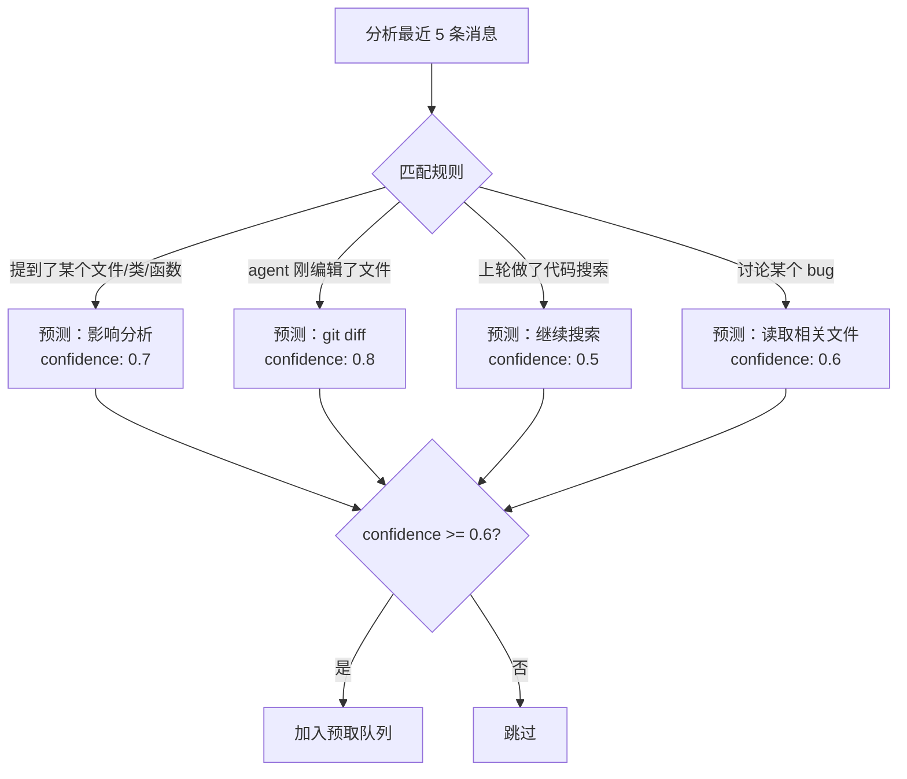
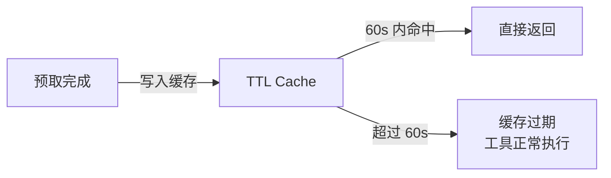
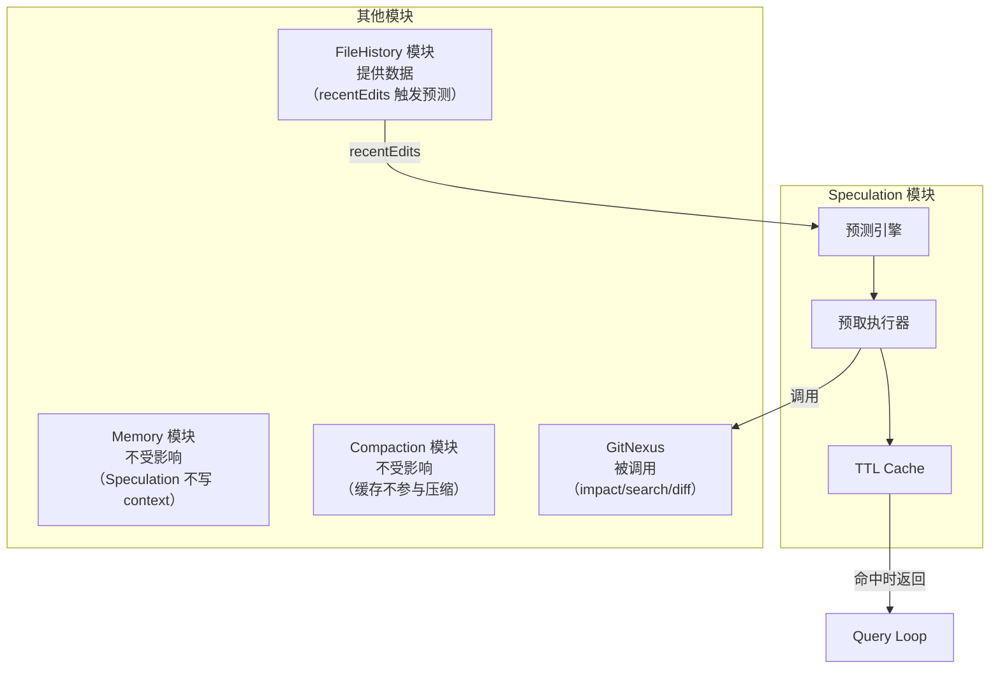

# 15. Speculation 预取设计方案

## 1. 背景与问题

### 1.1 Agent 响应延迟的来源

AI Agent 的响应延迟主要来自两部分：



**模型推理和生成不可优化，但工具执行可以提前做。**

### 1.2 核心思路

在用户还没发下一条消息时，预测可能需要的上下文并提前加载，放入缓存。当工具调用真正发生时，直接从缓存返回，跳过执行时间。



---

## 2. 关键设计决策：预取结果不注入 Context

这是 Speculation 最重要的设计原则，也是很多人容易误解的地方。

### 2.1 错误做法 vs 正确做法



**正确做法的好处：**
- 预取结果不占用 context window
- 不会干扰模型的判断和推理
- 不命中时完全退化为正常执行，无副作用

### 2.2 不命中的三种情况



**结论：不命中 = 退化为正常执行，不浪费 context，不影响正确性。**

---

## 3. 预测策略

### 3.1 基于规则的预测（先实现这个）



**典型规则的命中率：**

| 规则 | 命中率 | 说明 |
|------|--------|------|
| 讨论文件 → 影响分析 | ~60% | 用户经常问影响范围 |
| 刚编辑 → git diff | ~75% | 编辑后问影响是高频行为 |
| 上轮搜索 → 继续搜索 | ~40% | 不一定继续同一话题 |
| 讨论 bug → 读文件 | ~55% | 需要看代码才能分析 |

### 3.2 基于 LLM 的预测（进阶，命中率更高）

```typescript
const SPECULATION_PROMPT = `Based on this conversation, predict what tools the agent will call next.

Output JSON:
{
  "predictions": [
    { "type": "file_read|impact_analysis|search|git_diff", "confidence": 0.0-1.0, "params": {} }
  ]
}

Rules:
- Only predict confidence > 0.6
- Max 3 predictions
- Be conservative, wrong predictions waste compute`;
```

**两种策略对比：**

| 策略 | 命中率 | 延迟 | 适用场景 |
|------|--------|------|---------|
| 规则预测 | ~55% | 0ms | 默认，低成本 |
| LLM 预测 | ~70% | ~500ms | 高价值场景 |

---

## 4. 缓存设计

### 4.1 TTL 设计原则



**为什么 TTL 设为 60s？**
- 用户思考时间通常在 10-30s
- 60s 足够覆盖大多数场景
- 超过 60s 说明对话方向可能已经改变，旧数据不可靠

### 4.2 缓存 Key 设计

```typescript
// 缓存 key 必须精确匹配工具调用参数
function buildCacheKey(toolName: string, args: any): string {
  return `${toolName}:${JSON.stringify(sortedKeys(args))}`;
}

// 示例：
// impact_analysis + { target: "UserService", direction: "upstream" }
// → "impact_analysis:{"direction":"upstream","target":"UserService"}"
```

---

## 5. 完整实现

### 5.1 预测引擎

```typescript
// packages/speculation/src/engine.ts

export interface SpeculationPrediction {
  type: 'file_read' | 'impact_analysis' | 'search' | 'git_diff';
  confidence: number;
  params: any;
  cacheKey: string;
}

export function predictByRules(
  messages: Message[],
  ctx: QueryContext
): SpeculationPrediction[] {
  const predictions: SpeculationPrediction[] = [];
  const recent = messages.slice(-5);

  // 规则 1：提到文件/类/函数 → 影响分析
  const mentionedSymbols = extractMentionedSymbols(recent);
  for (const symbol of mentionedSymbols) {
    predictions.push({
      type: 'impact_analysis',
      confidence: 0.7,
      params: { target: symbol, direction: 'upstream', repo: ctx.repoName },
      cacheKey: `impact_analysis:${symbol}`
    });
  }

  // 规则 2：agent 刚编辑了文件 → git diff
  const recentEdits = getRecentAgentEdits(ctx.fileHistory);
  if (recentEdits.length > 0) {
    predictions.push({
      type: 'git_diff',
      confidence: 0.8,
      params: { repo: ctx.repoName },
      cacheKey: `git_diff:${ctx.repoName}`
    });
  }

  // 规则 3：上轮搜索了某概念 → 继续搜索
  const lastSearch = getLastToolCall(recent, 'search_code');
  if (lastSearch) {
    predictions.push({
      type: 'search',
      confidence: 0.5,
      params: { query: lastSearch.args.query, repo: ctx.repoName },
      cacheKey: `search:${lastSearch.args.query}`
    });
  }

  return predictions.filter(p => p.confidence >= 0.6);
}
```

### 5.2 预取执行器

```typescript
// packages/speculation/src/executor.ts

export async function executePrefetch(
  predictions: SpeculationPrediction[],
  ctx: QueryContext,
  cache: SpeculationCache
): Promise<void> {
  // 异步执行，绝对不阻塞主流程
  setImmediate(async () => {
    for (const pred of predictions) {
      if (cache.has(pred.cacheKey)) continue; // 已缓存跳过

      try {
        let result: any;

        switch (pred.type) {
          case 'file_read':
            result = await fs.readFile(pred.params.path, 'utf-8');
            break;
          case 'impact_analysis':
            result = await runGitNexusTool('impact', pred.params);
            break;
          case 'search':
            result = await runGitNexusTool('query', pred.params);
            break;
          case 'git_diff':
            result = await runGitNexusTool('detect_changes', pred.params);
            break;
        }

        cache.set(pred.cacheKey, result, 60000);

      } catch {
        // 静默失败，不影响主流程
      }
    }
  });
}
```

### 5.3 缓存

```typescript
// packages/speculation/src/cache.ts

export class SpeculationCache {
  private cache = new Map<string, { data: any; expiresAt: number }>();

  set(key: string, data: any, ttl = 60000): void {
    this.cache.set(key, { data, expiresAt: Date.now() + ttl });
  }

  get(key: string): any | null {
    const entry = this.cache.get(key);
    if (!entry || Date.now() > entry.expiresAt) {
      this.cache.delete(key);
      return null;
    }
    return entry.data;
  }

  has(key: string): boolean {
    return this.get(key) !== null;
  }

  // 工具执行前查询
  tryGetToolResult(toolName: string, args: any): any | null {
    return this.get(buildCacheKey(toolName, args));
  }
}
```

---

## 6. 与 Query Loop 集成

```typescript
// packages/agent-core/src/query/loop.ts

export async function* queryLoop(ctx: QueryContext) {
  while (true) {
    const response = await callModel(ctx);

    if (response.type === 'assistant') {
      // Turn 结束，启动 speculation（异步，不等待）
      const predictions = predictByRules(ctx.messages, ctx);
      executePrefetch(predictions, ctx, ctx.speculationCache);

      yield { type: 'done', response };
      break;
    }

    // 工具执行前先查缓存
    for (const tool of response.tools) {
      const cached = ctx.speculationCache.tryGetToolResult(tool.name, tool.args);
      if (cached) {
        // 命中缓存，直接用，跳过工具执行
        yield { type: 'tool_result', toolId: tool.id, result: cached, fromCache: true };
        continue;
      }
      // 未命中，正常执行（和没有 Speculation 完全一样）
      yield* runSingleTool(tool, ctx);
    }
  }
}
```

---

## 7. 对其他模块的影响



**Speculation 对其他模块的影响：**
- Memory、Compaction：**无影响**（预取结果不注入 context）
- FileHistory：**读取数据**（用于触发预测规则）
- GitNexus：**被调用**（执行实际的代码分析）

---

## 8. 监控与优化

### 8.1 关键指标

| 指标 | 说明 | 优化目标 |
|------|------|---------|
| 命中率 | 预取命中 / 总工具调用 | > 40% |
| 预取成功率 | 预取成功 / 预取尝试 | > 90% |
| 节省时间 | 命中时节省的工具执行时间 | > 1s/次 |
| 无效预取率 | 预取了但没被用到 | < 60% |

### 8.2 优化策略

- 命中率 < 30% 的规则直接删掉
- 只预取执行时间 > 500ms 的工具（读文件太快，不值得预取）
- 高置信度（> 0.8）才触发 LLM 预测，避免浪费

---

## 9. 总结

| 机制 | 作用 |
|------|------|
| 规则预测 | 基于对话模式预测下一步操作，0ms 延迟 |
| 异步预取 | 用户思考期间后台执行，不阻塞主流程 |
| TTL 缓存 | 预取结果缓存 60s，不注入 context |
| 缓存命中 | 工具执行前查缓存，命中则跳过执行 |
| 不命中降级 | 完全退化为正常执行，无副作用 |

**核心原则：预取结果只放缓存，不注入 context。不命中 = 正常执行，零副作用。**
