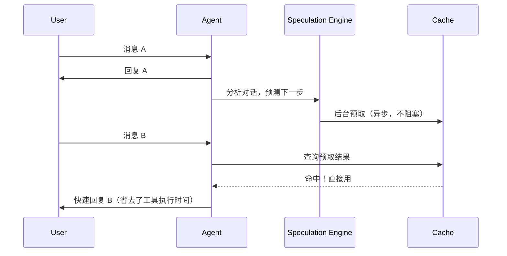

# 15. Speculation 预取设计方案

## 1. 背景与需求

### 1.1 问题

AI Agent 的响应延迟主要来自两部分：
1. 模型推理时间（不可优化）
2. 工具执行时间（**可以提前做**）

用户发出消息后，agent 需要先理解意图，再去读文件、搜索代码、分析影响。这些操作是串行的，用户必须等待。

### 1.2 核心思路

**在用户还没发下一条消息时，预测可能需要的上下文并提前加载。**



---

## 2. 预测策略

### 2.1 基于规则的预测（简单版，先做这个）

```typescript
// packages/speculation/src/rules.ts

export interface SpeculationPrediction {
  type: 'file_read' | 'impact_analysis' | 'search' | 'git_diff';
  confidence: number;  // 0-1
  params: any;
  cacheKey: string;
}

export function predictByRules(
  messages: Message[],
  ctx: QueryContext
): SpeculationPrediction[] {
  const predictions: SpeculationPrediction[] = [];
  const recent = messages.slice(-5);

  // 规则 1：讨论某个文件 → 预测会做影响分析
  const mentionedFiles = extractMentionedFiles(recent);
  for (const file of mentionedFiles) {
    predictions.push({
      type: 'impact_analysis',
      confidence: 0.7,
      params: { target: path.basename(file, path.extname(file)) },
      cacheKey: `impact:${file}`
    });
  }

  // 规则 2：刚编辑了文件 → 预测会问影响范围
  const recentEdits = getRecentAgentEdits(ctx.fileHistory);
  if (recentEdits.length > 0) {
    predictions.push({
      type: 'git_diff',
      confidence: 0.8,
      params: { files: recentEdits },
      cacheKey: `diff:${recentEdits.join(',')}`
    });
  }

  // 规则 3：上一轮搜索了某个概念 → 预测会继续搜索相关内容
  const lastSearch = getLastToolCall(recent, 'search_code');
  if (lastSearch) {
    predictions.push({
      type: 'search',
      confidence: 0.5,
      params: { query: lastSearch.args.query },
      cacheKey: `search:${lastSearch.args.query}`
    });
  }

  return predictions.filter(p => p.confidence >= 0.5);
}
```

### 2.2 基于 LLM 的预测（进阶版）

```typescript
// packages/speculation/src/llm-predictor.ts

const SPECULATION_PROMPT = `Based on this conversation, predict what context the agent will need next.

Output JSON:
{
  "predictions": [
    {
      "type": "file_read|impact_analysis|search|git_diff",
      "confidence": 0.0-1.0,
      "params": {}
    }
  ]
}

Only predict high-confidence (>0.6) actions. Max 3 predictions.`;

export async function predictByLLM(
  messages: Message[]
): Promise<SpeculationPrediction[]> {
  const response = await sideQuery({
    system: SPECULATION_PROMPT,
    user: formatRecentMessages(messages.slice(-5)),
    model: 'fast-model',
    maxTokens: 256
  });

  const result = JSON.parse(response);
  return result.predictions
    .filter((p: any) => p.confidence >= 0.6)
    .map((p: any) => ({
      ...p,
      cacheKey: `llm:${p.type}:${JSON.stringify(p.params)}`
    }));
}
```

---

## 3. 预取执行

```typescript
// packages/speculation/src/executor.ts

export async function executePrefetch(
  predictions: SpeculationPrediction[],
  ctx: QueryContext,
  cache: SpeculationCache
): Promise<void> {
  // 异步执行，不阻塞主流程
  setImmediate(async () => {
    for (const pred of predictions) {
      // 已缓存则跳过
      if (cache.has(pred.cacheKey)) continue;

      try {
        let result: any;

        switch (pred.type) {
          case 'file_read':
            result = await fs.readFile(pred.params.path, 'utf-8');
            break;

          case 'impact_analysis':
            result = await runGitNexus('impact', {
              target: pred.params.target,
              direction: 'upstream',
              repo: ctx.repoName
            });
            break;

          case 'search':
            result = await runGitNexus('query', {
              query: pred.params.query,
              repo: ctx.repoName
            });
            break;

          case 'git_diff':
            result = await runGitNexus('detect_changes', {
              repo: ctx.repoName
            });
            break;
        }

        cache.set(pred.cacheKey, result, 60000);  // 缓存 60s

      } catch (error) {
        // 预取失败不影响主流程
        console.debug(`[Speculation] prefetch failed for ${pred.cacheKey}:`, error);
      }
    }
  });
}
```

---

## 4. 缓存设计

```typescript
// packages/speculation/src/cache.ts

export class SpeculationCache {
  private cache = new Map<string, { data: any; expiresAt: number }>();

  set(key: string, data: any, ttl = 60000): void {
    this.cache.set(key, { data, expiresAt: Date.now() + ttl });
  }

  get(key: string): any | null {
    const entry = this.cache.get(key);
    if (!entry) return null;
    if (Date.now() > entry.expiresAt) {
      this.cache.delete(key);
      return null;
    }
    return entry.data;
  }

  has(key: string): boolean {
    return this.get(key) !== null;
  }

  // 工具执行前查询缓存
  tryGetToolResult(toolName: string, args: any): any | null {
    const key = buildCacheKey(toolName, args);
    return this.get(key);
  }
}

function buildCacheKey(toolName: string, args: any): string {
  return `${toolName}:${JSON.stringify(args)}`;
}
```

---

## 5. 与 Query Loop 集成

```typescript
// packages/agent-core/src/query/loop.ts

import { predictByRules, executePrefetch } from '@your-org/speculation';

export async function* queryLoop(ctx: QueryContext) {
  while (true) {
    const response = await callModel(ctx);

    if (response.type === 'assistant') {
      // Turn 结束，启动 speculation（异步，不等待）
      const predictions = predictByRules(ctx.messages, ctx);
      executePrefetch(predictions, ctx, ctx.speculationCache);

      yield { type: 'done', response };
      break;
    }

    // 工具执行前先查缓存
    for (const tool of response.tools) {
      const cached = ctx.speculationCache.tryGetToolResult(tool.name, tool.args);
      if (cached) {
        // 命中缓存，直接用
        yield { type: 'tool_result', toolId: tool.id, result: cached, fromCache: true };
        continue;
      }
      // 未命中，正常执行
      yield* runSingleTool(tool, ctx);
    }
  }
}
```

---

## 6. 总结

| 机制 | 作用 |
|------|------|
| 规则预测 | 基于对话模式预测下一步操作 |
| LLM 预测 | 更智能的预测（进阶） |
| 异步预取 | 后台执行，不阻塞主流程 |
| TTL 缓存 | 预取结果缓存 60s |
| 缓存命中 | 工具执行前查缓存，命中则跳过执行 |

**实现建议：**
1. 先做规则预测版本，覆盖最常见的 3-5 个场景
2. 观察命中率，再决定是否引入 LLM 预测
3. 缓存 TTL 根据实际场景调整（代码分析结果可以缓存更久）
