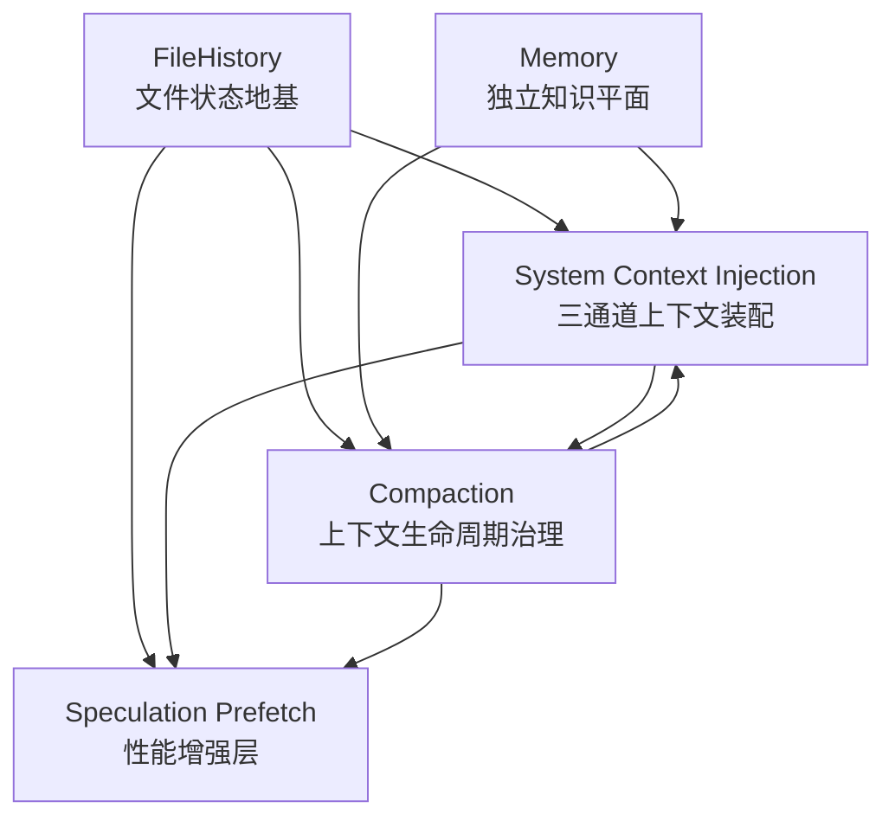
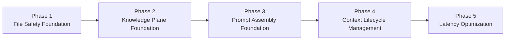
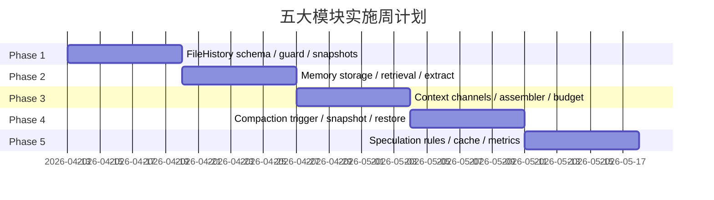
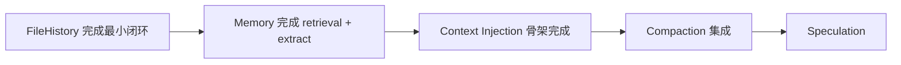
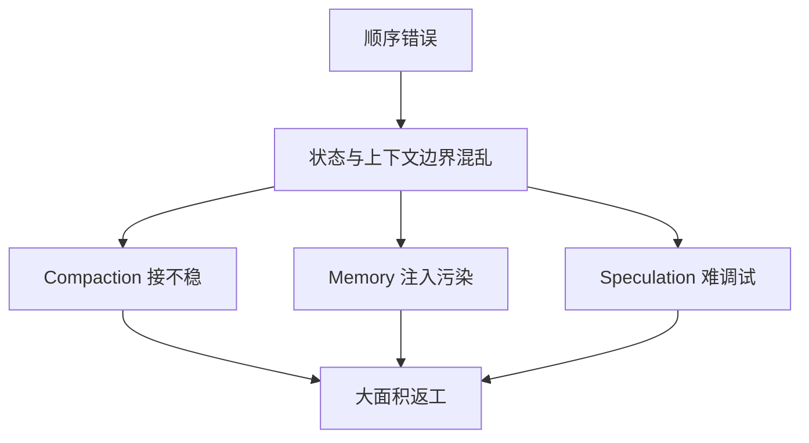

# 16. 五大模块实施执行计划（按依赖关系与优先级）

## 1. 文档目标

前面的五篇文档分别从模块视角完成了企业级设计：

- `11-memory-module-design.md`
- `12-compaction-module-design.md`
- `13-file-history-module-design.md`
- `14-system-context-injection-design.md`
- `15-speculation-prefetch-design.md`

但在真正推进实现时，只看单篇设计还不够。工程上更关键的问题是：

1. **先做什么，后做什么**
2. **哪些模块是前置依赖，哪些是增强层**
3. **哪些能力可以并行推进，哪些必须串行闭环**
4. **如何减少返工，避免“先做了一个模块，后面发现挂不进去”**

所以本篇的目标不是重复模块设计，而是给出一份可直接执行的**实施计划 / ToDo 路线图**。

---

## 2. 总体结论：推荐实施顺序

### 2.1 推荐主线

```text
FileHistory → Memory → System Context Injection → Compaction → Speculation Prefetch
```

这个顺序不是按模块名称排列，而是按**状态地基 → 知识平面 → 上下文编排 → 生命周期治理 → 性能增强**的工程依赖链排序。

### 2.2 为什么不是先做 Compaction

很多团队会直觉地把 Compaction 提前，因为“长上下文最急”。但从前面的设计文档反推，Compaction 真正依赖三类输入：

- **FileHistory**：压缩前必须保存 fileHistory snapshot，否则压缩后 read-before-edit 状态会失真
- **Memory**：压缩后需要重新注入长期记忆和相关记忆
- **System Context Injection**：Compaction 摘要必须有正式注入位置，不能只是生成一段字符串

也就是说：

> Compaction 不是一个“独立摘要器”，而是一个依赖状态恢复和上下文装配的中后期模块。

如果没有先完成三通道注入机制，Compaction 很容易变成“摘要做出来了，但不知道往哪里放、以什么优先级放”的半成品。

---

## 3. 模块依赖关系总图



### 3.1 依赖关系解释

#### FileHistory → Compaction
Compaction 的 Pre-compact 阶段必须保存 `fileHistory`，Post-compact 阶段必须恢复它，否则 read-before-edit 保护会失效。

#### Memory → System Context Injection
Memory 模块负责提供：
- `MEMORY.md` 入口内容
- relevant memories
- daily logs / extract / dream

这些都不是直接拼进 system prompt，而是应该进入 `userContext`。

#### System Context Injection → Compaction
Compaction 的输出并不是终点，它必须作为：
- systemContext 尾部提醒
- userContext / systemContext 的重建依据
- 压缩后继续推理的结构化上下文

所以 Context Injection 先落地，Compaction 才有稳定挂载点。

#### Speculation Prefetch 依赖前面所有模块
Speculation 只做缓存，不直接注入 context。但它的预测依据来自：
- FileHistory 的 recent edits
- 稳定的 Query Loop / Context 链路
- 已明确的 Compaction 边界

因此它天然是最后做的增强层。

---

## 4. 分阶段推进策略

## 4.1 Phase 划分



### Phase 1：File Safety Foundation
对应模块：**FileHistory**

### Phase 2：Knowledge Plane Foundation
对应模块：**Memory**

### Phase 3：Prompt Assembly Foundation
对应模块：**System Context Injection**

### Phase 4：Context Lifecycle Management
对应模块：**Compaction**

### Phase 5：Latency Optimization
对应模块：**Speculation Prefetch**

---

# 5. Phase 1：File Safety Foundation

## 5.1 核心目标

建立所有文件操作的正确性地基：

- 编辑前知道文件有没有被用户改过
- 编辑时留下 pre-edit / post-edit 快照
- 压缩时 fileHistory 可保存和恢复
- 系统出错时可以回滚到安全状态

## 5.2 为什么必须先做

因为 `13-file-history-module-design.md` 里最核心的一句其实是：

> read-before-edit 保护是核心，不能绕过。

这意味着 FileHistory 不是一个“锦上添花”的日志模块，而是后面所有状态一致性的基础保障。

## 5.3 本阶段 ToDo

### A. 数据结构与边界
- [ ] 定义 `FileSnapshot`
- [ ] 定义 `FileHistoryEntry`
- [ ] 定义 `FileHistoryStore`
- [ ] 定义 `FileHistorySnapshot`
- [ ] 明确 source 分类：`read / pre-edit / post-edit / compaction`

### B. Read-before-edit guard
- [ ] 实现 `checkReadBeforeEdit()`
- [ ] 返回 `safe / modified / not-read`
- [ ] 判断“当前 hash 是否等于上次读取 hash”
- [ ] 判断“当前 hash 是否等于最近一次 agent post-edit 结果”

### C. 快照生命周期
- [ ] Read tool 调用时记录 `read snapshot`
- [ ] Edit 前记录 `pre-edit snapshot`
- [ ] Edit 后记录 `post-edit snapshot`
- [ ] Compaction 前记录 `compaction snapshot`

### D. 冲突与回滚
- [ ] 定义冲突策略：`abort / overwrite / merge`
- [ ] 实现 `rollbackFile()`
- [ ] 实现 `rollbackSession()`
- [ ] 默认回滚到最近 pre-edit 快照

### E. 持久化与序列化
- [ ] 实现 `serializeFileHistory()`
- [ ] 实现 `deserializeFileHistory()`
- [ ] 明确只保留最近 N 个快照
- [ ] 为 Compaction 预留快照序列化入口

### F. 变更追踪
- [ ] 输出 modified files
- [ ] 输出 created files
- [ ] 输出 user modified files

## 5.4 阶段产出
- FileHistory schema
- read-before-edit guard 流程
- snapshot lifecycle
- rollback 设计
- tool integration 伪代码

## 5.5 阶段验收标准
- agent 不会在用户修改过文件后静默覆盖
- 任意 edit 都能回溯到 pre/post 版本
- fileHistory 能被序列化并恢复

---

# 6. Phase 2：Knowledge Plane Foundation

## 6.1 核心目标

把 Memory 建成真正的独立知识平面，而不是“把一些笔记塞进 system prompt”。

## 6.2 为什么排第二

`11-memory-module-design.md` 的关键结论是：

> Memory 是独立平面，不是系统 prompt 的附属文件读取逻辑。

它必须先独立成型，后续才能稳定为 Context Injection 提供：

- 长期记忆入口
- relevant memories
- daily log
- extract / dream 结果

## 6.3 本阶段 ToDo

### A. 分层设计落地
- [ ] ConfigLayer
- [ ] PathLayer
- [ ] PromptLayer
- [ ] RetrievalLayer
- [ ] TeamLayer
- [ ] TurnEndLayer

### B. 存储结构落地
- [ ] `MEMORY.md`
- [ ] `projects/<hash>/memory/`
- [ ] `daily logs`
- [ ] `decisions.md`
- [ ] `context.md`
- [ ] `learnings.md`
- [ ] `global/preferences.md`

### C. Retrieval 实现
- [ ] 实现 header scan
- [ ] 只读前 N 行，不读全文
- [ ] 提取 title / summary / lastModified
- [ ] 生成 manifest

### D. Selector 实现
- [ ] 实现 sideQuery selector
- [ ] 选择 0~5 条 relevant memories
- [ ] 过滤 already surfaced 记忆
- [ ] 预留轻量模型接口

### E. Turn-end extract
- [ ] 提取 preferences
- [ ] 提取 decisions
- [ ] 提取 context updates
- [ ] 提取 learnings
- [ ] 写入 daily log

### F. Auto dream
- [ ] 后台整理最近 N 天 daily logs
- [ ] distill 到 `MEMORY.md`
- [ ] 失败静默，不阻塞主流程

### G. 安全控制
- [ ] 团队记忆路径 sanitize
- [ ] path traversal 检测
- [ ] team memory 读写安全验证

## 6.4 阶段产出
- Memory 架构分层图
- 存储结构规范
- retrieval 流程
- extract / dream 时序图

## 6.5 阶段验收标准
- 能按需选择 relevant memories，而不是全量注入
- turn-end 能持续沉淀长期价值
- global / project / team 三种边界清晰

---

# 7. Phase 3：Prompt Assembly Foundation

## 7.1 核心目标

建立正式的三通道上下文装配机制：

- `systemPrompt`
- `userContext`
- `systemContext`

为 Memory、FileHistory、Compaction 提供稳定挂载点。

## 7.2 为什么这是 Compaction 的前置

在 `14-system-context-injection-design.md` 里，三通道设计不是“优化项”，而是整个上下文系统的主干。

如果没有它：
- Memory 不知道应该挂在头部还是系统提示里
- FileHistory 的 recent edits 没有正式位置
- Compaction 摘要只能粗暴拼接，优先级不可控

所以更稳的路线是：

> 先把上下文装配架构定型，再让 Compaction 接入这套架构。

## 7.3 本阶段 ToDo

### A. 定义三通道模型
- [ ] systemPrompt（静态）
- [ ] userContext（每轮 prepend）
- [ ] systemContext（每轮 append）
- [ ] 明确三者的边界与位置语义

### B. 定义 ContextPart 抽象
- [ ] `type`
- [ ] `priority`
- [ ] `content`
- [ ] `truncatable`
- [ ] `maxTokens`

### C. 实现 ContextAssembler
- [ ] 按优先级排序
- [ ] 按 token budget 装配
- [ ] 可截断部分裁剪
- [ ] 不可截断部分强制保留
- [ ] `assembleForCompaction()` 高优先级组装

### D. 定义来源与预算
- [ ] systemPrompt 预算
- [ ] userContext 预算
- [ ] systemContext 预算
- [ ] 历史消息预算
- [ ] 输出 token 预算

### E. 与模块集成
- [ ] Memory → userContext
- [ ] relevant memories → userContext
- [ ] FileHistory recent edits → systemContext
- [ ] 当前时间 / 工作目录 → systemContext

### F. 可观测性
- [ ] 每轮输出 context parts 来源
- [ ] part token 占用
- [ ] 被裁剪的 part
- [ ] 裁剪原因

## 7.4 阶段产出
- 三通道依赖图
- context assembly pipeline
- token budget 设计
- 模块到 channel 的职责映射表

## 7.5 阶段验收标准
- 各模块可以独立产出自己的 context part
- token 超限时行为稳定且可解释
- userContext / systemContext 的位置语义明确

---

# 8. Phase 4：Context Lifecycle Management

## 8.1 核心目标

把上下文压缩做成一个正式生命周期：

- Pre-compact
- Compact
- Post-compact

不是“简单截短历史消息”，而是“保存状态 → 生成摘要 → 恢复继续”。

## 8.2 为什么现在做

当 FileHistory、Memory、System Context Injection 都完成最小闭环后，Compaction 才终于有了完整依赖：

- 有 fileHistory snapshot 可存可恢复
- 有 memory context 可重新注入
- 有三通道上下文可用来挂载 compact summary

## 8.3 本阶段 ToDo

### A. Trigger 与预算检测
- [ ] `estimateTokenCount()`
- [ ] `shouldCompact()`
- [ ] `getCompactionUrgency()`
- [ ] warning / urgent 分级

### B. Pre-compact
- [ ] 保存完整 messages
- [ ] 保存 fileHistory snapshot
- [ ] 保存 readFileState
- [ ] 保存 toolPermissions
- [ ] 保存 memoryContext
- [ ] 持久化 `CompactionSnapshot`

### C. Compact 阶段
- [ ] 实现 structured summary prompt
- [ ] 保留 completed tasks
- [ ] 保留 key decisions
- [ ] 保留 current state
- [ ] 保留 pending work
- [ ] 保留 important context
- [ ] 保留最近 N 条消息

### D. Post-compact 恢复
- [ ] 恢复 messages
- [ ] 恢复 readFileState
- [ ] 恢复 toolPermissions
- [ ] 恢复 fileHistory
- [ ] 重建 userContext / systemContext
- [ ] 把 compact summary 注入 systemContext

### E. 错误回滚
- [ ] compaction 失败回滚到 snapshot
- [ ] snapshot 恢复失败时降级处理
- [ ] 必要时退化为简单截断

### F. Telemetry
- [ ] 压缩触发频率
- [ ] 压缩比
- [ ] 压缩耗时
- [ ] snapshot 大小

## 8.4 阶段产出
- 三阶段状态机
- compaction summary schema
- snapshot persistence 设计
- rollback 机制
- telemetry 指标表

## 8.5 阶段验收标准
- 压缩后系统不丢关键状态
- 压缩结果能无缝进入下一轮上下文
- 出错可恢复

---

# 9. Phase 5：Latency Optimization

## 9.1 核心目标

在不污染主流程的前提下，通过预测 + 缓存降低工具执行延迟。

## 9.2 为什么必须最后做

`15-speculation-prefetch-design.md` 的核心原则非常明确：

> 预取结果不注入 context，只放缓存；不命中 = 正常执行，零副作用。

这意味着 Speculation 必须建立在“主链已经稳定”的前提下。否则它会把调试复杂度拉高，甚至让团队误把缓存命中当主逻辑。

## 9.3 本阶段 ToDo

### A. 定义边界
- [ ] 明确只预取高价值、耗时较高的工具
- [ ] 明确不把预取结果注入任何 context 通道
- [ ] 明确 miss 时完全回退正常执行

### B. Prediction Engine
- [ ] 讨论文件/类/函数 → 影响分析
- [ ] 刚编辑文件 → git diff
- [ ] 上轮搜索 → 继续搜索
- [ ] 讨论 bug → 读相关文件
- [ ] 置信度阈值过滤

### C. TTL Cache
- [ ] 实现 `set/get/has`
- [ ] 实现 `tryGetToolResult()`
- [ ] TTL 默认 60s
- [ ] 自动清除过期项

### D. Async Prefetch Executor
- [ ] 后台执行，不阻塞主流程
- [ ] 静默失败
- [ ] 缓存命中时跳过真实工具执行

### E. Query Loop 接入
- [ ] assistant turn 结束后触发 speculation
- [ ] tool 执行前先查缓存
- [ ] 标记 `fromCache`

### F. 指标与删规则
- [ ] cache hit rate
- [ ] prefetch success rate
- [ ] latency saved
- [ ] wasted prefetch ratio
- [ ] 低命中规则淘汰机制

## 9.4 阶段产出
- prediction matrix
- TTL cache 设计
- hit/miss sequence diagram
- metrics specification

## 9.5 阶段验收标准
- prefetch 结果绝不直接进 context
- miss 时完全退化为正常执行
- hit 时能显著减少等待时间

---

# 10. 推荐周计划

## 10.1 五周推进图



> 注：这是按最稳的串行闭环排法画的。真实项目里可以在每周后半段做少量下一阶段预研，但主交付仍建议按这个顺序锁死。

## 10.2 每周交付重点

### Week 1：FileHistory
目标：把文件安全与状态快照打牢。

### Week 2：Memory
目标：把长期知识与按需检索做成独立平面。

### Week 3：System Context Injection
目标：把上下文装配机制从字符串拼接升级成三通道体系。

### Week 4：Compaction
目标：让长上下文治理具备完整生命周期。

### Week 5：Speculation
目标：在不污染主链的前提下做性能增强。

---

# 11. 并行与串行策略

## 11.1 必须串行的部分



这些环节建议严格串行，因为它们之间存在明确的“输入输出依赖”。

## 11.2 可以有限并行的部分

### 可并行 A：Memory 与 FileHistory 的文档/接口预研
在 Phase 1 后半程，可以提前预研 Memory 的 schema 与 retrieval manifest，但**不要先写 Compaction**。

### 可并行 B：Compaction prompt 预研
在 Context Injection 建好骨架后，可以先预研 summary prompt，但不要提前做完整集成。

### 可并行 C：Speculation rule catalog 收集
在 Compaction 开发后期，可以提前整理预测规则候选列表，但不要正式接入 Query Loop。

---

# 12. 风险与返工点

## 12.1 最高风险点

### 风险 1：先做 Compaction，后补 Context Injection
后果：摘要逻辑和注入逻辑解耦失败，返工概率高。

### 风险 2：把 Memory 当成 prompt 文本文件处理
后果：检索、extract、dream 全都会被做成脆弱的字符串拼接。

### 风险 3：把 FileHistory 当成普通日志系统
后果：read-before-edit guard 不完整，最关键的 correctness 价值丢失。

### 风险 4：过早做 Speculation
后果：问题定位复杂，主流程和缓存逻辑混杂，调试成本陡增。

## 12.2 风险关系图



---

# 13. 可直接转为项目板的 Epic

## Epic A：File safety and recoverability
- [ ] Define FileHistory schema and boundaries
- [ ] Implement read-before-edit guard
- [ ] Implement snapshot lifecycle
- [ ] Implement rollback support
- [ ] Add fileHistory serialization hooks
- [ ] Generate file change report

## Epic B：Independent memory plane
- [ ] Define memory storage layout
- [ ] Implement header scan + manifest
- [ ] Implement sideQuery selector
- [ ] Implement relevant memory retrieval
- [ ] Implement turn-end extract
- [ ] Implement auto dream
- [ ] Add team memory safety validation

## Epic C：Three-channel context assembly
- [ ] Define systemPrompt / userContext / systemContext
- [ ] Implement ContextPart abstraction
- [ ] Implement ContextAssembler
- [ ] Add token budget strategy
- [ ] Integrate Memory and FileHistory outputs
- [ ] Add per-turn observability

## Epic D：Compaction lifecycle
- [ ] Implement token detector
- [ ] Implement Pre-compact snapshot save
- [ ] Implement structured summary generation
- [ ] Implement Post-compact restore
- [ ] Rebuild context channels after compaction
- [ ] Add rollback and telemetry

## Epic E：Latency optimization
- [ ] Implement rule-based prediction engine
- [ ] Implement TTL cache
- [ ] Implement async prefetch executor
- [ ] Query cache before tool execution
- [ ] Add metrics and low-hit rule pruning

---

# 14. 最终建议

如果目标是把这五个模块真正落成一个稳定、可维护、可扩展的企业级系统，那么最重要的不是“哪个模块最炫”，而是：

> **先把状态地基和上下文装配打牢，再做生命周期治理，最后做性能增强。**

因此最推荐的执行路线是：

```text
FileHistory → Memory → System Context Injection → Compaction → Speculation Prefetch
```

这个顺序的优点是：

1. **返工最少**：后做的模块都有稳定挂点
2. **边界最清晰**：每个模块都清楚自己产出什么、注入哪里
3. **风险可控**：不会过早引入复杂优化逻辑
4. **便于验收**：每一阶段都能形成清晰闭环

这也是从五篇模块设计文档反推出来，最稳的一条实现路径。
