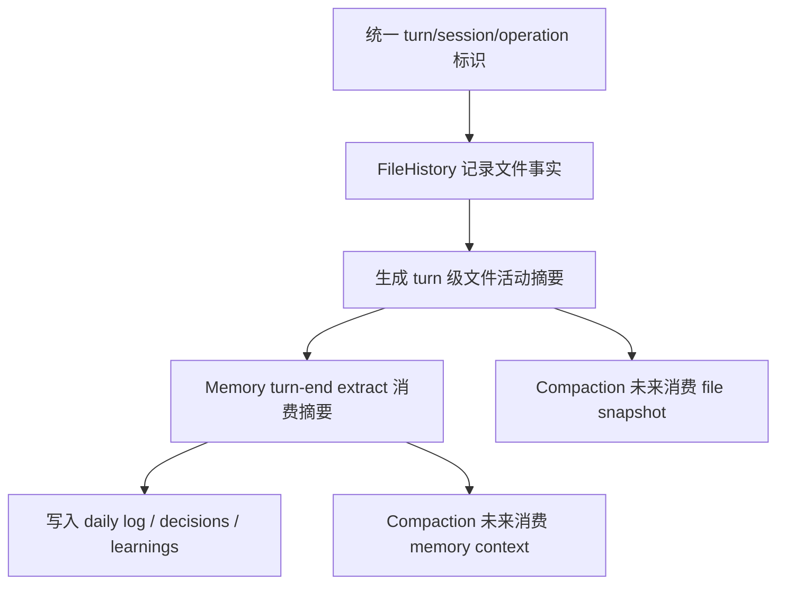
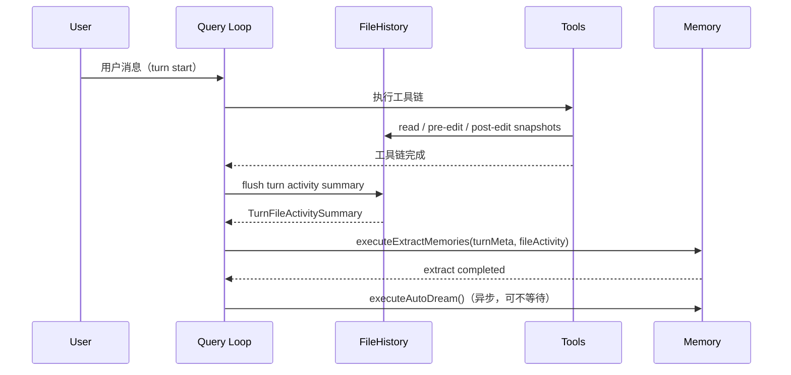
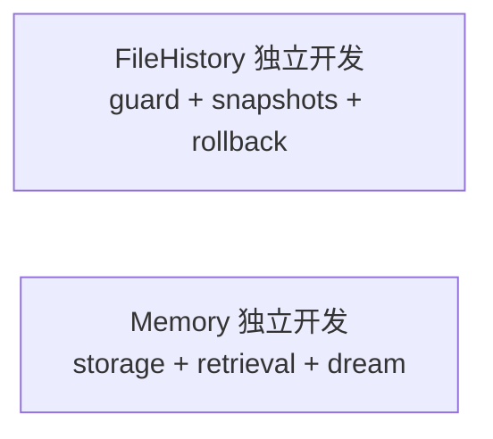

# 17. FileHistory × Memory 并行开发接口对齐文档

## 1. 文档目标

在五大模块的实施顺序中，`FileHistory` 与 `Memory` 都属于前置基础模块，且二者在工程上**可以并行推进**。但“可以并行”不等于“完全无依赖”。

如果两边各自埋头实现、最后再接，通常会出现几类问题：

- FileHistory 保存了大量原始快照，但 Memory 不知道该消费哪一层信息
- Memory 想在 turn-end 提取“本轮发生了什么”，却拿不到稳定的文件活动摘要
- 双方对 turn/session 边界理解不一致，导致 extract 时机不稳定
- 后续接 Compaction 时，二者都没有预留统一导出接口，集成返工

所以这篇文档的目标是：

1. 明确 **FileHistory 与 Memory 能否并行开发**
2. 明确 **两边需要提前对齐的最小接口契约**
3. 明确 **哪些部分可以完全独立推进，哪些必须联调**
4. 给出 **联调时序图、检查清单、责任边界**

---

## 2. 结论先说

## 2.1 结论

### `FileHistory` 和 `Memory` 可以并行开发。

但前提是：

> **先对齐接口契约，再并行推进实现。**

### 推荐协作方式

- **FileHistory 负责人**：专注文件状态、安全、快照、回滚、变更事实输出
- **Memory 负责人**：专注知识存储、检索、extract、dream、长期记忆结构
- **双方共同先对齐 4 个依赖点**：
  1. turn / session / operation 标识体系
  2. 文件活动摘要结构
  3. turn-end extract 的触发时机
  4. 给 Compaction 预留的导出接口

---

## 3. 为什么它们可以并行

## 3.1 FileHistory 的核心职责

根据 `13-file-history-module-design.md`，FileHistory 主要负责：

- read-before-edit 保护
- read / pre-edit / post-edit / compaction snapshot
- rollback
- change report
- 为 compaction 提供 fileHistory snapshot

它的本质是：

> **文件状态正确性 + 可追踪性基础设施**

## 3.2 Memory 的核心职责

根据 `11-memory-module-design.md`，Memory 主要负责：

- Memory 存储结构
- MEMORY.md / daily logs / decisions / learnings
- header scan + sideQuery retrieval
- turn-end extract
- auto dream
- project / global / team isolation

它的本质是：

> **独立知识平面 + 记忆维护机制**

## 3.3 为什么主任务天然可分开

- FileHistory 关心的是：**文件发生了什么**
- Memory 关心的是：**什么值得长期记住**

前者是事实层，后者是知识层。

所以在实现层面：

- FileHistory 不必等 Memory 才能完成 guard / snapshot / rollback
- Memory 不必等 FileHistory 才能完成 retrieval / extract / dream 的大部分骨架

---

## 4. 但必须先对齐的依赖点

## 4.1 依赖点总图



---

## 5. 必须对齐的四个接口契约

# 5.1 契约 1：统一 turn / session / operation 标识

## 为什么必须先对齐

FileHistory 的快照与 Memory 的 extract 都是围绕“某一轮对话”发生的。

如果两边没有统一的 turn/session 语义：

- FileHistory 记录的快照不知道属于哪个 turn
- Memory 的 turn-end extract 不知道该抓哪一轮文件活动
- 后续 Compaction 也无法精确知道哪些状态属于当前压缩窗口

## 推荐最小标识模型

```typescript
export interface TurnContextMeta {
  sessionId: string;
  turnId: string;
  startedAt: number;
  endedAt?: number;
}

export interface OperationMeta {
  operationId: string;
  sessionId: string;
  turnId: string;
  timestamp: number;
}
```

## 对齐要求
- `sessionId`：整个会话稳定不变
- `turnId`：每轮用户输入 → agent 完成一次完整响应链路
- `operationId`：每次工具调用或关键内部动作唯一标识

## 实施建议
- Query Loop 在 turn 开始时生成 `turnId`
- 所有 FileHistory snapshot 都带上 `sessionId + turnId`
- Memory extract 使用同一个 `turnId`

---

# 5.2 契约 2：FileHistory 不直接暴露原始快照给 Memory，而暴露“文件活动摘要”

## 为什么不能直接让 Memory 读 FileHistory 全量快照

因为 FileHistory 的快照结构是为了 correctness / rollback 设计的，里面可能包含：

- 原始 content
- hash
- mtime
- source
- capturedAt

Memory 如果直接消费这套结构：

- 耦合太深
- extract 逻辑会被快照细节污染
- 后面 FileHistory 内部结构一变，Memory 也要跟着改

## 正确方式
FileHistory 对外提供一个更轻的**turn 级事实摘要**。

### 推荐接口

```typescript
export interface TurnFileActivitySummary {
  sessionId: string;
  turnId: string;
  readFiles: string[];
  modifiedFiles: string[];
  createdFiles: string[];
  conflictedFiles: string[];
  rolledBackFiles: string[];
}
```

### 可扩展版本（如果需要更多细节）

```typescript
export interface FileChangeFact {
  path: string;
  action: 'read' | 'edit' | 'create' | 'rollback';
  source: 'read' | 'pre-edit' | 'post-edit' | 'compaction';
  changedBy: 'agent' | 'user' | 'unknown';
  timestamp: number;
}

export interface TurnFileActivitySummary {
  sessionId: string;
  turnId: string;
  readFiles: string[];
  modifiedFiles: string[];
  createdFiles: string[];
  conflictedFiles: string[];
  rolledBackFiles: string[];
  facts?: FileChangeFact[];
}
```

## Memory 该怎么用这份摘要
Memory extract 可以把它作为**辅助事实源**，用于提取：

- 本轮修改了哪些文件
- 是否发生冲突
- 是否做了关键回滚
- 哪些文件变化值得记录为 project context / decisions / learnings

---

# 5.3 契约 3：Memory extract 的触发时机必须依赖 FileHistory flush 完成

## 为什么这个时机必须锁死

如果 Memory 在 FileHistory 还没完成本轮 post-edit snapshot / conflict 标记之前就开始 extract：

- 本轮文件活动信息不完整
- 可能漏掉最后一次 edit
- 可能不知道本轮是否发生 rollback / conflict

最后 daily log 里记录出来的“本轮发生了什么”就不可靠。

## 推荐时序



## 建议规则
- `executeExtractMemories()` 必须在“本轮工具链完成”后触发
- 必须在 `TurnFileActivitySummary` 已可用后触发
- `autoDream` 可以异步，不阻塞主流程

---

# 5.4 契约 4：为 Compaction 预留导出接口

虽然当前讨论的是 FileHistory 和 Memory 的并行开发，但如果这一步不先预留，后面接 Compaction 一定返工。

## FileHistory 需要预留

```typescript
export interface FileHistoryPublicAPI {
  exportSnapshot(): Promise<FileHistorySnapshot>;
  getTurnFileActivitySummary(turnId: string): Promise<TurnFileActivitySummary>;
}
```

## Memory 需要预留

```typescript
export interface MemoryPublicAPI {
  executeExtractMemories(
    turnMeta: TurnContextMeta,
    fileActivity?: TurnFileActivitySummary
  ): Promise<void>;

  exportContext(): Promise<MemoryContext>;
  flushTurnExtractIfNeeded(): Promise<void>;
}
```

## 为什么这两个导出接口很关键

### `exportSnapshot()`
Compaction 的 Pre-compact 阶段需要保存 fileHistory snapshot。

### `exportContext()`
Compaction 的 Post-compact 阶段需要重新注入 memory entrypoint 与 relevant memories。

### `flushTurnExtractIfNeeded()`
Compaction 触发前，如果当前 turn 有还没写入的记忆候选，需要先冲刷，避免压缩把上下文切断后丢失信息。

---

## 6. 推荐的公共接口契约（最小版）

```typescript
export interface TurnContextMeta {
  sessionId: string;
  turnId: string;
  startedAt: number;
  endedAt?: number;
}

export interface TurnFileActivitySummary {
  sessionId: string;
  turnId: string;
  readFiles: string[];
  modifiedFiles: string[];
  createdFiles: string[];
  conflictedFiles: string[];
  rolledBackFiles: string[];
}

export interface FileHistoryPublicAPI {
  getTurnFileActivitySummary(turnId: string): Promise<TurnFileActivitySummary>;
  exportSnapshot(): Promise<FileHistorySnapshot>;
}

export interface MemoryPublicAPI {
  executeExtractMemories(
    turnMeta: TurnContextMeta,
    fileActivity?: TurnFileActivitySummary
  ): Promise<void>;

  exportContext(): Promise<MemoryContext>;
  flushTurnExtractIfNeeded(): Promise<void>;
}
```

## 这套接口的优点

1. **低耦合**：Memory 不依赖 FileHistory 内部快照细节
2. **高复用**：Compaction 能直接消费两边导出接口
3. **可演进**：以后可在 `TurnFileActivitySummary` 增加更细 facts，而不破坏主接口
4. **易联调**：联调只需要验证几个稳定方法，而不是理解对方全部内部实现

---

## 7. 谁可以完全独立做，谁必须联调

## 7.1 FileHistory 可独立推进的部分

### 可以独立开发
- [ ] `FileSnapshot` / `FileHistoryEntry` / `FileHistoryStore`
- [ ] `checkReadBeforeEdit()`
- [ ] `recordSnapshot()`
- [ ] `rollbackFile()` / `rollbackSession()`
- [ ] `serializeFileHistory()` / `deserializeFileHistory()`
- [ ] change report

### 依赖对齐后再接的部分
- [ ] `getTurnFileActivitySummary(turnId)`
- [ ] 在 Query Loop 的 turn 边界上生成 summary

---

## 7.2 Memory 可独立推进的部分

### 可以独立开发
- [ ] Memory storage layout
- [ ] header scan
- [ ] manifest generation
- [ ] sideQuery selector
- [ ] relevant memory retrieval
- [ ] auto dream
- [ ] team memory path safety

### 依赖对齐后再接的部分
- [ ] `executeExtractMemories(turnMeta, fileActivity)`
- [ ] turn-end extract 如何消费 `TurnFileActivitySummary`
- [ ] `flushTurnExtractIfNeeded()` 触发时机

---

## 8. 推荐协作分工

## 8.1 双人并行版

### 负责人 A：FileHistory
负责：
- schema
- snapshot lifecycle
- read-before-edit guard
- rollback
- change report
- file activity summary 输出
- exportSnapshot

### 负责人 B：Memory
负责：
- storage layout
- retrieval
- sideQuery
- turn-end extract
- auto dream
- exportContext
- flushTurnExtractIfNeeded

### 共同负责
- turn/session/operation 标识对齐
- Query Loop 的 turn end hook
- 联调测试

---

## 9. 推荐开发节奏

## 9.1 第一阶段：半天接口对齐

目标：先定契约，不急着开写。

### 对齐清单
- [ ] `sessionId / turnId / operationId` 命名和来源
- [ ] `TurnFileActivitySummary` 结构
- [ ] `executeExtractMemories()` 触发时机
- [ ] `exportSnapshot()` / `exportContext()` 是否满足 Compaction 需求

---

## 9.2 第二阶段：各自完成 80% 独立开发



这一阶段不要急着深度互调，先把各自主链做稳。

---

## 9.3 第三阶段：做最小集成闭环

只接这一条链路：


### 为什么只接这一条
因为这条最小闭环能验证：
- turn 边界对没对齐
- FileHistory 输出是否足够
- Memory extract 是否能稳定消费
- 两边是否已经耦合过深

如果这一条通了，后面接 Compaction 会轻松很多。

---

## 10. 联调检查清单

## 10.1 接口层检查
- [ ] FileHistory snapshot 都带 `sessionId + turnId`
- [ ] Memory extract 接口接受 `turnMeta + fileActivity`
- [ ] `TurnFileActivitySummary` 不依赖 FileHistory 内部原始快照结构
- [ ] FileHistory / Memory 都预留了给 Compaction 的导出接口

## 10.2 时序检查
- [ ] tools 完成后，FileHistory 才 flush turn summary
- [ ] turn summary ready 后，Memory 才 extract
- [ ] autoDream 是异步，不阻塞主流程

## 10.3 语义检查
- [ ] Memory 不会把所有文件变化都无脑写成长记忆
- [ ] FileHistory 不承担记忆提炼职责
- [ ] conflict / rollback 事实能被 Memory 感知，但 Memory 不负责决定冲突处理

## 10.4 Compaction 前瞻检查
- [ ] `exportSnapshot()` 可用于 Pre-compact
- [ ] `exportContext()` 可用于 Post-compact
- [ ] `flushTurnExtractIfNeeded()` 可在压缩前调用

---

## 11. 最容易踩的坑

## 坑 1：Memory 直接读 FileHistory 快照细节
后果：强耦合，一改 FileHistory 结构就全炸。

## 坑 2：没有统一 turnId
后果：extract 拿到的文件活动和对话轮次对不上。

## 坑 3：extract 触发过早
后果：漏掉最后一次 post-edit / conflict / rollback。

## 坑 4：只考虑两边互调，不考虑 Compaction
后果：当前看似接通，后面接 Compaction 还得大改导出接口。

---

## 12. 最终建议

### 可以并行吗？
可以，而且值得并行。

### 并行的前提是什么？
先锁定四个接口契约：

1. `turn/session/operation` 标识体系
2. `TurnFileActivitySummary`
3. `executeExtractMemories()` 的触发时机
4. `exportSnapshot()` / `exportContext()` / `flushTurnExtractIfNeeded()`

### 最稳的并行推进方式是什么？

```text
半天对齐接口 → 两边各做 80% 主体 → 接 turn-end 最小闭环 → 再接 Compaction
```

这条路线的好处是：
- 两边都能高效率并行
- 集成点少而清晰
- 不会因为过早深耦合而返工
- 后续接 Compaction 时也更顺

所以结论很简单：

> **FileHistory 和 Memory 可以并行做，但必须先对齐最小接口契约；实现并行，语义先对齐。**
