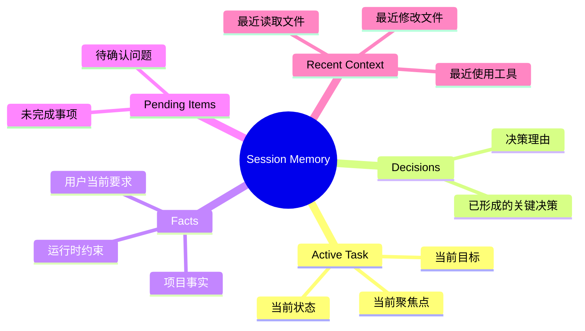
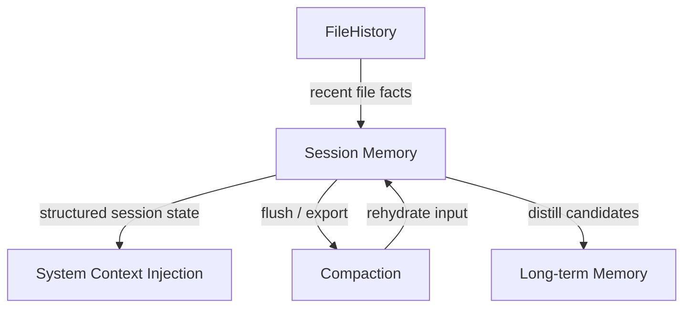
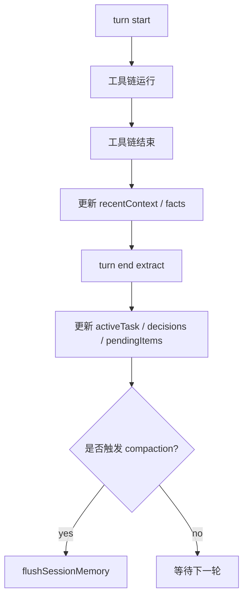
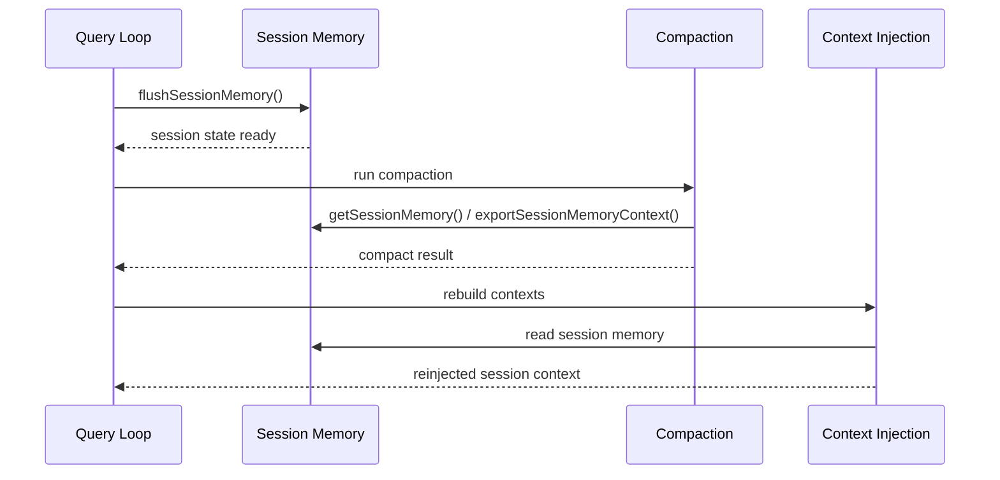

# 18. Session Memory 设计与优先实施方案

## 1. 文档目标

在 Memory 模块的整体设计中，既有：

- 跨会话长期记忆（如 `MEMORY.md`、长期偏好、项目事实）
- 项目级记忆（如 `context.md`、`decisions.md`、daily logs）
- 团队共享记忆
- 异步 dream 整理机制

但如果从真正影响 Agent 连续工作能力的角度看，最应该优先落地的，其实不是 dream，也不是 team memory，而是：

> **Session Memory（会话级记忆）**

它解决的是当前 session 内最核心的问题：

- 刚刚讨论过什么
- 当前任务做到哪了
- 有哪些关键 decision 已经形成
- 刚刚读/改过哪些关键文件
- 一旦发生 compaction，怎样避免“压缩完就失忆”

所以这篇文档的目标是：

1. 明确什么是 Session Memory
2. 明确为什么它应该优先于其他 Memory 子能力先做
3. 给出 Session Memory 的数据结构、更新时机、消费方式
4. 明确它与 Context Injection / Compaction 的关系
5. 给出一份可直接推进的优先实施方案

---

## 2. 结论先说

## 2.1 结论

如果当前重点是提升 Agent 在单个会话中的连续工作能力，那么 Memory 模块最应该优先实现的部分是：

```text
Session Memory
```

而不是先做完整的长期记忆沉淀体系。

## 2.2 为什么优先做它

因为用户最先感知到的不是：
- dream 做得多优雅
- team memory 多完整
- 长期记忆目录多漂亮

而是：

- 你刚说过的话后面还记不记得
- 你刚定的决策会不会下一轮就忘
- 你刚读/改过的文件后面还能不能接着分析
- 长对话压缩后会不会直接断片

这些问题本质上都是：

> **会话级工作记忆是否成立**

---

## 3. 什么是 Session Memory

## 3.1 定义

Session Memory 不是聊天记录的简单缓存，也不是长期记忆仓库。

更准确的定义是：

> **Session Memory 是为了支持当前 session 内持续完成任务而维护的结构化工作记忆。**

它的目标不是“尽量存更多”，而是“保留后续继续干活真正需要的状态”。

---

## 3.2 它不是什么

### 不是 1：全部历史消息
把所有消息原样保留不等于记忆，这只是历史记录。

### 不是 2：长期记忆
很多会话中的内容是临时性的，不该直接写入长期层。

### 不是 3：工具结果缓存
工具输出是执行产物，不等于工作记忆本身。

---

## 3.3 它应该包含什么



---

# 4. 为什么 Session Memory 应该优先实现

## 4.1 它最直接决定 Agent 是否“不断片”

一个 Agent 在当前 session 内是否好用，用户最先体感到的是：

- 能不能延续当前任务
- 会不会忘掉刚才的关键约束
- 会不会在上下文变长后突然智商掉线
- 压缩后还能不能继续刚才的工作主线

这些都依赖 Session Memory，而不是长期记忆。

---

## 4.2 它是长期记忆的上游原料层

长期记忆通常来自以下链路：


这意味着：

> Session Memory 先做稳，长期记忆的质量才会稳。

如果会话内都没结构，后面 dream 只是在整理一堆噪声。

---

## 4.3 它和 Compaction 的关系最紧密

Compaction 真正难的地方不是“做摘要”，而是：

- 当前任务状态怎么保住
- 当前决策怎么别丢
- 当前最近工作上下文怎么继续

这些本质上都属于 Session Memory。

所以从工程落地上说：

> **Compaction 要想做好，Session Memory 先得站住。**

---

# 5. Session Memory 的设计边界

## 5.1 Session Memory 的职责

### 它负责
- 保存当前 session 内对后续工作有用的结构化状态
- 在 turn 之间维持任务连续性
- 在 compaction 前提供可 flush / 可导出的状态
- 在 compaction 后作为 rehydrate 的重要输入

### 它不负责
- 永久保存所有高价值事实
- 代替长期记忆层
- 保存所有工具原始输出
- 代替文件快照系统（那是 FileHistory 的职责）

---

## 5.2 与其他模块的边界



### 解释
- **FileHistory → Session Memory**：提供最近文件活动事实，但不直接变成记忆本体
- **Session Memory → Context Injection**：把当前任务状态、决策、pending items 注入上下文
- **Session Memory → Compaction**：在压缩前 flush，压缩后 rehydrate
- **Session Memory → Long-term Memory**：作为长期记忆沉淀的候选来源

---

# 6. 推荐数据结构

## 6.1 最小可用版本（P0）

```typescript
export interface SessionMemory {
  sessionId: string;
  updatedAt: number;

  activeTask?: {
    goal: string;
    status: 'active' | 'blocked' | 'done';
    currentFocus?: string;
  };

  decisions: Array<{
    summary: string;
    rationale?: string;
    turnId: string;
    timestamp: number;
  }>;

  facts: Array<{
    summary: string;
    type: 'project' | 'user' | 'runtime' | 'constraint';
    turnId: string;
    timestamp: number;
  }>;

  pendingItems: Array<{
    item: string;
    priority?: 'high' | 'medium' | 'low';
    turnId: string;
  }>;

  recentContext: {
    filesRead: string[];
    filesModified: string[];
    toolsUsed: string[];
  };
}
```

---

## 6.2 为什么这个结构够用

### `activeTask`
用于明确：当前 session 最核心的工作目标是什么。

### `decisions`
用于避免“刚决定完，下一轮就忘”。

### `facts`
用于保存当前 session 中形成的高价值事实与约束。

### `pendingItems`
用于维持未完成事项，不让任务收尾时丢失尾巴。

### `recentContext`
用于把最近工作轨迹结构化，而不是靠翻历史消息。

---

# 7. Session Memory 的写入规则

## 7.1 应该写入什么

### 写入原则

> **只写“后续继续干活会用到的东西”。**

### 应写入的内容
- 当前任务目标
- 当前任务状态变化
- 关键 decision
- 明确约束
- 未完成事项
- 后面仍会依赖的事实
- 最近关键工作上下文（文件/工具）

---

## 7.2 不该写入什么

### 不写入的内容
- 客套话
- 全量聊天历史
- 重复信息
- 所有工具原始输出
- 噪声型搜索结果
- 临时的低价值 chatter

### 原因
如果 Session Memory 变成一个“什么都塞”的桶，它很快就会退化成：
- 半残废聊天摘要
- 低质量 context 垃圾源
- compaction 前后都不可靠的状态块

---

# 8. 更新时机设计

## 8.1 推荐的三个更新点



---

## 8.2 更新点解释

### 1. 工具链结束后
适合更新：
- `recentContext.filesRead`
- `recentContext.filesModified`
- `recentContext.toolsUsed`
- 某些运行时事实

### 2. turn end
适合更新：
- `activeTask`
- `decisions`
- `facts`
- `pendingItems`

### 3. compaction 前
必须调用：
- `flushSessionMemory()`

确保当前工作记忆被固化，不因为压缩而丢失。

---

# 9. 读取与消费方式

## 9.1 第一版不要过度设计

Session Memory 不是海量长期知识库，所以第一版没必要搞复杂语义检索。

### 第一版建议
直接按结构消费：

- activeTask
- 最近 decisions
- 当前 pendingItems
- recentContext

---

## 9.2 推荐消费方式


### 建议注入策略
- `activeTask` → userContext 高优先级
- `decisions` → userContext 中高优先级
- `pendingItems` → systemContext 或 userContext
- `recentContext` → systemContext（更偏当前状态提醒）

---

# 10. Session Memory 与 Compaction 的关系

## 10.1 为什么必须提前对齐

如果 Session Memory 没有清晰的 flush/export 机制，Compaction 就只能：
- 读全量历史消息
- 临时猜当前状态
- 压缩后再靠摘要恢复

这种恢复是不稳定的。

所以更合理的方式是：

> 让 Session Memory 成为 Compaction 前后的结构化工作状态来源。

---

## 10.2 推荐接口

```typescript
export interface SessionMemoryPublicAPI {
  getSessionMemory(): Promise<SessionMemory>;
  updateSessionMemory(patch: Partial<SessionMemory>): Promise<void>;
  flushSessionMemory(): Promise<void>;
  exportSessionMemoryContext(): Promise<string>;
}
```

---

## 10.3 与 Compaction 的交互时序



---

# 11. 推荐实施范围

## 11.1 P0：先做 Session Memory 主体

### 目标
让当前 session 的任务连续性成立。

### ToDo
- [ ] 定义 `SessionMemory` schema
- [ ] 定义 update rules
- [ ] 定义 write policy
- [ ] 实现 `getSessionMemory()`
- [ ] 实现 `updateSessionMemory()`
- [ ] 实现 `flushSessionMemory()`
- [ ] 实现 `exportSessionMemoryContext()`
- [ ] 实现 turn-end extract 到 Session Memory
- [ ] 实现 recentContext 聚合

---

## 11.2 P1：接入 Context Injection

### 目标
让 Session Memory 真正参与当前轮次上下文。

### ToDo
- [ ] 将 activeTask 注入 userContext
- [ ] 将 recent decisions 注入 userContext
- [ ] 将 pendingItems 注入 context
- [ ] 将 recentContext 注入 systemContext
- [ ] 做 token budget 控制

---

## 11.3 P2：接入 Compaction

### 目标
让压缩前后会话工作记忆连续。

### ToDo
- [ ] compaction 前强制 `flushSessionMemory()`
- [ ] compaction 时读取 exported session memory context
- [ ] compaction 后重新注入
- [ ] 验证 activeTask / pendingItems / recent decisions 不丢失

---

## 11.4 P3：再沉淀到长期记忆

### 目标
让高价值 session facts 进入长期层。

### ToDo
- [ ] 将高价值 session memory 输出到 daily log
- [ ] 从 daily log distill 到 `MEMORY.md`
- [ ] 接 auto dream

---

# 12. 验收标准

## P0 验收标准
- 当前 session 的 activeTask 能持续保持
- 本轮决策不会下一轮立刻丢失
- pending items 能被结构化保留
- recentContext 能概括当前工作轨迹

## P1 验收标准
- Session Memory 能稳定进入上下文
- 不会因为全量历史消息增长而丢失主线

## P2 验收标准
- compaction 前后 activeTask / decisions / pendingItems 连续
- 压缩后不会出现“主线断片”

## P3 验收标准
- 高价值会话记忆能沉淀进长期记忆，而不是全部进入

---

# 13. 最终建议

如果现在 Memory 模块只优先打一块，我最建议的是：

```text
先做 Session Memory
```

因为它：

1. **最直接提升当前 Agent 的连续工作能力**
2. **是长期记忆的高质量上游**
3. **是 Compaction 稳定落地的重要前提**
4. **比 dream / team memory / 全局长期层更早产生可感知价值**

所以对当前阶段最合理的推进路线是：

```text
Session Memory → Context Injection → Compaction → Long-term Distill
```

而不是一上来就把完整 Memory 宇宙全部铺开。

一句话总结：

> **Memory 模块当前最值得优先实现的不是“长期记住一切”，而是“在当前 session 内别失忆、别断片、能持续把活干完”。**
